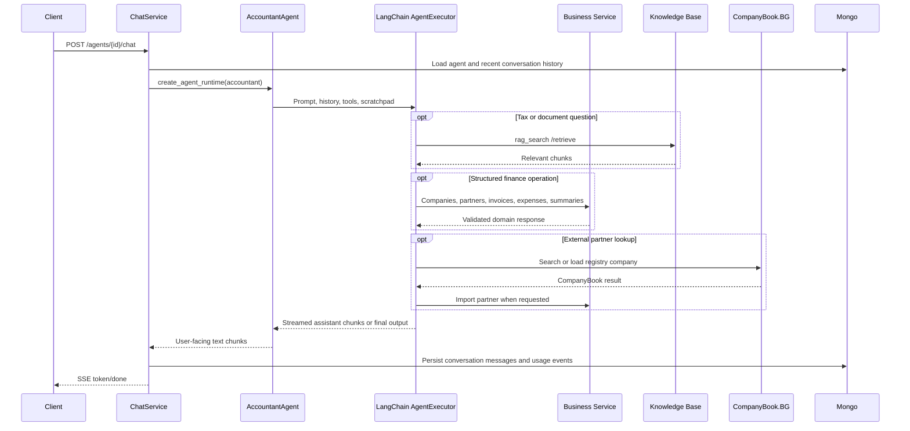
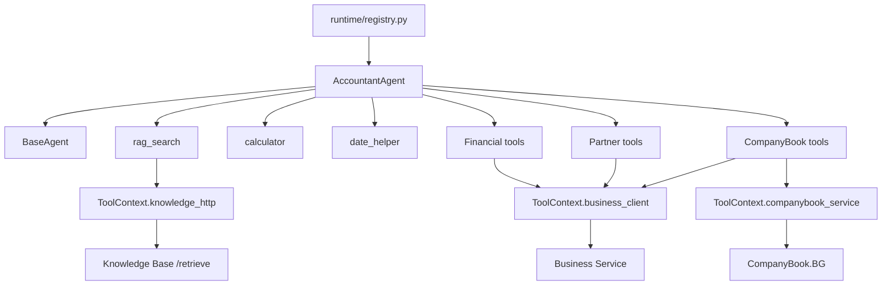

# Accountant Agent

## Purpose

`AccountantAgent` is the finance-focused concrete runtime for the Agent Service. It helps users answer accounting, tax, invoice, expense, partner, and company-document questions while keeping all structured operations scoped to the authenticated user and, when configured, one assigned company.

The agent delegates shared execution, streaming, conversation history conversion, usage collection, and lifecycle hooks to `BaseAgent`. Its own responsibilities are limited to the accountant-specific system prompt and the tools exposed for each run.

## Supported Workflows

- Answer tax, accounting, and finance questions from retrieved regulatory or uploaded company-document context.
- Query invoices by status, dates, partner, amount, category, or company scope.
- Query expenses by category, dates, counterparty, amount, or deductibility.
- Produce financial summaries with source-currency totals and BGN-converted totals for Bulgarian regulation checks.
- Draft and create invoices after partner resolution and explicit user confirmation.
- Record expenses only after explicit user confirmation.
- Resolve companies when the agent is not bound to a single company.
- Search, resolve, create, and import partners for invoice workflows.
- Search CompanyBook.BG and import Bulgarian registry data as local partners.
- Perform arithmetic and date calculations through dedicated tools instead of guessing.

## Feature Matrix

| Capability | Status | Notes |
|------------|--------|-------|
| Chat streaming | Supported | Inherited from `BaseAgent` through LangChain `AgentExecutor` events. |
| RAG over tax and company documents | Supported | Uses Knowledge Base `/retrieve` through `rag_search`. |
| Invoice queries | Supported | Uses Business Service invoice listing APIs. |
| Expense queries | Supported | Uses Business Service expense listing APIs. |
| Financial summaries | Supported | Includes raw totals by currency and BGN-converted top-level totals. |
| Invoice creation | Supported with confirmation | First call returns a draft unless `confirmed=true`. |
| Expense recording | Supported with confirmation | Tool refuses to persist until `confirmed=true`. |
| Partner management | Supported | Search, resolve, get, and create local partners. |
| CompanyBook partner import | Supported | Searches external registry, maps details to a local partner, handles missing fields. |
| Multi-company selection | Supported for unassigned agents | Adds company tools only when `agent.company_id` is absent. |
| Billing or quota decisions | Not supported | Runtime records provider usage facts only; pricing is out of scope. |

## Tool Inventory

| Tool | Source | Purpose |
|------|--------|---------|
| `rag_search` | `tools/rag.py` | Retrieve tax regulations and uploaded company documents from Knowledge Base. |
| `calculator` | `tools/calculator.py` | Evaluate simple arithmetic with decimal-safe parsing. |
| `date_helper` | `tools/dates.py` | Return current UTC date and calculate common relative invoice dates. |
| `query_invoices` | `tools/financial.py` | List invoices using structured filters. |
| `query_expenses` | `tools/financial.py` | List expenses using structured filters. |
| `get_financial_summary` | `tools/financial.py` | Summarize invoice and expense totals. |
| `create_invoice` | `tools/financial.py` | Draft or create an invoice within one company scope. |
| `record_expense` | `tools/financial.py` | Record an expense after confirmation. |
| `search_partners` | `tools/financial.py` | List or search clients and suppliers in the current company scope. |
| `resolve_partner_by_name` | `tools/financial.py` | Resolve a mentioned partner before invoice creation. |
| `get_partner` | `tools/financial.py` | Load one partner by id. |
| `create_partner` | `tools/financial.py` | Create a local partner from complete user-provided details. |
| `search_companybook_companies` | `tools/companybook.py` | Search CompanyBook.BG by name or UIC. |
| `import_companybook_partner` | `tools/companybook.py` | Import a selected CompanyBook company as a local partner. |
| `list_companies` | `tools/financial.py` | List or search companies when the agent is unassigned. |
| `resolve_company_by_name` | `tools/financial.py` | Resolve a company name or registration number when the agent is unassigned. |

`list_companies` and `resolve_company_by_name` are exposed only for agents without an assigned `company_id`. Assigned agents use their stored company scope automatically and reject attempts to pass a different `company_id`.

## Runtime Prompt Rules

The system prompt is generated on every run by `AccountantAgent.get_system_prompt()`.

- Treat the agent as an accountant that helps with tax, accounting, and finance.
- Use `rag_search` for tax regulations and uploaded company documents.
- Call `rag_search` at most once per single user question unless the user explicitly asks for a different source or topic.
- Use structured financial tools for invoices, expenses, and summaries.
- Report ordinary balances, income, expenses, invoices, and cash-flow amounts in source currencies from `totals_by_currency`.
- Use BGN-converted top-level totals only for Bulgarian tax thresholds or BGN-denominated regulation checks, and mention conversion when source records are not BGN.
- Use `calculator` for arithmetic and never compare threshold numbers without checking currency.
- Use `date_helper` for current or relative dates; never guess the current date.
- Before invoice creation, call `create_invoice` with `confirmed=false`, present the draft, and ask for explicit user confirmation.
- Before expense recording, summarize the record and ask for explicit user confirmation.
- Search or resolve local partners before creating invoices.
- Use CompanyBook.BG only after local partner lookup, or when the user asks to search the Bulgarian registry.
- Ask the user to choose when multiple CompanyBook matches are returned.
- Ask only for missing partner details when registry data is incomplete.
- Append `config.system_prompt_override` as additional agent-specific instructions when present.

Default invoice dates are injected into the prompt from the current UTC date. When the user does not provide dates, issue date and tax event date default to today, while due date defaults to the first day of the next month.

## Data Flow

## Dependency Graph

## Data Ownership

| Data | Owner | Accountant Agent Access |
|------|-------|-------------------------|
| Agent config and assigned company | Agent Service | Read through `AgentInDB`. |
| Conversation messages | Agent Service | Read by `ChatService`, emitted by runtime, persisted after completion. |
| Raw LLM usage events | Agent Service | Collected by `BaseAgent`, persisted by `ChatService`. |
| Companies | Business Service | Read for unassigned company resolution. |
| Partners | Business Service | Read, create, and import through tools. |
| Invoices | Business Service | Query and create through tools. |
| Expenses | Business Service | Query and create through tools. |
| Financial summaries | Business Service | Read through summary tool. |
| Tax regulations and uploaded documents | Knowledge Base Service | Read through RAG retrieval only. |
| Bulgarian registry details | CompanyBook.BG adapter | Read through CompanyBook service, then optionally persisted as partners by Business Service. |

The runtime must not import repositories or database clients for downstream domain data. All service calls go through `ToolContext`.

## Configuration

| Config | Source | Effect |
|--------|--------|--------|
| `agent_type="accountant"` | `AgentInDB.agent_type` | Selects `AccountantAgent` in the runtime registry. |
| `company_id` | `AgentInDB.company_id` | Scopes finance, partner, RAG, and CompanyBook import operations to one company when present. |
| `config.system_prompt_override` | `AgentConfig` | Appended to the accountant system prompt as additional instructions. |
| `config.provider` | `AgentConfig` | Selects the LLM provider before runtime creation. |
| `config.model` | `AgentConfig` | Overrides the provider model when configured. |
| `config.temperature` | `AgentConfig` | Controls provider temperature when supported. |
| `RAG_TOP_K` | Service settings | Controls how many chunks `rag_search` requests. |
| `MAX_AGENT_ITERATIONS` | Service settings | Limits LangChain agent loop iterations. |
| `AGENT_ENV=development` | Environment | Enables detailed runtime observability logs. |

## Guardrails And Confirmation Rules

- All tool calls are scoped by the gateway-injected `user_id`.
- Assigned agents must not switch companies. Finance and partner tools reject a different requested `company_id`.
- Unassigned agents must resolve a company before company-scoped operations.
- Invoice creation is a two-step flow: first draft with `confirmed=false`, then persist only after clear user confirmation with `confirmed=true`.
- Expense recording requires explicit confirmation before persistence.
- Partner lookup should prefer local partners before external registry search.
- CompanyBook imports must ask the user to choose when multiple registry matches are possible.
- Incomplete CompanyBook data should result in a focused request for missing partner fields, not broad re-entry.
- RAG retrieval is intentionally limited to reduce repeated near-identical search loops.
- Currency comparisons must use source currency for ordinary reporting and BGN conversion only for BGN-denominated regulation checks.

## Failure Modes

- Knowledge Base timeout or transport failure returns a user-facing retrieval error from `rag_search`.
- Repeated near-identical RAG calls in the same turn return a skip message instructing the model to use existing retrieved chunks.
- Business Service validation or conflict errors are returned as tool text for the agent to explain or recover from.
- Partner creation conflicts attempt automatic resolution by registration number or UIC before asking the user to search locally.
- CompanyBook mapping errors return missing fields and a partner draft so the assistant can ask only for the unavailable details.
- Missing company scope returns an instruction to resolve or list companies before retrying the tool.

## Tests And Verification

Automated coverage should stay aligned with:

- `services/agent/tests/test_base_agent_runtime.py` for shared runtime streaming, fallback output, hooks, and usage collection behavior.
- `services/agent/tests/test_chat_usage_persistence.py` for chat completion and usage persistence integration.
- Tool-specific tests around financial, partner, RAG, date, and CompanyBook behavior as those modules evolve.

Manual verification scenarios:

- Ask a tax question and confirm the agent uses RAG context once before answering.
- Ask for an invoice summary and verify source currency is preserved.
- Ask for a BGN threshold check from EUR records and verify the assistant mentions conversion.
- Create an invoice and confirm the first tool response is a draft, with persistence only after explicit confirmation.
- Record an expense and confirm persistence is blocked until confirmation.
- Use an unassigned agent with multiple companies and verify company resolution happens before finance tools.
- Use an assigned agent and verify attempts to pass another `company_id` are rejected.
- Search for a missing invoice partner, import it from CompanyBook, then create the invoice after confirmation.
