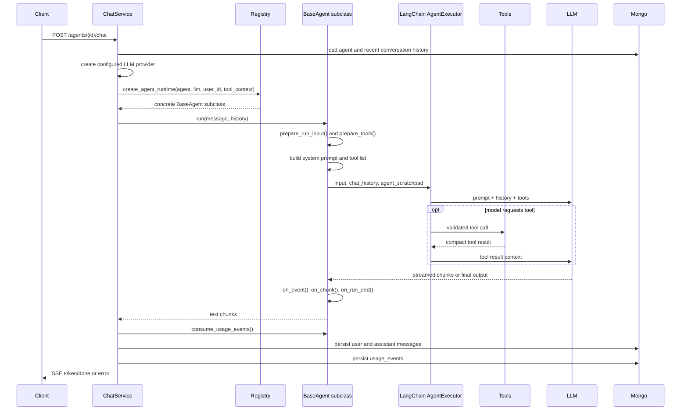
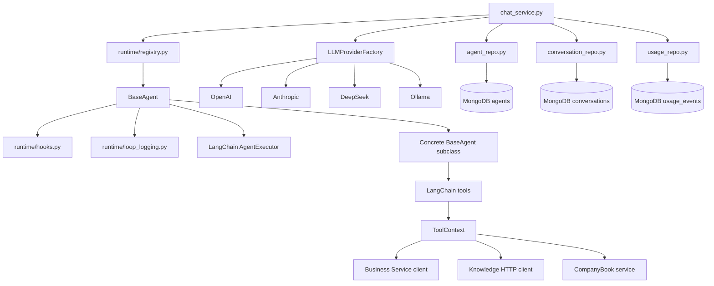

# Base Agent Runtime

## Purpose

`BaseAgent` is the shared strategy contract for all chat-capable agents in the Agent Service. It defines how a persisted agent configuration, selected LLM provider, user scope, tool context, prompt, tools, and conversation history are assembled into a LangChain `AgentExecutor` run.

Concrete agents, such as `AccountantAgent`, provide only:

- The system prompt through `get_system_prompt()`.
- The allowed LangChain tools through `get_tools()`.

The base runtime owns the common execution loop, chat history conversion, streaming extraction, final-output fallback, and development-only observability.

## Source Files

| File | Responsibility |
|------|----------------|
| `services/agent/app/runtime/base_agent.py` | Abstract runtime contract and shared LangChain execution loop. |
| `services/agent/app/runtime/hooks.py` | Run-local hook data contracts passed through the runtime lifecycle. |
| `services/agent/app/runtime/loop_logging.py` | Development logging, LLM tracing, and provider token metadata extraction. |
| `services/agent/app/runtime/usage.py` | Runtime-only token usage contracts collected from provider metadata. |
| `services/agent/app/runtime/registry.py` | Maps stored `agent_type` values to concrete runtime classes. |
| `services/agent/app/runtime/tool_context.py` | Injects shared service clients into tool builders. |
| `services/agent/app/services/chat_service.py` | Loads agent config, creates provider/runtime, manages SSE and persistence. |
| `services/agent/app/models/usage.py` | Persisted usage event schemas for the raw usage ledger. |
| `services/agent/app/repositories/usage_repo.py` | MongoDB writes for immutable usage events. |
| `services/agent/app/models/agent.py` | Defines valid `agent_type`, provider config, and persisted agent schema. |

## Current Registry

| `agent_type` | Runtime class | Notes |
|--------------|---------------|-------|
| `accountant` | `AccountantAgent` | Only supported concrete agent today. |

Adding another agent requires updating the `AgentType` literal in `models/agent.py`, implementing a `BaseAgent` subclass, registering it in `runtime/registry.py`, and adding a dedicated document in this folder.

## Runtime Contract

```python
class BaseAgent(ABC):
    def __init__(self, agent: AgentInDB, llm: BaseChatModel, user_id: str, tool_context: ToolContext) -> None: ...
    @abstractmethod
    def get_tools(self) -> list[BaseTool]: ...
    @abstractmethod
    def get_system_prompt(self) -> str: ...
    async def prepare_run_input(self, run_input: AgentRunInput) -> AgentRunInput | None: ...
    async def prepare_tools(self, tools: list[BaseTool], run_input: AgentRunInput) -> list[BaseTool] | None: ...
    async def on_run_start(self, run_input: AgentRunInput, tools: list[BaseTool]) -> None: ...
    async def on_event(self, event: AgentRunEvent) -> AgentRunEvent | None: ...
    async def on_chunk(self, chunk: AgentRunChunk) -> AgentRunChunk | None: ...
    async def on_run_end(self, result: AgentRunResult) -> AgentRunResult | None: ...
    async def on_run_error(self, exc: Exception, run_input: AgentRunInput | None) -> None: ...
    async def run(self, message: str, history: list[MessageSchema]) -> AsyncIterator[str]: ...
    def consume_usage_events(self) -> list[LLMUsageEvent]: ...
```

The constructor receives already validated runtime dependencies. `BaseAgent` should not import FastAPI routes, dependencies, repositories, or MongoDB clients. The chat service owns those concerns before runtime creation and after runtime completion.

`get_tools()` and `get_system_prompt()` are the only abstract methods. Lifecycle hooks are optional no-op override points for concrete agents that need controlled runtime customization without replacing the shared LangChain event loop.

## Runtime Hooks

Concrete agents may override async lifecycle hooks:

- `prepare_run_input()` changes the current message, history, or run-local metadata before prompt/executor creation.
- `prepare_tools()` filters, wraps, or augments the turn's tool list before executor creation.
- `on_run_start()` observes the final prepared input and tools after the executor is ready.
- `on_event()` observes or transforms normalized LangChain events before chunk/fallback extraction.
- `on_chunk()` transforms assistant text before `ChatService` emits an SSE `token`; returning an empty chunk suppresses that chunk.
- `on_run_end()` adjusts final fallback output, emitted-text state, usage events, or metadata before the runtime finishes.
- `on_run_error()` records cleanup or diagnostic state before the error returns to `ChatService`.

All hook data classes live in `services/agent/app/runtime/hooks.py`. They share one run-local `metadata` dict for the whole turn. Hook methods may return `None`; the runtime keeps the current object in that case.

Hooks must stay runtime-local. They may transform runtime input, tools, events, chunks, final fallback output, and metadata, but they must not emit SSE directly, append conversation messages, call FastAPI dependencies, or write repositories. Persisted writes remain owned by `ChatService` and repositories.

## Lifecycle



## Data Flow

`BaseAgent.run()` converts persisted `MessageSchema` history into LangChain messages:

| Stored role | LangChain message |
|-------------|-------------------|
| `user` | `HumanMessage` |
| `assistant` | `AIMessage` |
| `system` | `SystemMessage` |

The prompt is assembled as:

1. Concrete agent system prompt.
2. Recent chat history.
3. Current user message.
4. Agent scratchpad for tool calls.

During execution, the runtime reads LangChain stream events, applies hook callbacks, and yields only user-facing assistant text. Tool logs and internal events are never emitted to SSE or persisted as conversation messages.

Runtime token usage is collected from provider/LangChain metadata on stream chunks and final model output. The runtime records only provider-reported facts; it does not estimate missing token counts and does not calculate billing cost.

## Dependency Graph



## Owned Data

Base runtime does not write persisted data. Ownership is split as follows:

| Data | Owner |
|------|-------|
| Agent config | Agent Service repositories and models |
| Conversation history | Agent Service conversation repository |
| Raw LLM usage ledger | Agent Service usage repository |
| Companies, partners, invoices, expenses, summaries | Business Service |
| RAG documents and retrieval | Knowledge Base Service |
| External registry details | CompanyBook.BG adapter and Business partner writes |

Concrete tools may call downstream services through `ToolContext`, but runtime classes should stay focused on prompt and tool selection.

## Usage Ledger

`usage_events` is an Agent-owned raw ledger for completed LLM calls. `BaseAgent` collects `LLMUsageEvent` values during a run, and `ChatService` drains them with `consume_usage_events()` after runtime completion.

The persisted record includes `user_id`, `agent_id`, `conversation_id`, provider, model, optional LangChain `run_id`, LLM call index, provider-reported token counts, stream chunk/character counts, timing fields, `source="agent_runtime"`, and `created_at`. The repository stores an `idempotency_key` of `conversation_id:run_id:llm_call_index` so retries do not double-count the same provider call.

Usage persistence happens only after conversation message persistence succeeds. If usage persistence fails, the service logs the failure and still emits SSE `done` because the user-visible chat already succeeded. Billing, quota enforcement, price lookup, and usage aggregation are intentionally out of scope for the runtime.

## Streaming Behavior

`BaseAgent.run()` consumes LangChain `astream_events(..., version="v2")`.

- `on_chat_model_stream` events are converted into assistant text chunks.
- `on_chain_end` for `AgentExecutor` is stored as a fallback final output.
- If the provider streams no chunks but returns final text, the runtime yields the final output once.
- `on_event()` runs before text extraction, and `on_chunk()` runs before each yielded assistant chunk.
- `on_run_end()` runs before final fallback output and before usage events are exposed to `ChatService`.
- Development logs track tool start/end/error events, model start/first-token/stream/end/slow/error events, and token metadata when providers expose it. Those logs are not returned to users.

## Guardrails

- All agent execution is scoped by gateway-injected `user_id`.
- Concrete agents must expose only tools that match their role and scope.
- Tools must use service clients, not cross-service repositories.
- Write tools should require explicit user confirmation before persisting domain records.
- Assigned agents must respect their `company_id`; unassigned agents must resolve a company before company-scoped writes.
- RAG must go through Knowledge Base Service, never direct ChromaDB access.
- Hooks must not emit SSE, persist data, or call FastAPI dependency functions directly.
- Runtime token counts are best-effort provider metadata. Missing metadata must stay `None`; do not estimate tokens locally.
- The runtime does not compute billing cost. Future billing jobs should apply prices to `usage_events` outside the runtime.

## Configuration Inputs

| Config | Source | Used by |
|--------|--------|---------|
| `agent_type` | `AgentInDB.agent_type` | Runtime registry selection |
| `company_id` | `AgentInDB.company_id` | Concrete prompt and tool scoping |
| `config.provider` | `AgentConfig.provider` | LLM provider factory |
| `config.model` | `AgentConfig.model` | Provider-specific model override |
| `config.temperature` | `AgentConfig.temperature` | Provider-specific model settings |
| `config.system_prompt_override` | `AgentConfig.system_prompt_override` | Concrete agent prompt extension |
| `AGENT_ENV=development` | Environment | Tool, LLM, heartbeat, and usage metadata debug logging |
| `MAX_AGENT_ITERATIONS` | Environment/settings | LangChain executor max iterations |

## Per-Agent Documentation Template

Use this outline for each concrete agent document:

```markdown
# <Agent Name>

## Purpose
## Supported Workflows
## Feature Matrix
## Tool Inventory
## Runtime Prompt Rules
## Data Flow
## Dependency Graph
## Data Ownership
## Configuration
## Guardrails And Confirmation Rules
## Failure Modes
## Tests And Verification
```

## Current Gaps

- Future agents need one document each and should be linked from `docs/agents/README.md`.
