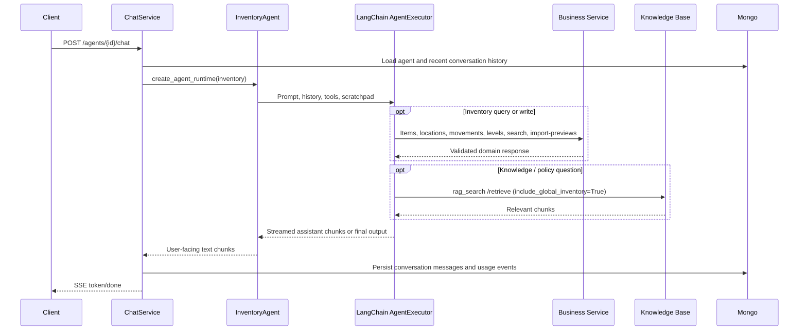
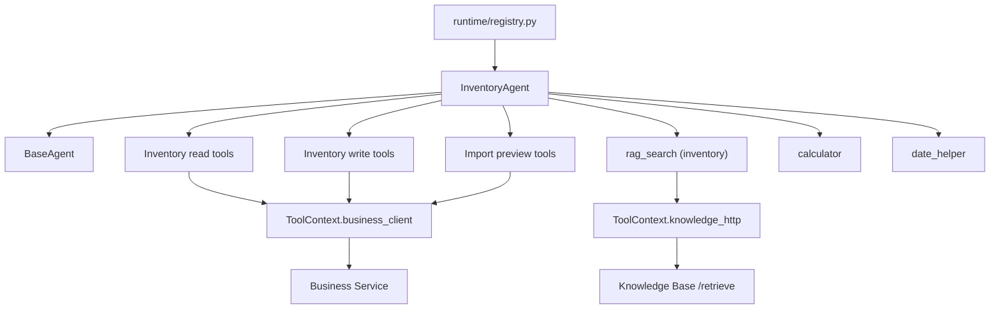

# Inventory Agent

## Purpose

`InventoryAgent` is the inventory-focused concrete runtime for the Agent Service. It helps users track stock, manage inventory items, review supplier invoice import previews, and advise on reorder decisions while keeping all structured inventory operations scoped to the authenticated user and, when configured, one assigned company.

The agent delegates shared execution, streaming, conversation history conversion, usage collection, and lifecycle hooks to `BaseAgent`. It does not own inventory data — all persistence and business rules live in Business Service.

## Source Files

| File | Responsibility |
|------|----------------|
| `services/agent/app/runtime/inventory.py` | Concrete runtime: system prompt and tool selection. |
| `services/agent/app/tools/inventory.py` | LangChain inventory tools (read, write, import preview). |
| `services/agent/app/models/inventory.py` | Agent-side Pydantic models for inventory tool args and client responses. |
| `services/agent/app/clients/business/inventory.py` | `_InventoryClient` mixin — HTTP calls to Business Service inventory endpoints. |
| `services/agent/app/tools/rag.py` | `build_inventory_rag_tool` — RAG tool configured for the `global_inventory` collection. |
| `services/knowledge/app/services/inventory_preload_service.py` | Preloads inventory reference data into the `global_inventory` ChromaDB collection. |
| `data/knowledgebase/inventory/` | Static inventory reference documents (movement types, import guides, best practices). |

## Supported Workflows

- Search inventory items by natural language, SKU, barcode, category, or alias.
- Check current stock levels per item and location.
- List items below their reorder point with suggested reorder quantities.
- View stock movement history for specific items.
- Create new inventory items after explicit user confirmation.
- Update existing inventory items after explicit user confirmation.
- Record stock movements (receipts, issues, adjustments, transfers, returns) after explicit user confirmation.
- Review supplier invoice import previews (extracted lines, matched items, proposed new items, warnings).
- Confirm or cancel import previews.
- Answer questions about invoice-inventory links and stock deduction timing.
- Search uploaded inventory policies or supplier documents through RAG.
- Resolve companies when the agent is not bound to a single company.

## Feature Matrix

| Capability | Status | Notes |
|------------|--------|-------|
| Chat streaming | Supported | Inherited from `BaseAgent`. |
| Inventory search | Supported | Natural-language queries via Business Service `POST /inventory/search`. |
| Stock level queries | Supported | Per-item, per-location, with reorder-point filtering. |
| Low-stock alerts | Supported | Items below configured reorder point. |
| Movement history | Supported | Filterable by item, location, movement type. |
| Item creation | Supported with confirmation | Two-step: draft then confirm. |
| Item updates | Supported with confirmation | Two-step: draft then confirm. |
| Stock movements | Supported with confirmation | Two-step: draft then confirm. |
| Import preview review | Supported | List, get, confirm, cancel. |
| Import confirmation | Supported with confirmation | Two-step: draft then confirm. |
| RAG search | Supported | For uploaded inventory policies, supplier docs, and preloaded inventory reference data. |
| Multi-company selection | Supported for unassigned agents | Company tools added when `agent.company_id` is absent. |
| Invoice stock deduction | Guidance only | Agent explains timing but does not trigger deduction. |

## Tool Inventory

| Tool | Source | Purpose |
|------|--------|---------|
| `search_inventory_stock` | `tools/inventory.py` | Natural-language item search with stock quantities. |
| `list_inventory_items` | `tools/inventory.py` | Structured item listing by exact category, SKU, barcode, or active status filters. |
| `get_stock_levels` | `tools/inventory.py` | Current stock levels per item and location. |
| `list_low_stock_items` | `tools/inventory.py` | Items below reorder point. |
| `get_stock_movements` | `tools/inventory.py` | Stock movement history. |
| `list_inventory_locations` | `tools/inventory.py` | Storage locations. |
| `create_inventory_item` | `tools/inventory.py` | Create item with confirmation. |
| `update_inventory_item` | `tools/inventory.py` | Update item with confirmation. |
| `record_stock_movement` | `tools/inventory.py` | Record movement with confirmation. |
| `list_import_previews` | `tools/inventory.py` | List supplier invoice import previews. |
| `get_import_preview` | `tools/inventory.py` | Load specific import preview. |
| `confirm_import_preview` | `tools/inventory.py` | Confirm import with confirmation. |
| `cancel_import_preview` | `tools/inventory.py` | Cancel draft import preview. |
| `calculator` | `tools/calculator.py` | Arithmetic. |
| `date_helper` | `tools/dates.py` | Date calculations. |
| `rag_search` | `tools/rag.py` | Knowledge Base document retrieval (inventory reference data + uploaded docs). |
| `list_companies` | `tools/financial.py` | Company listing (unassigned agents only). |
| `resolve_company_by_name` | `tools/financial.py` | Company resolution (unassigned agents only). |

`list_companies` and `resolve_company_by_name` are exposed only for agents without an assigned `company_id`. Assigned agents use their stored company scope automatically and reject attempts to pass a different `company_id`.

## Runtime Prompt Rules

The system prompt is generated on every run by `InventoryAgent.get_system_prompt()`.

- Treat the agent as an inventory specialist that helps with stock tracking, item management, import review, and reorder advice.
- Use `search_inventory_stock` when the user provides free-text search terms such as an item name, SKU, barcode, or a natural-language stock question.
- Use `list_inventory_items` only for filtered item listing by structured fields such as exact category, SKU, barcode, or active status.
- Use `get_stock_levels` to check current quantities per item and location.
- Use `list_low_stock_items` to find items below their reorder point and suggest reorder quantities based on the item's `target_stock_level`.
- Use `get_stock_movements` to show movement history for specific items.
- Before creating an inventory item, call `create_inventory_item` with `confirmed=false`, present the draft, and only set `confirmed=true` after explicit user confirmation.
- Before updating an item, call `update_inventory_item` with `confirmed=false` first.
- Before recording a stock movement, call `record_stock_movement` with `confirmed=false`, present the planned movement, and only set `confirmed=true` after user confirmation.
- For import previews: use `list_import_previews` and `get_import_preview` to review extracted lines. Explain matched items, proposed new items, and any warnings. Before confirming, call `confirm_import_preview` with `confirmed=false` first.
- When users ask about invoice inventory links: explain that draft invoices do not reduce stock. Stock issue movements are created only on `draft -> sent` transition.
- Use `calculator` for arithmetic and `date_helper` for dates; never guess the current date.
- Use `rag_search` only when the user asks about uploaded inventory policies, supplier documents, or other knowledge base content.
- Never guess stock quantities — always use tool results.
- Append `config.system_prompt_override` as additional agent-specific instructions when present.

## Data Flow

## Dependency Graph

## Data Ownership

| Data | Owner | Inventory Agent Access |
|------|-------|------------------------|
| Agent config and assigned company | Agent Service | Read through `AgentInDB`. |
| Conversation messages | Agent Service | Read by `ChatService`, emitted by runtime, persisted after completion. |
| Raw LLM usage events | Agent Service | Collected by `BaseAgent`, persisted by `ChatService`. |
| Companies | Business Service | Read for unassigned company resolution. |
| Inventory items | Business Service | Read and write through tools. |
| Inventory locations | Business Service | Read through tools. |
| Stock movements | Business Service | Read and write through tools. |
| Stock levels | Business Service | Derived read through tools. |
| Import previews | Business Service | Read, confirm, and cancel through tools. |
| Inventory reference data | Knowledge Base Service | Read through RAG retrieval from `global_inventory` collection. |
| Uploaded inventory documents | Knowledge Base Service | Read through RAG retrieval. |

The runtime must not import repositories or database clients for downstream domain data. All service calls go through `ToolContext`.

## Configuration

| Config | Source | Effect |
|--------|--------|--------|
| `agent_type="inventory"` | `AgentInDB.agent_type` | Selects `InventoryAgent` in the runtime registry. |
| `company_id` | `AgentInDB.company_id` | Scopes inventory, import preview, and company operations to one company when present. |
| `config.system_prompt_override` | `AgentConfig` | Appended to the inventory system prompt as additional instructions. |
| `config.provider` | `AgentConfig` | Selects the LLM provider before runtime creation. |
| `config.model` | `AgentConfig` | Overrides the provider model when configured. |
| `config.temperature` | `AgentConfig` | Controls provider temperature when supported. |
| `RAG_TOP_K` | Service settings | Controls how many chunks `rag_search` requests. |
| `PRELOAD_INVENTORY_DOCS` | Knowledge Service settings | Enables inventory reference data preload into `global_inventory` ChromaDB collection. |
| `MAX_AGENT_ITERATIONS` | Service settings | Limits LangChain agent loop iterations. |
| `AGENT_ENV=development` | Environment | Enables detailed runtime observability logs. |

## Guardrails And Confirmation Rules

- All tool calls are scoped by the gateway-injected `user_id`.
- Assigned agents must not switch companies. Inventory tools reject a different requested `company_id`.
- Unassigned agents must resolve a company before company-scoped operations.
- Write tools (`create_inventory_item`, `update_inventory_item`, `record_stock_movement`, `confirm_import_preview`) require two-step confirmation: first call with `confirmed=false`, then persist only after clear user confirmation with `confirmed=true`.
- Read tools are freely callable without confirmation.
- Import previews must be reviewed with the user before confirmation.
- The agent explains stock deduction timing but does not trigger invoice status changes.
- Never guess stock quantities — always use tool results.
- RAG retrieval is limited to reduce repeated near-identical search loops.

## Failure Modes

- Business Service timeout or transport failure returns a user-facing error from inventory tools via `BusinessClientError`.
- Knowledge Base timeout returns a retrieval error from `rag_search`.
- Repeated near-identical RAG calls in the same turn return a skip message instructing the model to use existing retrieved chunks.
- SKU collision on item create returns a `409` conflict surfaced as tool text for the agent to explain.
- Empty search results return an empty `matches` array; the agent informs the user no items matched.
- Import preview with warnings returns lines with `warnings`; the agent presents those before offering to confirm.
- Below-reorder-point query returns empty when no items have `reorder_point` set; the agent explains configuration is needed.
- Missing company scope returns an instruction to resolve or list companies before retrying the tool.

## Tests And Verification

Automated coverage:

- `services/agent/tests/test_business_client.py`: inventory client methods (search, items, locations, movements, levels, import previews).
- `services/agent/tests/test_inventory_tools.py`: read/write/import tools confirmation, delegation, runtime tool set, system prompt.

Manual verification scenarios:

- Ask "how many iPhones do we have?" and confirm the agent uses `search_inventory_stock`.
- Ask for low-stock items and verify the agent uses `list_low_stock_items` with reorder suggestions.
- Create an inventory item and confirm the first tool response is a draft, with persistence only after explicit confirmation.
- Record a stock movement and confirm persistence is blocked until confirmation.
- Review an import preview and confirm the agent explains matched items, proposed items, and warnings before offering to confirm.
- Use an unassigned agent with multiple companies and verify company resolution happens before inventory tools.
- Use an assigned agent and verify attempts to pass another `company_id` are rejected.
- Ask about invoice stock deduction and verify the agent explains `draft -> sent` timing without triggering any status change.
