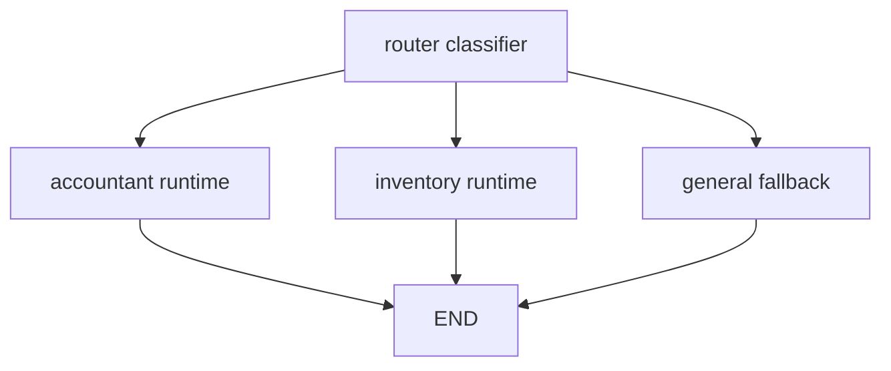

# Router Agent

## Purpose

`RouterAgent` is a chat-capable runtime that classifies each user turn and delegates execution to an accountant runtime, an inventory runtime, or a general fallback response. It keeps the public `POST /agents/{id}/chat` SSE contract intact while allowing one visible assistant to handle finance, inventory, and general platform questions.

## Supported Workflows

| Workflow | Route | Execution |
|----------|-------|-----------|
| Invoice, expense, partner, VAT, payment, bookkeeping, or financial summary questions | `accountant` | Delegates to `AccountantAgent` when a compatible child runtime exists. |
| Stock, item, warehouse/location, movement, low-stock, reorder, or supplier import-preview questions | `inventory` | Delegates to `InventoryAgent` when a compatible child runtime exists. |
| Greetings, platform help, unsupported requests, or missing specialist runtime | `general` | Uses the router LLM with a no-tool general prompt. |

The router can also emit a non-persistent `workflow_suggestion` for inventory-backed sales invoice requests. The suggestion only offers frontend kickoff metadata; it does not call invoice workflow endpoints, start preview, create invoices, or reserve stock. See `docs/workflows/chat-workflow-suggestions.md` and `docs/workflows/sales-invoice-inventory.md`.

The router is selected by creating an agent with `agent_type: "router"`. The frontend create-agent form exposes Router alongside Accountant and Inventory and lowers the default temperature to `0.1` when the user selects Router from the untouched default.

## Graph

The production graph lives in `services/agent/app/runtime/router.py` and is built with LangGraph:



The classifier produces this structured contract:

```json
{
  "route": "inventory",
  "reason": "The user asked about stock levels.",
  "confidence": 0.95
}
```

Valid routes are `accountant`, `inventory`, and `general`. If structured classification fails, the runtime uses a deterministic fallback decision: `route="general"`, reason `"Structured routing failed; defaulting to general specialist."`, and confidence `0.0`.

## Runtime Lifecycle

1. `ChatService` loads the selected router agent using the gateway-authenticated `user_id`.
2. `ChatService` creates the router LLM from the router agent config and constructs `RouterAgent` through `create_agent_runtime()`.
3. `ChatService` tries to configure accountant and inventory child runtimes:
   - First it calls `AgentRepository.get_delegate_for_router(user_id, router.id, role)` for a linked delegate document with `parent_agent_id` and `delegate_role`.
   - If no linked delegate is found, it falls back to `get_latest_by_type(user_id, role, router.company_id)` for backward compatibility with manually created same-scope specialist agents.
   - Any child whose `company_id` does not exactly match the router `company_id` is rejected and logged.
4. The router graph classifies the turn using the latest message plus a bounded recent-history snippet.
5. If the predicted specialist runtime is configured, the router delegates to that child runtime and drains its usage events.
6. If the specialist is missing, or if the classifier returns `general`, the router calls the general fallback prompt.
7. `ChatService` persists the user and assistant messages, persists provider-reported usage facts, emits optional `route` metadata, then emits `done`.

## Scope Propagation

All router and child execution is scoped by the gateway-authenticated `user_id`; runtime classes never read FastAPI dependencies or repositories. Company scope is exact:

| Router `company_id` | Child lookup behavior |
|---------------------|-----------------------|
| Non-null company id | Only a child with the same `company_id` is used. |
| `null` | Only unassigned child agents are used. Company-assigned children are not used silently. |

The router passes `company_scope: "assigned"` when `company_id` is non-null and `"unassigned"` otherwise. The classifier receives these identifiers only as routing context and is instructed not to invent business data.

## SSE Metadata

Router route metadata is optional and non-persisted. It is emitted after conversation messages and usage records are saved, and before `done`:

```text
event: route
data: {"predicted_route":"inventory","executed_route":"inventory","reason":"stock question","confidence":0.95,"company_id":"665f1f77c9e0f7a8093bb701","company_scope":"assigned"}
```

Payload fields:

| Field | Type | Meaning |
|-------|------|---------|
| `predicted_route` | `accountant` \| `inventory` \| `general` | Classifier decision before availability checks. |
| `executed_route` | `accountant` \| `inventory` \| `general` | Branch actually executed. Missing specialists execute `general`. |
| `reason` | string | Bounded classifier reason for debugging. |
| `confidence` | number | Classifier confidence from `0.0` to `1.0`. |
| `company_id` | string or null | Router company scope. |
| `company_scope` | `assigned` \| `unassigned` | Human-readable scope state. |

Frontend `shared/api/sse.ts` types this event as `RouteMetadata`, and `widgets/chat-window` accepts it without rendering a new visible chat message.

### Workflow Suggestion Metadata

When the classifier detects an inventory-backed sales invoice intent with confidence at least `0.85`, the router may expose a `sales_invoice_inventory` suggestion. `ChatService` emits it after `route` and before `done`:

```text
event: workflow_suggestion
data: {"workflow":"sales_invoice_inventory","confidence":0.94,"reason":"The user requested a stock-backed customer invoice.","prefill":{"partner_query":"Acme","lines":[{"description":"Widget","query":"Widget","quantity":"2"}]}}
```

The frontend validates the event with `features/send-message/model/chat-suggestion-schema.ts`. Unknown workflow names or invalid payloads are ignored.

The sales invoice workflow itself is still executed by explicit Agent workflow endpoints:

1. `POST /agents/{agent_id}/invoice-workflows/sales-inventory/preview`
2. `POST /agents/{agent_id}/invoice-workflows/sales-inventory/inventory/confirm`
3. `POST /agents/{agent_id}/invoice-workflows/sales-inventory/invoice/confirm`

The Router should prefer emitting the suggestion when the request mentions both customer invoicing and stock/inventory fulfillment. Low-confidence or incomplete requests should stay as normal chat guidance until the user supplies enough partner or line detail.

## Usage Attribution

`usage_events` stays the raw provider ledger:

- Router classifier calls use the router agent id.
- Router general fallback calls use the router agent id.
- Delegated accountant calls use the accountant child runtime agent id.
- Delegated inventory calls use the inventory child runtime agent id.

The runtime never estimates missing token counts. `ChatService` persists only usage events with provider-reported token fields, after successful message persistence.

## Current Delegate Limitation

The repository can resolve linked delegate documents that contain `parent_agent_id` and `delegate_role`, but the public `AgentInDB`/`AgentResponse` schema does not yet expose typed delegate fields, normal agent listing does not hide delegates, and `AgentService.create_agent()` does not auto-provision hidden accountant/inventory delegates when a router is created.

Until that ownership layer is implemented, router delegation works in two practical ways:

- Seed or insert linked delegate documents with matching `user_id`, `company_id`, `parent_agent_id`, and `delegate_role`.
- Create normal accountant and inventory agents in the same company scope; the router will use the latest same-scope specialist as a compatibility fallback.

If neither child exists, specialist predictions fall back to the general response while preserving `predicted_route` in the metadata.

## Failure Modes

| Scenario | Behavior |
|----------|----------|
| Structured classification fails | Router executes `general` with confidence `0.0`. |
| Predicted child is missing | Router executes `general`, with `predicted_route` preserved. |
| Child company scope mismatches router | Child is ignored and the predicted route falls back to `general`. |
| Child runtime raises | `ChatService` emits SSE `error` and does not persist a successful assistant message. |
| Provider lacks token metadata | Token fields remain `None`; no local estimates are written. |

## Tests And Verification

Targeted tests:

```bash
cd services/agent
python -m pytest tests/test_router_agent.py tests/test_router_chat_service.py tests/test_chat_usage_persistence.py

cd ../../frontend
npm test -- chat-window
npm test -- create-agent-form
npm run lint
```

Manual smoke test:

```bash
curl -X POST http://localhost:8010/agents \
  -H "Authorization: Bearer $TOKEN" \
  -H "Content-Type: application/json" \
  -d '{"name":"Ops Router","agent_type":"router","company_id":"'"$COMPANY_ID"'","config":{"provider":"openai","temperature":0.1}}'

curl -N -X POST "http://localhost:8010/agents/$ROUTER_AGENT_ID/chat" \
  -H "Authorization: Bearer $TOKEN" \
  -H "Accept: text/event-stream" \
  -H "Content-Type: application/json" \
  -d '{"message":"Do we have low stock items?"}'
```

Expected stream shape for a successful router turn:

```text
event: conversation
data: {"conversation_id":"..."}

event: start
data: {"conversation_id":"..."}

event: token
data: {"content":"..."}

event: route
data: {"predicted_route":"inventory","executed_route":"inventory","reason":"...","confidence":0.95,"company_id":"...","company_scope":"assigned"}

event: workflow_suggestion
data: {"workflow":"sales_invoice_inventory","confidence":0.95,"reason":"...","prefill":{"lines":[]}}

event: done
data: {"conversation_id":"..."}
```
