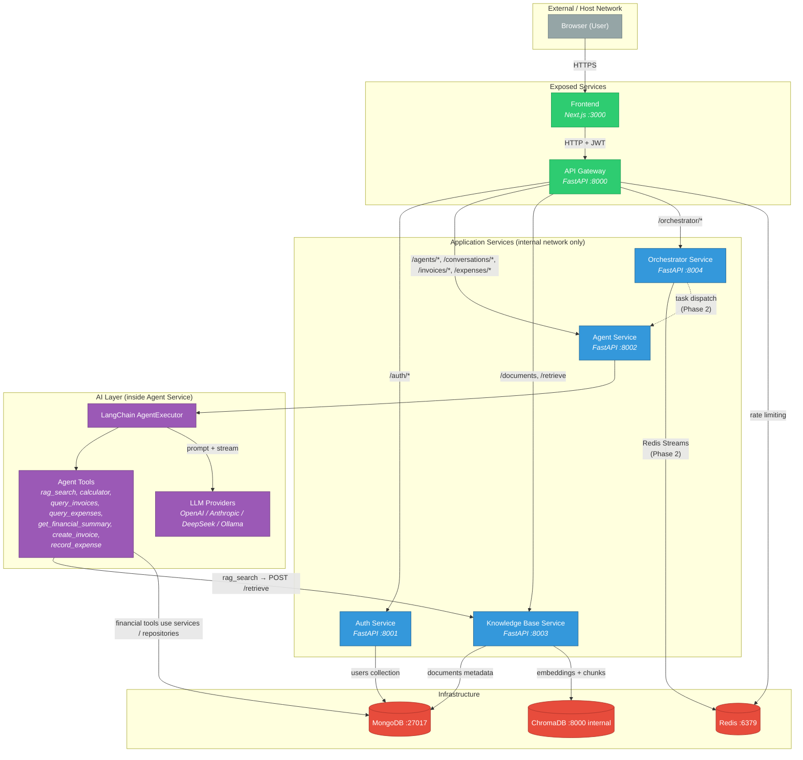
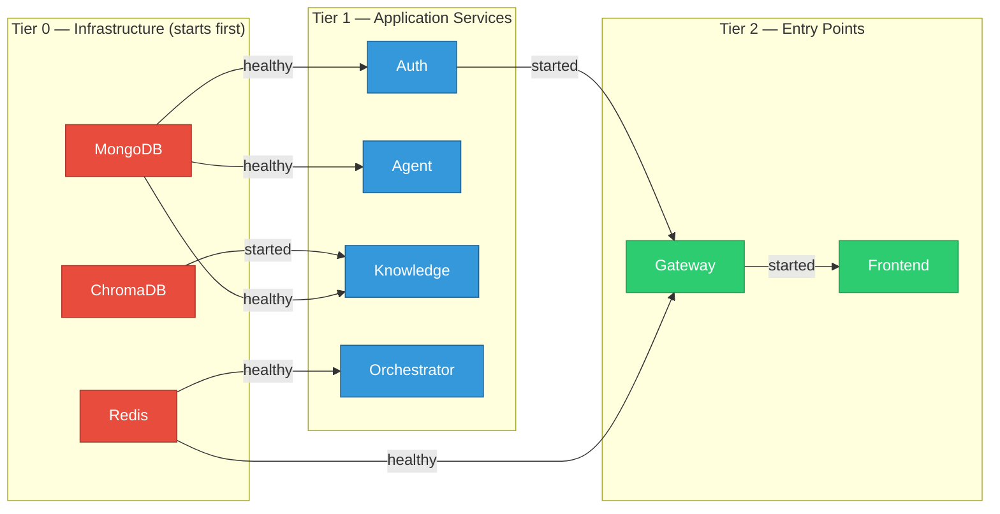
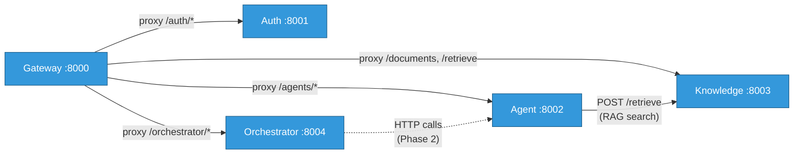

# Dependency Graph

This document maps every dependency relationship in the Agent Platform: service-to-service communication, service-to-infrastructure connections, the Docker Compose startup chain, data flow paths, and network exposure rules. It is the single source of truth for understanding what depends on what.

> **Related docs:**
> - `docs/architecture/overview.md` — system architecture and patterns
> - `plans/agent_microservices_architecture_f9eb3905.plan.md` — full architecture plan

---

## System Dependency Graph

The complete picture: frontend, gateway, application services, AI layer, and infrastructure.

---

## Service Dependency Matrix

Each row is a service. Columns show what it depends on. Read as: *"Row service requires Column service to function."*

| Service | MongoDB | Redis | ChromaDB | Auth Service | Agent Service | KB Service | Orchestrator | LLM Providers |
|---------|:-------:|:-----:|:--------:|:------------:|:-------------:|:----------:|:------------:|:-------------:|
| **API Gateway** | — | **Rate limiting** | — | Route target | Route target | Route target | Route target | — |
| **Auth Service** | **users** | — | — | — | — | — | — | — |
| **Agent Service** | **agents, conversations, invoices, expenses, counters** | — | — | — | — | **RAG retrieval** | — | **OpenAI / Anthropic / DeepSeek / Ollama** |
| **Knowledge Base** | **documents** (metadata) | — | **embeddings + chunks** | — | — | — | — | **OpenAI** (embedding) |
| **Orchestrator** | — | **Redis Streams** (Phase 2) | — | — | Task dispatch (Phase 2) | — | — | — |
| **Frontend** | — | — | — | — | — | — | — | — |

**How to read:** The Agent Service row shows it depends on MongoDB for `agents`, `conversations`, `invoices`, `expenses`, and invoice `counters`, on the Knowledge Base Service during `rag_search` tool execution, and on external or local LLM providers. It does not depend on Auth, Orchestrator, Redis, or ChromaDB directly.

---

## Docker Compose Startup Order

The `depends_on` directives in `docker-compose.yml` define the startup DAG. Services wait for their dependencies to pass health checks (`service_healthy`) or at least start (`service_started`).

| Service | Depends On | Condition | Reason |
|---------|-----------|-----------|--------|
| **Auth** | MongoDB | `service_healthy` | Needs `users` collection on startup |
| **Agent** | MongoDB | `service_healthy` | Needs `agents`, `conversations`, `invoices`, `expenses`, and `counters` collections |
| **Knowledge** | MongoDB, ChromaDB | `service_healthy`, `service_started` | Metadata in Mongo, vectors in Chroma |
| **Orchestrator** | Redis | `service_healthy` | Will use Redis Streams for task coordination |
| **Gateway** | Redis, Auth | `service_healthy`, `service_started` | Rate limiting needs Redis; auth proxying needs Auth alive |
| **Frontend** | Gateway | `service_started` | All API calls go through the gateway |

**Startup sequence in practice:**
1. MongoDB, Redis, ChromaDB start in parallel (no dependencies)
2. Once Mongo is healthy → Auth, Agent, Knowledge start in parallel
3. Once Redis is healthy → Orchestrator starts
4. Once Redis is healthy + Auth is started → Gateway starts
5. Once Gateway is started → Frontend starts

---

## Data Flow Dependencies

Which service writes to and reads from each data store, and what data it owns.

### MongoDB Collections

| Collection | Owner Service | Readers | Purpose |
|-----------|--------------|---------|---------|
| `users` | Auth Service | Auth Service | User accounts, credentials, Google OAuth links |
| `agents` | Agent Service | Agent Service | Agent instance configs (type, LLM provider, KB refs) |
| `conversations` | Agent Service | Agent Service | Chat message history per agent session |
| `invoices` | Agent Service | Agent Service REST routes and LangChain tools | Financial invoices queried and created by both UI/API clients and the Accountant Agent |
| `expenses` | Agent Service | Agent Service REST routes and LangChain tools | Financial expenses recorded and queried by both UI/API clients and the Accountant Agent |
| `counters` | Agent Service | Agent Service | Atomic invoice number sequences per user and year |
| `documents` | Knowledge Base | Knowledge Base | Document metadata + content hashes (vectors live in ChromaDB) |

### ChromaDB Collections

| Collection | Owner Service | Readers | Purpose |
|-----------|--------------|---------|---------|
| `global_tax` | Knowledge Base | Knowledge Base (via Agent's `rag_search`) | Pre-loaded tax regulation embeddings, shared read-only |
| `user_{user_id}` | Knowledge Base | Knowledge Base (via Agent's `rag_search`) | Per-user uploaded document embeddings |

### Redis Keys

| Key Pattern | Owner Service | Purpose | TTL |
|------------|--------------|---------|-----|
| `rate:{user_id}:{hour_bucket}` | Gateway | Per-user hourly rate limit counter | Auto-expires with the hour |
| `stream:*_tasks` | Orchestrator (Phase 2) | Task dispatch to agent workers | Persistent (Streams) |
| `stream:results` | Orchestrator (Phase 2) | Agent results back to orchestrator | Persistent (Streams) |

---

## Service-to-Service Communication

All inter-service communication happens over HTTP on the internal Docker network. No service calls another service's database directly.

| From | To | Protocol | Path | Purpose |
|------|-----|---------|------|---------|
| Gateway | Auth | HTTP | `/auth/*` | Proxy registration, login, OAuth, profile requests |
| Gateway | Agent | HTTP | `/agents/*`, `/conversations/*`, `/invoices/*`, `/expenses/*` | Proxy agent CRUD, conversation reads, chat (SSE), and financial record CRUD |
| Gateway | Knowledge | HTTP | `/documents`, `/retrieve` | Proxy document upload, lifecycle, and retrieval |
| Gateway | Orchestrator | HTTP | `/orchestrator/*` | Proxy workflow management (Phase 2) |
| Agent | Knowledge | HTTP | `POST /retrieve` | RAG semantic search during agent tool execution |
| Orchestrator | Agent | HTTP | (Phase 2) | Task dispatch to agent workers |

---

## Network Exposure

Only two services are reachable from outside the Docker network.

| Service | Host Port | Accessible From | Notes |
|---------|----------|----------------|-------|
| **Frontend** | 3000 | Browser | Web application entry point |
| **Gateway** | 8000 | Browser / Frontend | Single API entry point, JWT required for most routes |
| Auth | not published | Internal only | Reachable as `http://auth:8001` on `agents-network` |
| Agent | not published | Internal only | Reachable as `http://agent:8002` on `agents-network` |
| Knowledge | not published | Internal only | Reachable as `http://knowledge:8003` on `agents-network` |
| Orchestrator | not published | Internal only | Reachable as `http://orchestrator:8004` on `agents-network` |
| MongoDB | not published | Internal only | Reachable as `mongodb:27017` on `agents-network` |
| Redis | not published | Internal only | Reachable as `redis:6379` on `agents-network` |
| ChromaDB | not published | Internal only | Reachable as `chromadb:8000` on `agents-network` |

> The default compose file exposes only ports 3000 and 8000. Publish internal ports temporarily only when debugging a specific service.

---

## External Dependencies

Services that reach outside the Docker network.

| Service | External Dependency | Protocol | Purpose |
|---------|-------------------|----------|---------|
| Agent Service | OpenAI API | HTTPS | LLM inference when an agent uses the OpenAI provider |
| Agent Service | Anthropic API | HTTPS | LLM inference when an agent uses the Anthropic provider |
| Agent Service | DeepSeek API | HTTPS | LLM inference when an agent uses the DeepSeek provider |
| Agent Service | Ollama | Local HTTP | Local LLM inference when an agent uses the Ollama provider |
| Knowledge Base | OpenAI API | HTTPS | Text embedding (`text-embedding-3-small`, 1536-dim) |
| Frontend | Google OAuth (GCP) | HTTPS | Google sign-in flow via NextAuth |

---

## Dependency Summary by Service

A quick-reference for each service: what it needs to start, what it talks to at runtime, and what data it owns.

### API Gateway
- **Startup requires:** Redis (healthy), Auth (started)
- **Runtime dependencies:** Redis (rate limiting), all 4 application services (proxy targets)
- **Data owned:** none (stateless proxy)

### Auth Service
- **Startup requires:** MongoDB (healthy)
- **Runtime dependencies:** MongoDB
- **Data owned:** `users` collection
- **External:** none

### Agent Service
- **Startup requires:** MongoDB (healthy)
- **Runtime dependencies:** MongoDB, Knowledge Base Service during `rag_search`, LLM providers
- **Data owned:** `agents`, `conversations`, `invoices`, `expenses`, and invoice `counters` collections
- **External:** OpenAI API, Anthropic API, DeepSeek API, or local Ollama depending on agent config

### Knowledge Base Service
- **Startup requires:** MongoDB (healthy), ChromaDB (started)
- **Runtime dependencies:** MongoDB, ChromaDB, OpenAI (embedding)
- **Data owned:** `documents` collection (MongoDB) + ChromaDB collections (`global_tax`, `user_{id}`)
- **External:** OpenAI API (embeddings only)

### Orchestrator Service
- **Startup requires:** Redis (healthy)
- **Runtime dependencies:** Redis (Streams), Agent Service (Phase 2)
- **Data owned:** none currently (stub)
- **External:** none

### Frontend
- **Startup requires:** Gateway (started)
- **Runtime dependencies:** Gateway (all API calls)
- **Data owned:** none (client-side state only)
- **External:** Google OAuth (NextAuth)
