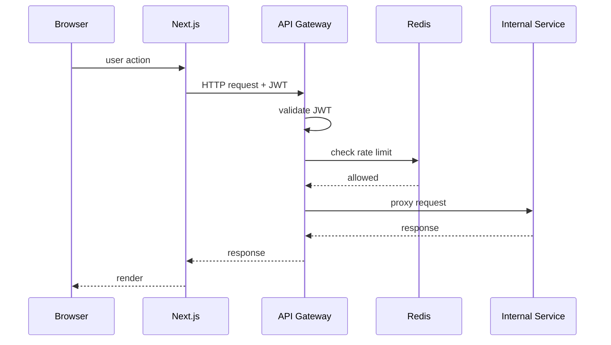
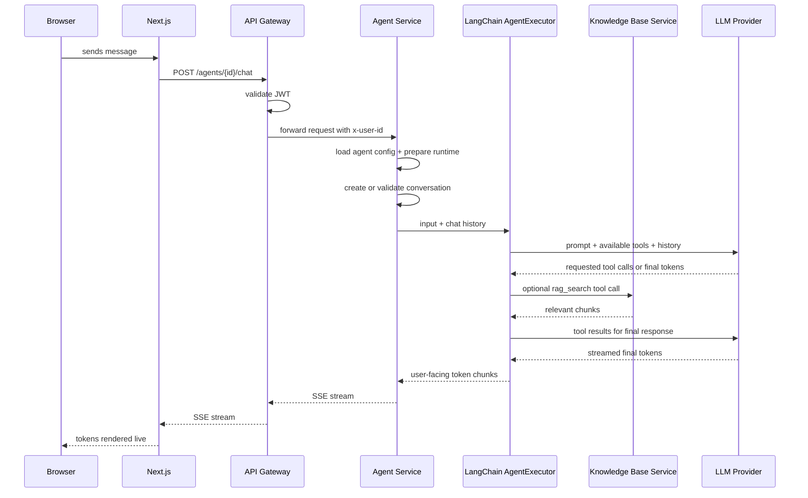
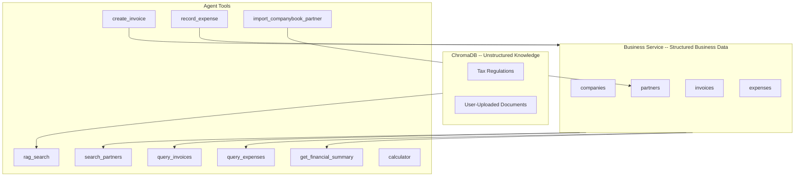
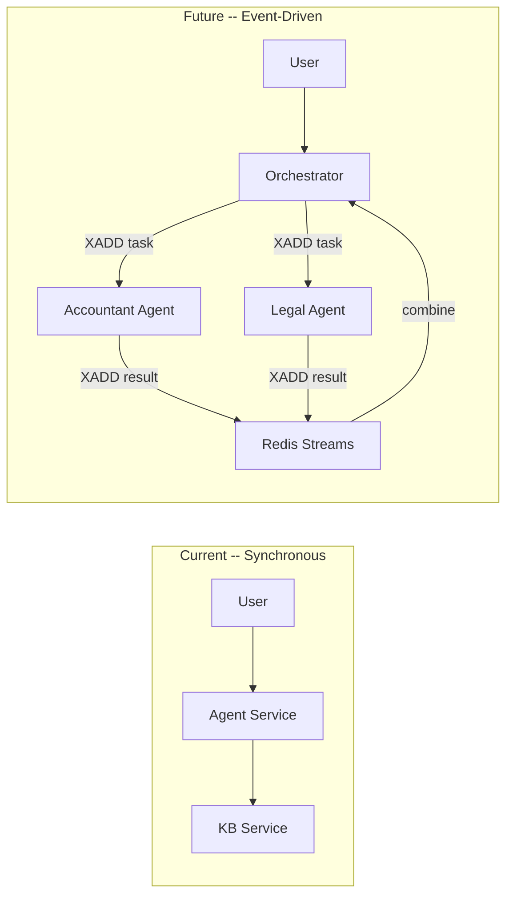

# Architecture Overview

A microservice platform for creating and orchestrating AI agents. Users log in, create accountant, inventory, or router agents, and interact with them through a chat interface. Agents have access to a tax regulation knowledge base, user-uploaded documents, and structured business data (companies, partners, invoices, expenses, and inventory) through the Business Service. The system is designed so that new agent types can be added as independent modules and, in the future, collaborate on complex tasks.

## Current Implementation Status

> **Phase 1 complete** — Infrastructure, Auth Service, and API Gateway are fully implemented.
> **Phase 2 Knowledge Base complete** — document ingestion, MongoDB metadata, ChromaDB vectors, OpenAI embeddings, and retrieval are implemented.
> **Phase 3 Agent Service core complete** — agent CRUD, conversation persistence, provider factory, Accountant, Inventory, and Router runtimes, RAG/calculator/date tools, Business-backed tools, and SSE chat streaming are implemented.
> **Business Service split active** — companies, partners, invoices, expenses, inventory, financial summaries, and their MongoDB indexes are owned by the Business Service. Gateway keeps the public URLs stable while routing `/companies`, `/partners`, `/invoices`, `/expenses`, and `/inventory/*` to Business.
> **Document intake workflow complete** — Agent owns `POST /agents/{agent_id}/document-intake` orchestration and supplier-invoice two-stage approval, Knowledge performs classify/extract only, and Business performs inventory/expense writes only after explicit confirmations.
> **Company-scoped workflows complete** — Business owns companies and partners; agents, invoices, expenses, and document uploads can be scoped by company; invoices snapshot supplier/recipient parties; Knowledge Base user uploads/retrieval are company-scoped; and the Accountant Agent can import Bulgarian partners from CompanyBook.BG before invoice creation.
> Remaining Orchestrator work is planned. Features marked with *(planned)* are not yet built.

| Component | Status |
|-----------|--------|
| Docker Compose (infra + service stubs) | ✅ Implemented |
| Auth Service (register, login, Google OAuth, JWT, refresh) | ✅ Implemented |
| API Gateway (JWT, rate limiting, SSE proxy) | ✅ Implemented |
| Agent Service Core (CRUD, chat, providers, RAG/calculator tools) | ✅ Implemented |
| Business Service (companies, partners, invoices, expenses, inventory, summaries) | ✅ Implemented |
| Agent Financial Tools (Business-backed invoice/expense tools) | ✅ Implemented |
| Agent Inventory Tools And Router Runtime | ✅ Implemented |
| Knowledge Base Service | ✅ Implemented |
| Orchestrator Service | ⬜ Stub only (health endpoint) |
| Frontend (Next.js) | ✅ Implemented |

## System Diagram

```mermaid
graph TD
    subgraph frontend [Frontend -- Next.js *(planned)*]
        UI[Web App]
        NextAuth[NextAuth.js *(planned)*]
    end

    subgraph gateway [API Gateway]
        GW[FastAPI Gateway]
    end

    subgraph services [Core Microservices]
        AuthSvc[Auth Service]
        AgentSvc[Agent Service Core]
        BusinessSvc[Business Service]
        KBSvc[Knowledge Base Service]
        OrchestratorSvc[Orchestrator Service *(planned)*]
    end

    subgraph ai [AI Layer]
        LangChain[LangChain Agent Runtime]
        RAGTool[RAG Tool]
        DBQueryTool[Financial Query Tools]
        DBWriteTool[Financial Write Tools]
        CompanyBookTool[CompanyBook Partner Tools]
        CalcTool[Calculator Tool]
        ChromaDB[(ChromaDB)]
    end

    subgraph infra [Infrastructure]
        MongoDB[(MongoDB)]
        Redis[("Redis")]
    end

    UI --> NextAuth
    NextAuth --> GW
    UI --> GW
    GW --> AuthSvc
    GW --> AgentSvc
    GW --> BusinessSvc
    GW --> KBSvc
    GW --> OrchestratorSvc
    AgentSvc --> LangChain
    LangChain --> RAGTool
    LangChain --> DBQueryTool
    LangChain --> DBWriteTool
    LangChain --> CompanyBookTool
    LangChain --> CalcTool
    RAGTool --> KBSvc
    DBQueryTool --> BusinessSvc
    DBWriteTool --> BusinessSvc
    CompanyBookTool --> CompanyBookAPI[CompanyBook.BG API]
    BusinessSvc --> MongoDB
    KBSvc --> ChromaDB
    KBSvc --> MongoDB
    AuthSvc --> MongoDB
    AgentSvc --> MongoDB
    OrchestratorSvc --> Redis
    OrchestratorSvc --> AgentSvc
    GW --> Redis
```

## Services

| Service | Tech | Port | Purpose |
|---------|------|------|---------|
| Frontend | Next.js 14, App Router, Tailwind, shadcn/ui | 3000 | Web app, auth UI, dashboard, chat, invoice/expense forms |
| API Gateway | FastAPI (Python) | 8000 | JWT validation, routing, rate limiting, SSE pass-through |
| Auth Service | FastAPI (Python) | 8001 | Registration, login, Google OAuth callback, JWT issuance |
| Agent Service | FastAPI + LangChain/LangGraph (Python) | 8002 | Agent CRUD, conversation management, Accountant, Inventory, and Router runtimes, SSE chat, provider selection, RAG/calculator/financial/inventory/CompanyBook tool orchestration |
| Knowledge Base Service | FastAPI (Python) | 8003 | Document ingestion, ChromaDB management, RAG retrieval |
| Orchestrator Service *(planned)* | FastAPI (Python) | 8004 | Multi-agent coordination via Redis Streams (stub in Phase 1) |
| Business Service | FastAPI (Python) | 8005 | Company, partner, invoice, expense, and financial summary APIs and rules |
| MongoDB | -- | 27017 | Structured data: users, agents, conversations, business records, document metadata |
| Redis | -- | 6379 | Rate limiting, caching (Phase 1); Redis Streams for inter-agent messaging (Phase 2+) |
| ChromaDB | -- | 8000 internal | Vector embeddings for tax regulations and user documents |

## Request Flow

All traffic from the frontend enters through the API Gateway. The gateway validates the JWT, checks the rate limit against Redis, then proxies the request to the appropriate internal service. Internal services are not exposed to the host -- only the frontend and gateway are.

## Business Service Boundary

The Business Service split is active. Gateway preserves the public API shape but routes domain prefixes to Business, while Agent keeps runtime prefixes:

- Business Service owns `/companies`, `/partners`, `/invoices`, `/expenses`, internal `/financial-summary`, and the MongoDB indexes for those collections.
- Agent Service owns `/agents`, `/conversations`, `/agents/{agent_id}/document-intake`, supplier-invoice inventory-confirm continuation, SSE chat streaming, provider selection, RAG adapter usage, CompanyBook lookup orchestration, and tool orchestration.
- Gateway owns prefix routing only; it must not gain domain logic.
- Agent tools call Business over internal HTTP through a long-lived `httpx.AsyncClient`, so REST APIs and chat tools share the same Business validation and persistence rules.

Smoke checks for this boundary are:

- Gateway health remains reachable through `GET http://localhost:8000/health`.
- Business health responds inside the Docker network at `GET http://business:8005/health`.
- `GET /companies` through the gateway keeps the same response contract while routing to Business.
- An Agent chat prompt that invokes `query_expenses` or `get_financial_summary` works through Agent -> Business.

## Company Scope

The Business Service owns `companies` and `partners`. A company is scoped by the gateway-injected `x-user-id`; partners are scoped by `user_id + company_id`. Agents may be assigned to a company, invoices require a company for new records, and invoice creation validates that any selected partner belongs to the same company. Invoices persist `supplier_snapshot` and `recipient_snapshot` so historical PDF rendering is stable even if company or partner records change later.

Agent chat history is also company-scoped. Conversations persist the agent's `company_id` when created, and the frontend loads the latest history by `agent_id + company_id` so reusing one agent across companies does not mix chat context.

The Knowledge Base Service owns document metadata and ChromaDB writes. It validates company ownership through Business internal `GET /companies/{company_id}/exists` with `x-user-id`. Uploaded document metadata and uploaded chunk metadata include `company_id`, and `/retrieve` filters user-uploaded chunks by the requested company while keeping `global_tax` shared.



## Chat Flow (SSE Streaming)

A user's message is streamed token-by-token using Server-Sent Events. The gateway validates JWTs, injects `x-user-id`, and passes through the Agent Service stream without buffering. For new chats, the Agent Service builds the provider, chat model, and runtime before creating the conversation, so setup failures do not leave empty conversation records behind. Router chats may emit optional `route` metadata after persistence and before `done`.



`BaseAgent` creates a LangChain `AgentExecutor` for accountant and inventory turns. The executor handles model-requested tools, feeds tool results back into the model, and streams only the final user-facing model chunks as SSE `token` events. If a provider does not emit streaming chat chunks, the runtime falls back to the executor's final output once. `RouterAgent` uses a LangGraph classifier/delegation graph to choose accountant, inventory, or a general fallback for each turn.

## Two Data Paths

The Agent Service runtime works with unstructured knowledge through `rag_search`, simple arithmetic through `calculator`, and structured business data through Business-backed invoice, expense, partner, inventory, and summary tools.



**Unstructured data** (tax regulations, company policies) is stored as vector embeddings in ChromaDB by the implemented Knowledge Base Service. The Agent Service queries it through `POST /retrieve` when the model invokes `rag_search`. Assigned agents include their `company_id` so uploaded-document results come only from that company; unassigned agents still use shared `global_tax` context.

**Structured business data** (companies, partners, invoices, expenses, inventory, and financial summaries) is stored in MongoDB by the Business Service. The Accountant Agent can query invoices and expenses, summarize totals, search/create partners, import Bulgarian partners from CompanyBook.BG, create invoices, and record expenses through tools that call Business over internal HTTP. The Inventory Agent can search inventory, inspect stock, manage items/locations/movements, and review import previews through Business-backed tools.

Business list routes for companies, partners, invoices, and expenses now share one envelope contract: `total_count`, `returned_count`, `offset`, `limit`, `truncated`, `next_offset`, `items`. Accountant prompt rules treat `truncated=true` as incomplete and use `next_offset` only when the user asks to continue.

Expenses are company-scoped and can optionally link a same-company `partner_id`. Legacy expenses missing `company_id` must be backfilled before they participate in company-scoped reporting (`scripts/migrations/backfill_expense_company_id.py`).

Financial summary top-level totals are EUR-denominated (`currency="EUR"`, `exchange_rates_to_eur`) for cross-currency comparison, while source-currency totals remain in `totals_by_currency`. Unsupported currencies are listed in `unsupported_currencies`.

Partner resolution is handled by Business `POST /partners/resolve`, which returns ranked candidates with `match_type`, `score`, and `match_reasons`. Search normalization fields (`*_normalized`, `search_text`) are indexed and can be backfilled with `scripts/migrations/backfill_search_normalized_fields.py`.

Financial write tools require explicit user confirmation before creating records. Tool code calls `BusinessClient`, not repositories, so REST and chat behavior share Business validation, calculations, and user scoping without duplicating ownership inside Agent.

CompanyBook.BG is an external registry integration owned by the Agent Service runtime. The frontend does not call it directly. `search_companybook_companies` returns read-only registry candidates, and `import_companybook_partner` maps a selected UIC into the existing company-scoped partner model before invoices use the normal `partner_id` workflow. Configure it with `COMPANYBOOK_API_KEY`, optional `COMPANYBOOK_BASE_URL`, and `COMPANYBOOK_TIMEOUT_SECONDS`; missing keys, API quota errors, and incomplete registry fields are returned as user-safe tool messages.

---

## Technology Stack

| Layer | Technology | Rationale |
|-------|-----------|-----------|
| Frontend | Next.js 14 (App Router) | SSR, API routes for NextAuth, modern React |
| Auth | Custom Auth Service + NextAuth.js integration | Auth Service handles user creation, Google ID token verification, refresh tokens, and JWT issuance; NextAuth stores the frontend session |
| Backend services | FastAPI (Python) | Async, fast, strong AI ecosystem |
| AI framework | LangChain | Agent abstraction, tool binding, RAG, multi-provider support |
| LLM providers | OpenAI, Anthropic, DeepSeek, Ollama | Multi-provider via Factory pattern |
| Vector store | ChromaDB | Purpose-built for embeddings, lightweight, Docker-native |
| Database | MongoDB | Flexible schema for diverse data models |
| Streaming | SSE (Server-Sent Events) | Simpler than WebSockets for unidirectional chat streaming |
| Caching / Queuing | Redis (+ Redis Streams) | Rate limiting and caching now; inter-agent messaging later |
| Containerization | Docker Compose | Single command to start the entire stack locally |

---

## Architectural Patterns

### 1. API Gateway

The gateway is a thin reverse proxy with no business logic. It owns cross-cutting concerns: JWT validation, rate limiting (via Redis), request routing to internal services, and SSE stream pass-through. Services behind the gateway are not accessible from the outside.

### 2. Layered Architecture

Every microservice follows the same internal structure:

```
routes/          HTTP layer -- endpoints, request/response validation
   |
services/        Business logic -- orchestration, validation rules
   |
repositories/    Data access -- MongoDB queries, ChromaDB operations
   |
models/          Data models -- Pydantic schemas
```

Routes never access the database directly. Services never construct HTTP responses. Repositories never contain business rules. This separation means storage can be swapped or business rules can change without cascading modifications.

### 3. Strategy Pattern -- Agent Runtime

All agent types implement the same abstract base class. The runtime loads the correct agent class from the registry at request time.

```
BaseAgent (abstract)
  get_tools() -> list
  get_system_prompt() -> str
  run(message, history) -> async generator

AccountantAgent(BaseAgent)     -- finance tools
InventoryAgent(BaseAgent)      -- inventory tools
RouterAgent(BaseAgent)         -- LangGraph classifier/delegation
LegalAgent(BaseAgent)          -- future
```

Adding a new tool agent type usually means creating a single file with a class that defines its tools and system prompt, then registering it in `runtime/registry.py`. Graph-style agents like Router can override `run()` while preserving the same `BaseAgent` constructor and `ChatService` orchestration boundary.

### 4. Factory Pattern -- LLM Providers

`LLMProviderFactory.create("openai" | "anthropic" | "deepseek" | "ollama")` returns the appropriate LangChain chat model wrapper. The agent runtime receives a `BaseChatModel` interface and is unaware of the underlying provider. Switching providers is a config change per agent instance.

### 5. Repository Pattern -- Data Access

Repository classes encapsulate all database operations. This is critical in the Agent Service where the same data (invoices, expenses) is accessed from two entry points:

- REST endpoints called by the frontend
- LangChain tools called by the agent during chat

Both use the same repository methods. A change to query logic applies everywhere automatically.

### 6. Adapter Pattern -- Vector Store

ChromaDB access is wrapped behind a `VectorStore` abstract interface:

```
VectorStore (interface)
  add_chunks(collection, chunks, embeddings, metadata)
  search(collection, query_embedding, top_k, filters)
  delete_by_document(collection, document_id)

ChromaAdapter(VectorStore)     -- current implementation
```

The Knowledge Base Service only depends on the interface, never on ChromaDB directly. Swapping the vector store means writing a new adapter class.

### 7. Event-Driven Pattern -- Multi-Agent Orchestration (planned)

Today, implemented communication is synchronous HTTP. In a later orchestration phase, when multiple agents need to collaborate on a task, they communicate through Redis Streams:



The Strategy pattern (independent agent classes) makes this transition seamless -- each agent type can be wrapped as a stream consumer without internal changes.

---

## Infrastructure

### Docker Compose

All services run on a shared Docker network. Only `frontend` (port 3000) and `gateway` (port 8000) are exposed to the host by default.

```
frontend        :3000   (exposed)
gateway         :8000   (exposed)
auth            :8001   (internal)
agent           :8002   (internal)
knowledge       :8003   (internal)
orchestrator    :8004   (internal)
business        :8005   (internal)
mongodb         :27017  (internal)
redis           :6379   (internal)
chromadb        :8000   (internal)
```

### Redis Usage

**Phase 1:**
- Rate limiting at the gateway. Key: `rate:{user_id}:{hour_bucket}`, TTL auto-expiry. Prevents LLM API cost abuse.
- Optional caching: agent config (TTL 5 min), RAG results (TTL 10 min).

**Planned orchestration phase:**
- Redis Streams for multi-agent task orchestration (`XADD`, `XREADGROUP`, consumer groups, acknowledgment).
- No RabbitMQ needed. Redis Streams provides persistence, consumer groups, ordering, and acknowledgment -- sufficient for inter-agent messaging at this scale.

### ChromaDB

Stores document chunk embeddings for semantic retrieval (RAG). Two collection scopes:

- `global_tax` -- pre-loaded tax regulation documents, shared read-only across all users.
- `user_{user_id}` -- per-user collection for company-specific documents.

The Knowledge Base Service is the only consumer. It handles the full document lifecycle: upload, change detection (SHA-256 content hashing), re-embedding, deletion, and versioned bulk updates for global knowledge.

### MongoDB

Stores all structured data across services:

- `users` -- Auth Service
- `agents`, `conversations` -- Agent Service
- `companies`, `partners`, `invoices`, `expenses`, `counters` -- Business Service
- `documents` -- Knowledge Base Service (metadata only; vectors are in ChromaDB)

---

## Phased Rollout

### Phase 1
- Docker Compose with infrastructure + service stubs
- Auth Service: registration, login, refresh, Google OAuth (server-side ID token verification), JWT issuance
- API Gateway: JWT validation, rate limiting (Redis), request routing, SSE pass-through
- Agent / Knowledge Base / Orchestrator services: initial health endpoints

### Phase 2 Knowledge Base
- Knowledge Base Service: document upload, list, update, delete, and retrieval
- MongoDB `documents` metadata with startup indexes
- ChromaDB `global_tax` and `user_{user_id}` collections
- OpenAI embeddings through `EmbeddingProvider`

### Phase 3 Agent Service Core
- Agent Service: Agent CRUD, conversation persistence, Accountant, Inventory, and Router runtimes, SSE chat streaming
- Provider factory for OpenAI, Anthropic, DeepSeek, and Ollama
- Phase 3 tools: `rag_search` and `calculator`

### Phase 4
- Invoice and expense schemas, APIs, repositories, MongoDB indexes, financial summary aggregation, and LangChain tools
- Company and partner ownership, company-scoped agents/invoices/documents, invoice party snapshots, and Bulgarian invoice PDF fields

### Business Service Split
- Business Service owns companies, partners, invoices, expenses, inventory, financial summaries, and related MongoDB indexes on internal port 8005
- Gateway routes `/companies`, `/partners`, `/invoices`, `/expenses`, and `/inventory/*` to Business while keeping `/agents` and `/conversations` on Agent
- Agent financial and partner tools call Business through `BusinessClient` instead of in-process domain repositories/services

### Router And Inventory Runtime
- Inventory Agent runtime and tools call Business inventory APIs for items, locations, movements, stock levels, search, and import previews.
- Router Agent runtime uses LangGraph to classify each chat turn and delegate to accountant, inventory, or general fallback while preserving the public chat SSE endpoint.

### Later Phases
- Orchestrator Service activated with Redis Streams
- Multi-agent collaboration on cross-domain tasks
- Agent marketplace: users browse and "hire" agents from a catalog
- Agents collaborate autonomously on complex workflows

### Phase 5
- Billing and usage tracking
- Fine-tuned models per agent type
- Advanced analytics and reporting
