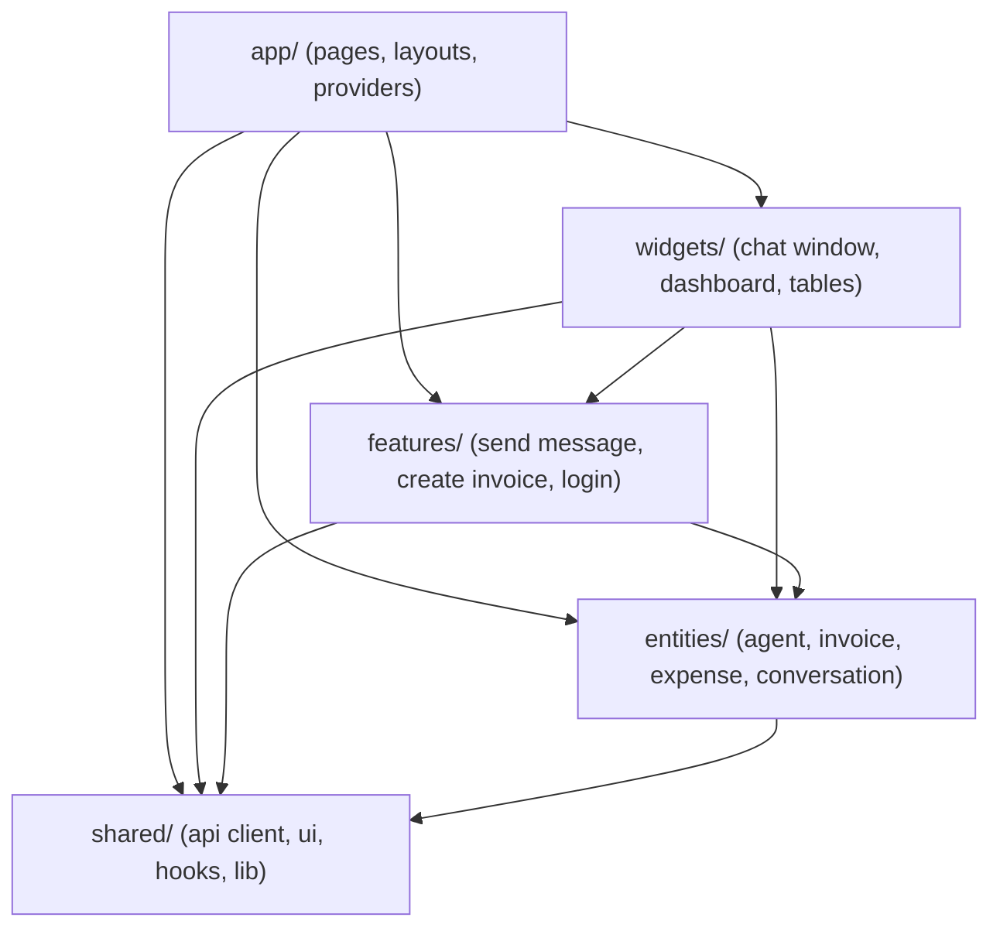
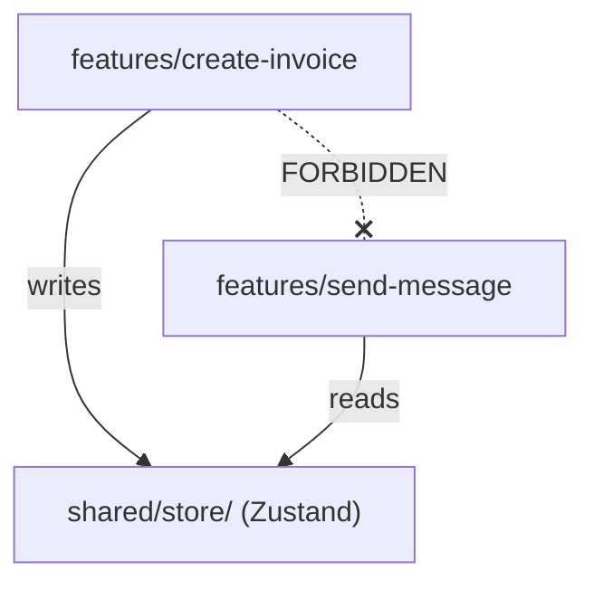
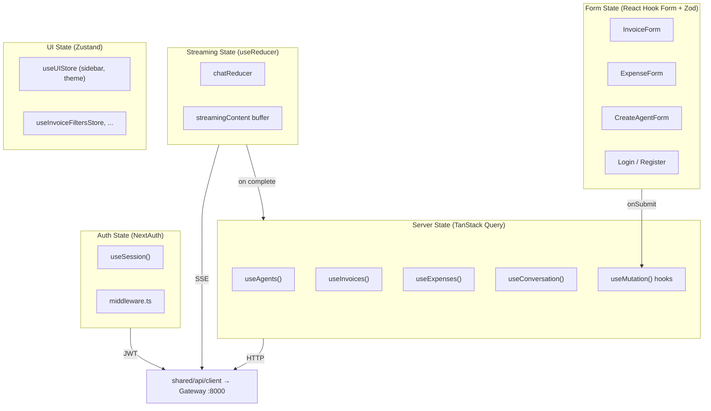
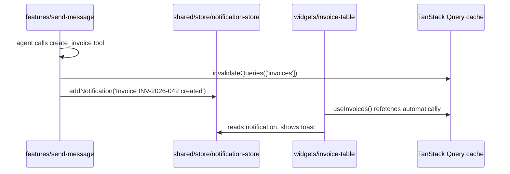
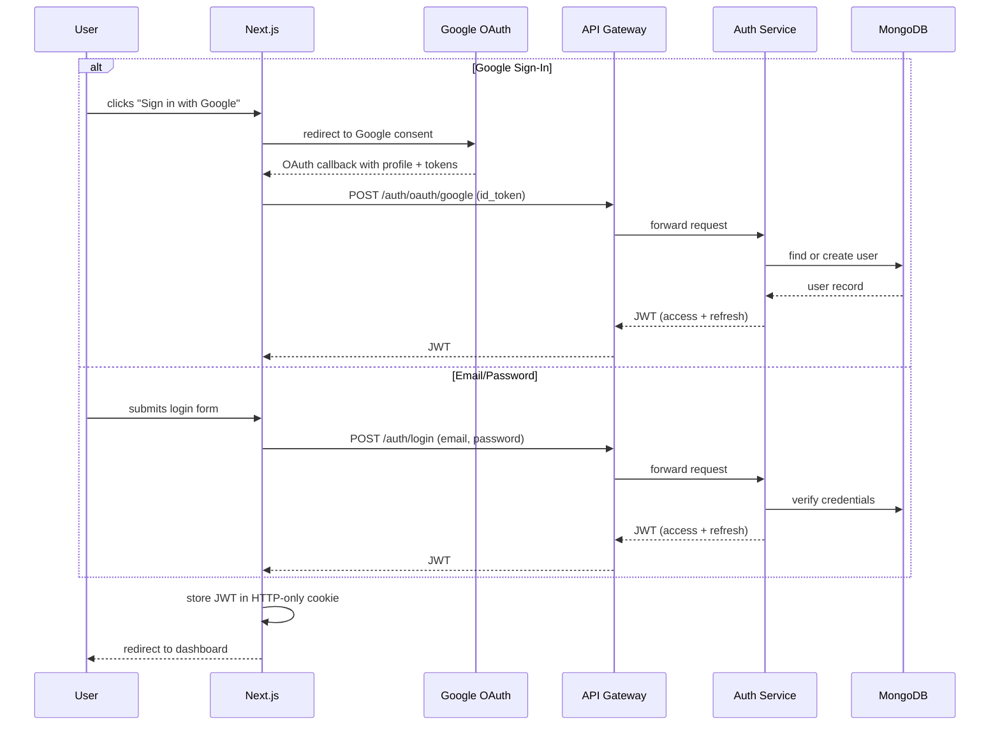
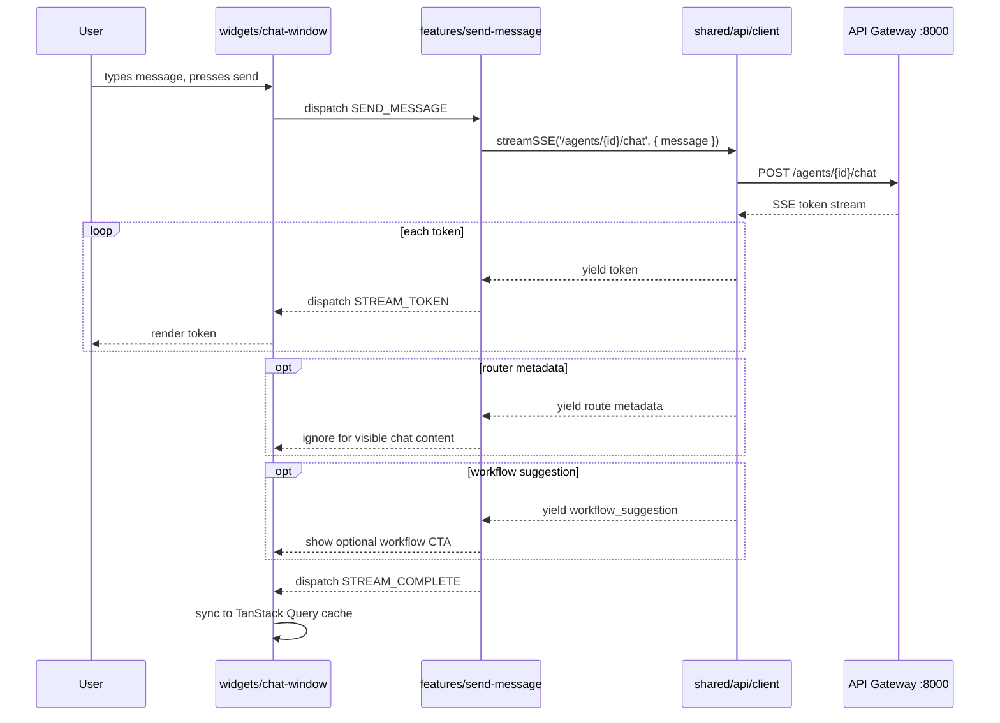

# Frontend Architecture

The frontend is a Next.js 14 application using the App Router. It serves as the single user-facing interface for the agent platform -- auth, agent management, chat, and financial data entry. All backend communication goes through the API Gateway on port 8000.

This document defines the architectural pattern, directory structure, state management strategy, and component rendering approach.

## Current State

The frontend is implemented in `frontend/` as a Next.js 14 App Router application. It uses Feature-Sliced Design, NextAuth credentials/Google providers, TanStack Query, Zustand UI stores, Tailwind/shadcn-style primitives, and fetch-based SSE streaming through the API Gateway.

## Architectural Pattern: Feature-Sliced Design (FSD)

The frontend uses **Feature-Sliced Design** -- a layered architecture that organizes code by business domain with strict dependency rules between layers. This mirrors the backend's layered + domain-separated microservice structure.

### Why FSD

The platform has multiple distinct domains (companies, partners, agents, chat, invoices, expenses, inventory, knowledge base, auth) that each involve data models, API calls, forms, and display components. A flat `components/` folder would quickly become unmanageable. FSD enforces domain boundaries and prevents cross-domain coupling.

| Alternative | Why Not |
|---|---|
| Atomic Design (atoms/molecules/organisms) | Organizes by visual granularity, not business domain. No structure for API calls, state, or business logic. |
| Modular/Feature Folders | Similar intent but lacks strict layering rules. Degrades over time without discipline. |
| MVC/MVVM | Doesn't map well to React's component model. |
| FSD | Domain-separated with strict top-down dependencies. Scales with new agent types and features in Phase 2+. |

### Layer Hierarchy

FSD defines layers with **strict top-down dependency** -- upper layers import from lower layers, never the reverse.

```
Layer 7:  app/           → Next.js App Router (pages, layouts, providers, route handlers)
Layer 6:  (pages/)       → Merged into app/ in Next.js 14 App Router
Layer 5:  widgets/       → Composite UI blocks (dashboard panels, chat window, data tables)
Layer 4:  features/      → User actions (send message, create invoice, login)
Layer 3:  entities/      → Business objects (company, partner, agent, invoice, expense, conversation)
Layer 2:  shared/        → Reusable infrastructure (api client, ui components, hooks, types)
Layer 1:  (external)     → npm packages
```



**Dependency rules:**

- **Top-down only:** `app/ → widgets/ → features/ → entities/ → shared/`. Never backwards.
- **No feature-to-feature imports.** `features/send-message/` never imports from `features/create-invoice/`. `features/create-agent/` never imports from `features/upload-document/`.
- **Cross-feature communication goes through Zustand stores in `shared/store/`.** If two features need to react to each other's state, they both read/write a shared Zustand store -- they never import each other directly.



---

## Directory Structure

```
frontend/src/
├── app/                              # Layer 7: Next.js App Router
│   ├── layout.tsx                    # Root layout (providers, theme, fonts)
│   ├── page.tsx                      # Landing / redirect to dashboard
│   ├── (auth)/
│   │   ├── login/page.tsx
│   │   └── register/page.tsx
│   ├── dashboard/
│   │   ├── layout.tsx                # Protected dashboard shell (sidebar, topbar)
│   │   ├── page.tsx                  # Dashboard home (agent + document overview)
│   │   ├── companies/
│   │   │   └── page.tsx              # Company list + create/update dialogs
│   │   ├── partners/
│   │   │   └── page.tsx              # Partner list + company/kind filters
│   │   ├── agents/
│   │   │   ├── page.tsx              # Agent list + create
│   │   │   └── [id]/
│   │   │       └── page.tsx          # Chat with agent
│   │   ├── invoices/
│   │   │   └── page.tsx              # Invoice list + create form
│   │   ├── expenses/
│   │   │   └── page.tsx              # Expense list + record form
│   │   └── inventory/
│   │       └── page.tsx              # Inventory list + stock controls + import review
│   └── api/
│       └── auth/
│           └── [...nextauth]/route.ts
│
├── widgets/                          # Layer 5: Composite UI blocks
│   ├── chat-window/
│   │   ├── ui/                       # ChatWindow component
│   │   └── model/                    # Chat window local state/logic
│   ├── agent-dashboard/
│   │   └── ui/                       # AgentDashboard (grid of agent cards)
│   ├── invoice-table/
│   │   └── ui/                       # InvoiceTable with sorting/filters
│   ├── company-table/
│   │   └── ui/                       # Company table with update actions
│   ├── partner-table/
│   │   └── ui/                       # Partner table with company/kind filters
│   ├── expense-table/
│   │   └── ui/                       # ExpenseTable with sorting/filters
│   ├── inventory-table/
│   │   └── ui/                       # Inventory item table with stock level badges and filters
│   ├── low-stock-panel/
│   │   └── ui/                       # Low stock alerts grouped by item/location
│   ├── import-preview-table/
│   │   └── ui/                       # Import preview review table with confirm/cancel actions
│   └── sidebar/
│       └── ui/                       # Navigation sidebar
│
├── features/                         # Layer 4: User actions
│   ├── auth/
│   │   ├── login/
│   │   │   └── ui/                   # LoginForm
│   │   └── register/
│   │       └── ui/                   # RegisterForm
│   ├── send-message/
│   │   ├── ui/                       # MessageInput, workflow request/review cards, shared review primitives
│   │   ├── model/                    # Send message logic, SSE parsing schemas, workflow response schemas
│   │   └── api/                      # POST /agents/{id}/chat and Agent workflow endpoints
│   ├── create-agent/
│   │   ├── ui/                       # CreateAgentForm (type picker, LLM config)
│   │   ├── model/                    # Validation logic
│   │   └── api/                      # POST /agents
│   ├── update-agent/
│   │   ├── ui/                       # UpdateAgentForm/Dialog
│   │   ├── model/                    # Validation logic
│   │   └── api/                      # PATCH /agents/:id
│   ├── create-invoice/
│   │   ├── ui/                       # InvoiceForm (dynamic line items, VAT calc)
│   │   ├── model/                    # Invoice creation logic, Zod schema
│   │   └── api/                      # POST /invoices
│   ├── create-inventory-item/
│   │   ├── ui/                       # CreateInventoryItemForm + dialog wrapper
│   │   ├── model/                    # Zod schema for inventory item create/update
│   │   └── api/                      # POST /inventory/items, PATCH /inventory/items/:id
│   ├── record-stock-movement/
│   │   ├── ui/                       # RecordStockMovementForm + dialog wrapper
│   │   ├── model/                    # Movement validation schema
│   │   └── api/                      # POST /inventory/movements
│   ├── inventory-import-review/
│   │   ├── ui/                       # ImportPreviewActions (confirm/cancel)
│   │   └── api/                      # POST /inventory/import-previews/:id/confirm|cancel
│   ├── download-invoice-pdf/
│   │   ├── ui/                       # PDF download button
│   │   └── model/                    # React PDF invoice document
│   ├── create-company/
│   │   ├── ui/                       # Company form/dialog
│   │   ├── model/                    # Zod schema + logo validation
│   │   └── api/                      # POST /companies
│   ├── update-company/
│   │   ├── ui/                       # Update company form
│   │   ├── model/
│   │   └── api/                      # PATCH /companies/:id
│   ├── create-partner/
│   │   ├── ui/                       # Partner form/dialog
│   │   ├── model/
│   │   └── api/                      # POST /partners
│   ├── update-partner/
│   │   ├── ui/
│   │   ├── model/
│   │   └── api/                      # PATCH /partners/:id
│   ├── record-expense/
│   │   ├── ui/                       # ExpenseForm
│   │   ├── model/                    # Expense validation, Zod schema
│   │   └── api/                      # POST /expenses
│   └── upload-document/
│       ├── ui/                       # FileUpload + progress indicator
│       └── api/                      # POST /documents
│
├── entities/                         # Layer 3: Business objects
│   ├── agent/
│   │   ├── ui/                       # AgentCard, AgentTypeBadge
│   │   ├── model/                    # Agent TypeScript types, query keys
│   │   └── api/                      # GET /agents, GET /agents/:id
│   ├── company/
│   │   ├── model/                    # Company TypeScript types, query keys
│   │   └── api/                      # GET /companies, GET /companies/:id
│   ├── partner/
│   │   ├── ui/                       # PartnerSelect
│   │   ├── model/                    # Partner types, query keys
│   │   └── api/                      # GET /partners
│   ├── invoice/
│   │   ├── ui/                       # InvoiceRow, InvoiceStatusBadge, detail dialog
│   │   ├── model/                    # Invoice types, query keys
│   │   └── api/                      # GET /invoices
│   ├── expense/
│   │   ├── ui/                       # ExpenseRow, CategoryBadge
│   │   ├── model/                    # Expense types, query keys
│   │   └── api/                      # GET /expenses
│   ├── inventory/
│   │   ├── ui/                       # InventoryItemRow, StockLevelBadge, MovementTypeBadge
│   │   ├── model/                    # Inventory types, query keys
│   │   └── api/                      # GET /inventory/items, /levels, /movements, /search, /import-previews
│   ├── conversation/
│   │   ├── ui/                       # MessageBubble, MessageList
│   │   ├── model/                    # Conversation types, query keys
│   │   └── api/                      # GET /conversations/:id
│   └── user/
│       ├── model/                    # User types, session state
│       └── api/                      # GET /me
│
├── shared/                           # Layer 2: Reusable infrastructure
│   ├── api/
│   │   ├── client.ts                 # Typed fetch wrapper to API Gateway
│   │   ├── sse.ts                    # Fetch-based SSE stream helper and parser
│   │   └── types.ts                  # API response envelopes, pagination types
│   ├── ui/                           # shadcn/ui components + custom primitives
│   │   ├── button.tsx
│   │   ├── input.tsx
│   │   ├── card.tsx
│   │   ├── dialog.tsx
│   │   ├── data-table.tsx
│   │   └── ...
│   ├── lib/
│   │   ├── auth.ts                   # NextAuth config + helpers
│   │   ├── cn.ts                     # clsx + tailwind-merge utility
│   │   └── format.ts                 # Currency, date, number formatting
│   ├── store/
│   │   ├── ui-store.ts               # Sidebar, theme (persisted)
│   │   ├── invoice-filters-store.ts  # Table filter state
│   │   ├── inventory-filters-store.ts # Inventory table filter state
│   │   ├── chat-store.ts             # Cross-feature: active agent, chat status
│   │   └── notification-store.ts     # Cross-feature: toast/notification queue
│   └── config/
│       └── routes.ts                 # Route path constants
```

### Slice Internal Structure

Every slice within `entities/` and `features/` follows the same sub-structure:

```
entity-or-feature/
├── ui/          # React components (presentational)
├── model/       # Types, Zod schemas, query keys, local state logic
└── api/         # TanStack Query hooks (useQuery, useMutation)
```

This maps to the backend's layered architecture (routes → services → repositories → models) applied to the frontend context.

---

## Mapping to Backend Services

Each backend service maps to specific frontend slices. When a backend domain changes, the affected frontend code is immediately identifiable.

```mermaid
graph LR
    subgraph backend [Backend Services]
        AuthSvc[Auth Service]
        BusinessSvcCompanies[Business Service -- Companies/Partners]
        AgentSvcCRUD[Agent Service -- Agent CRUD]
        AgentSvcChat[Agent Service -- Chat + Document Intake]
        BusinessSvcFin[Business Service -- Invoices/Expenses]
        BusinessSvcInv[Business Service -- Inventory]
        KBSvc[Knowledge Base Service]
    end

    subgraph frontend [Frontend Slices]
        EntUser["entities/user"]
        FeatAuth["features/auth/*"]
        EntCompany["entities/company"]
        EntPartner["entities/partner"]
        FeatCompany["features/create-company + update-company"]
        FeatPartner["features/create-partner + update-partner"]
        EntAgent["entities/agent"]
        FeatAgentCrud["features/create-agent + update-agent"]
        EntConv["entities/conversation"]
        FeatSendMsg["features/send-message"]
        WidgetChat["widgets/chat-window"]
        EntInvoice["entities/invoice"]
        FeatCreateInv["features/create-invoice"]
        FeatDownloadInvPdf["features/download-invoice-pdf"]
        WidgetInvTable["widgets/invoice-table"]
        EntExpense["entities/expense"]
        FeatRecordExp["features/record-expense"]
        WidgetExpTable["widgets/expense-table"]
        EntInventory["entities/inventory"]
        FeatCreateInventory["features/create-inventory-item"]
        FeatRecordMovement["features/record-stock-movement"]
        FeatImportReview["features/inventory-import-review"]
        WidgetInventoryTable["widgets/inventory-table"]
        WidgetLowStock["widgets/low-stock-panel"]
        WidgetImportPreview["widgets/import-preview-table"]
        FeatUploadDoc["features/upload-document"]
    end

    AuthSvc --> EntUser
    AuthSvc --> FeatAuth
    BusinessSvcCompanies --> EntCompany
    BusinessSvcCompanies --> EntPartner
    BusinessSvcCompanies --> FeatCompany
    BusinessSvcCompanies --> FeatPartner
    AgentSvcCRUD --> EntAgent
    AgentSvcCRUD --> FeatAgentCrud
    AgentSvcChat --> EntConv
    AgentSvcChat --> FeatSendMsg
    AgentSvcChat --> WidgetChat
    BusinessSvcFin --> EntInvoice
    BusinessSvcFin --> FeatCreateInv
    BusinessSvcFin --> FeatDownloadInvPdf
    BusinessSvcFin --> WidgetInvTable
    BusinessSvcFin --> EntExpense
    BusinessSvcFin --> FeatRecordExp
    BusinessSvcFin --> WidgetExpTable
    BusinessSvcInv --> EntInventory
    BusinessSvcInv --> FeatCreateInventory
    BusinessSvcInv --> FeatRecordMovement
    BusinessSvcInv --> FeatImportReview
    BusinessSvcInv --> WidgetInventoryTable
    BusinessSvcInv --> WidgetLowStock
    BusinessSvcInv --> WidgetImportPreview
    KBSvc --> FeatUploadDoc
```



| Backend Service | Frontend Slices |
|---|---|
| Auth Service | `entities/user` + `features/auth/*` |
| Business Service (Companies/Partners) | `entities/company` + `entities/partner` + `features/create-company` + `features/update-company` + `features/create-partner` + `features/update-partner` + `widgets/company-table` + `widgets/partner-table` |
| Agent Service (CRUD) | `entities/agent` + `features/create-agent` + `features/update-agent` |
| Agent Service (Chat + Document Intake) | `entities/conversation` + `features/send-message` + `widgets/chat-window` |
| Business Service (Invoices/Expenses) | `entities/invoice` + `features/create-invoice` + `features/download-invoice-pdf` + `widgets/invoice-table` + `entities/expense` + `features/record-expense` + `widgets/expense-table` |
| Business Service (Inventory) | `entities/inventory` + `features/create-inventory-item` + `features/record-stock-movement` + `features/inventory-import-review` + `widgets/inventory-table` + `widgets/low-stock-panel` + `widgets/import-preview-table` |
| Knowledge Base Service | `features/upload-document` using selected `company_id` |
| API Gateway | `shared/api/client.ts` (single entry point for all HTTP calls) |

---

## State Management

The frontend has five distinct categories of state. Each uses a different tool -- no single global store.



### 1. Server State -- TanStack Query

All data owned by the backend (agents, invoices, expenses, conversations, user profile) is managed by TanStack Query. It handles caching, background refetching, pagination, optimistic updates, and request deduplication.

**Query hooks** live in `entities/*/api/`:

```typescript
// entities/agent/api/queries.ts
export const agentKeys = {
  all: ['agents'] as const,
  detail: (id: string) => ['agents', id] as const,
};

export function useAgents() {
  return useQuery({
    queryKey: agentKeys.all,
    queryFn: () => apiClient.get<Agent[]>('/agents'),
    staleTime: 30_000,
  });
}

export function useAgent(id: string) {
  return useQuery({
    queryKey: agentKeys.detail(id),
    queryFn: () => apiClient.get<Agent>(`/agents/${id}`),
  });
}
```

**Mutation hooks** live in `features/*/api/`:

```typescript
// features/create-invoice/api/mutations.ts
export function useCreateInvoice() {
  const queryClient = useQueryClient();

  return useMutation({
    mutationFn: (data: CreateInvoiceInput) =>
      apiClient.post<Invoice>('/invoices', data),
    onSuccess: () => {
      queryClient.invalidateQueries({ queryKey: invoiceKeys.all });
    },
  });
}
```

**Why not Redux or Zustand for server state:** TanStack Query eliminates the need for manual cache management, loading states, error states, and refetch logic. Redux would require writing actions, reducers, and thunks to replicate what TanStack Query does out of the box. The app's state is ~90% server-owned data.

### 2. Streaming State -- useReducer + SSE Hook

Chat token streaming via SSE needs a dedicated state machine scoped to the chat window. Tokens arrive at high frequency and must be appended to a buffer, then committed as a complete message when the stream ends. The same reducer also owns upload-review workflow phases for document intake (`receipt_expense_review`, `supplier_invoice_inventory_review`, `supplier_invoice_expense_review`, `unknown_document_review`) and inventory-backed sales invoice workflow phases. This is not server state (ephemeral, not cached) and not simple UI state (has complex transitions).

A `useReducer` scoped to `widgets/chat-window/` handles this:

```typescript
// widgets/chat-window/model/chat-reducer.ts
type ChatState = {
  messages: Message[];
  streamingContent: string;
  status: 'idle' | 'streaming' | 'error';
};

type ChatAction =
  | { type: 'SEND_MESSAGE'; payload: string }
  | { type: 'STREAM_TOKEN'; payload: string }
  | { type: 'STREAM_COMPLETE' }
  | { type: 'STREAM_ERROR'; payload: string }
  | { type: 'LOAD_HISTORY'; payload: Message[] };

function chatReducer(state: ChatState, action: ChatAction): ChatState {
  switch (action.type) {
    case 'SEND_MESSAGE':
      return {
        ...state,
        messages: [...state.messages, { role: 'user', content: action.payload }],
        streamingContent: '',
        status: 'streaming',
      };
    case 'STREAM_TOKEN':
      return {
        ...state,
        streamingContent: state.streamingContent + action.payload,
      };
    case 'STREAM_COMPLETE':
      return {
        ...state,
        messages: [
          ...state.messages,
          { role: 'assistant', content: state.streamingContent },
        ],
        streamingContent: '',
        status: 'idle',
      };
    case 'STREAM_ERROR':
      return { ...state, status: 'error', streamingContent: '' };
    case 'LOAD_HISTORY':
      return { ...state, messages: action.payload, status: 'idle' };
  }
}
```

When streaming completes, the finalized message is also written to the TanStack Query cache (conversation history) so it persists across navigations without a refetch. Chat history is scoped by the agent's selected company: `widgets/chat-window` opens in a fresh state (no implicit latest-history restore), fetches scoped conversation summaries for the history menu via `GET /conversations?agent_id=...&company_id=...&limit=20`, and loads full history only when the user explicitly selects a conversation. `shared/store/chat-store.ts` keeps the currently opened conversation id by `agentId:companyId`.

Document uploads in the same chat widget call `POST /agents/{agent_id}/document-intake` with `requested_type`. Supplier invoices with extracted item lines require two explicit actions in order: confirm inventory preview through `POST /agents/{agent_id}/document-intake/supplier-invoice/inventory-imports/confirm`, then confirm the expense through `POST /agents/{agent_id}/expenses/confirm`.

Sales invoice workflows keep a generic `activeWorkflow` slot plus sales-prefixed compatibility fields while the first workflow is being introduced. The active slot records the workflow name, step (`loading_inventory`, `inventory_review`, `invoice_review`, `created`, or `error`), payload, and error. New workflows should extend the generic slot and reducer action shape before adding another full set of workflow-specific fields.

The sales invoice workflow UI is split between `features/send-message` and `widgets/chat-window`: Zod schemas mirror Agent response unions, API helpers call the three `/invoice-workflows/sales-inventory/*` endpoints, reusable `InventoryReviewWarnings`/`WorkflowReviewActions` primitives keep review cards consistent, and `ChatWindow` owns mutation sequencing plus TanStack Query invalidation for invoices, inventory, partners, and conversation history.

The generic SSE parser in `shared/api/sse.ts` uses `fetch()` with `Accept: text/event-stream`, which allows authenticated POST streams to `POST /agents/{id}/chat`. The parser accepts `conversation`, `start`, `token`, `route`, `workflow_suggestion`, `done`, and `error` events and skips unknown event names. The chat widget dispatches visible actions for token/error/done events, tolerates router `route` metadata without adding a visible message, and renders valid `sales_invoice_inventory` suggestions as optional CTA cards. Dismissing a suggestion does not call preview; starting one calls preview only after the user explicitly confirms or completes the request dialog.

### 3. Form State -- React Hook Form + Zod

All forms (create company, update company, create partner, update partner, create invoice, record expense, create agent, login, register) use React Hook Form with Zod schema validation. Form state is ephemeral -- it lives and dies with the form component.

```typescript
// features/create-invoice/model/schema.ts
const lineItemSchema = z.object({
  description: z.string().min(1),
  quantity: z.number().positive(),
  unit: z.enum(['hours', 'pieces', 'units']),
  unit_price: z.number().positive(),
  vat_rate: z.number().min(0).max(100),
});

export const createInvoiceSchema = z.object({
  counterparty: z.string().min(1),
  description: z.string().optional(),
  items: z.array(lineItemSchema).min(1),
  currency: z.enum(['EUR', 'USD']),
  category: z.string(),
  date: z.string(),
  due_date: z.string(),
});

export type CreateInvoiceInput = z.infer<typeof createInvoiceSchema>;
```

Zod schemas serve as the single source of truth for both runtime validation and TypeScript type inference. The `zodResolver` adapter bridges Zod with React Hook Form.

### 4. Client UI State -- Zustand

Cross-cutting UI concerns that don't involve the backend (sidebar toggle, theme preference, active filters on tables) use Zustand. Each domain gets its own small store in `shared/store/`, keeping state modular and co-located with the concerns it serves.

```typescript
// shared/store/ui-store.ts
import { create } from 'zustand';
import { persist } from 'zustand/middleware';

interface UIState {
  sidebarOpen: boolean;
  toggleSidebar: () => void;
  theme: 'light' | 'dark' | 'system';
  setTheme: (theme: 'light' | 'dark' | 'system') => void;
}

export const useUIStore = create<UIState>()(
  persist(
    (set) => ({
      sidebarOpen: true,
      toggleSidebar: () => set((s) => ({ sidebarOpen: !s.sidebarOpen })),
      theme: 'system',
      setTheme: (theme) => set({ theme }),
    }),
    { name: 'ui-preferences' },
  ),
);
```

```typescript
// shared/store/invoice-filters-store.ts
import { create } from 'zustand';

interface InvoiceFiltersState {
  status: string | null;
  dateRange: { from: string; to: string } | null;
  search: string;
  setStatus: (status: string | null) => void;
  setDateRange: (range: { from: string; to: string } | null) => void;
  setSearch: (search: string) => void;
  resetFilters: () => void;
}

export const useInvoiceFiltersStore = create<InvoiceFiltersState>((set) => ({
  status: null,
  dateRange: null,
  search: '',
  setStatus: (status) => set({ status }),
  setDateRange: (dateRange) => set({ dateRange }),
  setSearch: (search) => set({ search }),
  resetFilters: () => set({ status: null, dateRange: null, search: '' }),
}));
```

**Why Zustand over React Context:**

- **No provider nesting** -- Zustand stores are consumed via hooks without wrapping the tree in providers. This avoids the deeply nested provider stack that Context requires.
- **Selective re-renders** -- components subscribe to specific slices of state via selectors (`useUIStore(s => s.sidebarOpen)`), preventing unnecessary re-renders. Context re-renders every consumer when any value changes.
- **Persistence built in** -- the `persist` middleware saves UI preferences (sidebar state, theme) to `localStorage` automatically. Context would need manual `useEffect` + `localStorage` wiring.
- **Scales to Phase 3** -- when the agent marketplace adds complex filter combinations, drag-and-drop, and multi-select state, Zustand handles it without architectural changes.

### Cross-Feature Communication via Zustand

Features never import from other features. When two features need to coordinate, they communicate through a shared Zustand store in `shared/store/`. Each feature reads or writes to the store independently -- neither knows the other exists.

#### Example: Invoice Created via Chat

When the agent creates an invoice during a chat conversation, the chat feature and the invoice list need to stay in sync. Without this pattern, `features/send-message/` would need to import from `features/create-invoice/` -- violating the dependency rule.



The chat feature invalidates the TanStack Query cache (which triggers the invoice table to refetch) and pushes a notification to the store. The invoice table and toast component subscribe to the store. No feature imports another feature.

#### Example: Active Agent Context

Multiple features need to know which agent is currently selected (chat, document upload, financial forms). Instead of passing the agent ID through props from the page or importing between features, all features read from a shared store:

```typescript
// shared/store/chat-store.ts
import { create } from 'zustand';

interface ChatStore {
  conversationByScope: Record<string, string | null | undefined>;
  getConversationId: (agentId: string, companyId?: string | null) => string | null;
  setConversationId: (
    agentId: string,
    companyId: string | null | undefined,
    conversationId: string | null,
  ) => void;
}

export const useChatStore = create<ChatStore>((set, get) => ({
  conversationByScope: {},
  getConversationId: (agentId, companyId) =>
    get().conversationByScope[`${agentId}:${companyId ?? 'unassigned'}`] ?? null,
  setConversationId: (agentId, companyId, conversationId) =>
    set((state) => ({
      conversationByScope: {
        ...state.conversationByScope,
        [`${agentId}:${companyId ?? 'unassigned'}`]: conversationId,
      },
    })),
}));
```

```typescript
// shared/store/notification-store.ts
import { create } from 'zustand';

interface Notification {
  id: string;
  message: string;
  type: 'success' | 'error' | 'info';
}

interface NotificationStore {
  notifications: Notification[];
  addNotification: (message: string, type?: Notification['type']) => void;
  dismissNotification: (id: string) => void;
}

export const useNotificationStore = create<NotificationStore>((set) => ({
  notifications: [],
  addNotification: (message, type = 'info') =>
    set((s) => ({
      notifications: [
        ...s.notifications,
        { id: crypto.randomUUID(), message, type },
      ],
    })),
  dismissNotification: (id) =>
    set((s) => ({
      notifications: s.notifications.filter((n) => n.id !== id),
    })),
}));
```

#### Rules for Cross-Feature Stores

1. **Stores live in `shared/store/`** -- never inside a feature or entity slice.
2. **Features write to stores, widgets and features read from them.** A feature that produces data writes; any feature or widget that needs that data subscribes.
3. **Keep stores small and focused.** One store per cross-cutting concern (`chat-store`, `notification-store`), not one giant store.
4. **Prefer TanStack Query invalidation for server data sync.** If two features just need the same backend data to stay fresh, invalidating the query cache is simpler than a store. Use Zustand stores for client-side coordination that has no backend equivalent (notifications, active selection, UI mode).

### 5. Auth State -- NextAuth

Authentication is handled by NextAuth.js with two providers: **Google OAuth** and **Credentials** (email/password). The JWT is stored in an HTTP-only cookie. Components access session data via `useSession()`.

#### Auth Flow



#### NextAuth Configuration

```typescript
// shared/lib/auth.ts
export const authOptions: NextAuthOptions = {
  providers: [
    GoogleProvider({
      clientId: process.env.GOOGLE_CLIENT_ID!,
      clientSecret: process.env.GOOGLE_CLIENT_SECRET!,
    }),
    CredentialsProvider({
      async authorize(credentials) {
        const res = await fetch(`${GATEWAY_URL}/auth/login`, {
          method: 'POST',
          body: JSON.stringify(credentials),
          headers: { 'Content-Type': 'application/json' },
        });
        const user = await res.json();
        if (res.ok && user) return user;
        return null;
      },
    }),
  ],
  callbacks: {
    async signIn({ user, account }) {
      if (account?.provider === 'google') {
        const res = await fetch(`${GATEWAY_URL}/auth/oauth/google`, {
          method: 'POST',
          body: JSON.stringify({
            id_token: account.id_token,
          }),
          headers: { 'Content-Type': 'application/json' },
        });
        if (!res.ok) return false;
        const data = await res.json();
        user.accessToken = data.access_token;
      }
      return true;
    },
    async jwt({ token, user, account }) {
      if (user) token.accessToken = user.accessToken;
      if (account?.provider === 'google') token.provider = 'google';
      return token;
    },
    async session({ session, token }) {
      session.accessToken = token.accessToken;
      session.provider = token.provider;
      return session;
    },
  },
};
```

#### How Google OAuth Integrates with the Auth Service

NextAuth handles the OAuth handshake with Google on the frontend side (redirect, consent screen, token exchange). Once Google returns an ID token, the frontend sends it to the Auth Service via `POST /auth/oauth/google`. The Auth Service then:

1. Verifies the ID token with Google and extracts `sub`, `email`, `name`, and `picture`.
2. Checks if a user with that `google_id` (`sub`) already exists in MongoDB.
3. If yes -- returns a JWT for the existing user.
4. If no -- creates a new user record (no password needed) and returns a JWT.
5. If an email-based account already exists -- links the Google identity to it (account merging).

This keeps all user creation and JWT issuance in the Auth Service. NextAuth never writes directly to MongoDB -- it only talks to the backend through the API Gateway.

#### Login UI

The login page offers both options:

```
┌─────────────────────────────────┐
│         Sign in to Agent        │
│                                 │
│  ┌───────────────────────────┐  │
│  │   🔵 Continue with Google │  │
│  └───────────────────────────┘  │
│                                 │
│  ──────── or ────────           │
│                                 │
│  Email:    [________________]   │
│  Password: [________________]   │
│                                 │
│  ┌───────────────────────────┐  │
│  │          Sign In          │  │
│  └───────────────────────────┘  │
│                                 │
│  Don't have an account? Sign up │
└─────────────────────────────────┘
```

Route protection is enforced by Next.js middleware that checks for a valid session before allowing access to `(dashboard)/*` routes. The middleware is provider-agnostic -- it only checks for a valid JWT regardless of whether the user signed in with Google or email/password.

### State Management Summary

| Category | Tool | Scope | Location |
|---|---|---|---|
| Server state | TanStack Query | Global cache | `entities/*/api/`, `features/*/api/` |
| Streaming state | useReducer | Chat widget | `widgets/chat-window/model/` |
| Form state | React Hook Form + Zod | Per-form | `features/*/ui/`, `features/*/model/` |
| Client UI state | Zustand | Cross-cutting | `shared/store/` |
| Auth state | NextAuth `useSession()` | Global | `shared/lib/auth.ts` |

### What Is Not Used

| Tool | Reason |
|---|---|
| Redux | Excessive boilerplate for what TanStack Query + Zustand already covers. Redux is justified for complex client-only state (collaborative editors, real-time multiplayer). This app's state is server-owned. |
| Jotai / Recoil | Atomic state management shines in highly interconnected state graphs. This app's state is domain-separated, not atomic. |
| React Context (for UI state) | Zustand provides selective re-renders, built-in persistence, and no provider nesting. Context re-renders all consumers on any change and requires manual localStorage wiring. |
| Global store for chat | The streaming buffer is ephemeral and scoped to one component tree. A global store adds indirection with no benefit. |

---

## Architectural Patterns

### 1. Facade Pattern -- API Client

A single `shared/api/client.ts` wraps all HTTP calls to the API Gateway. Every `entities/*/api/` and `features/*/api/` module uses this client -- never raw `fetch`. This mirrors the backend's Repository pattern: one place to handle auth headers, base URL, error handling, and response parsing.

```typescript
// shared/api/client.ts
class ApiClient {
  private baseUrl: string;
  private getToken: () => Promise<string | null>;

  async get<T>(path: string, params?: Record<string, string>): Promise<T> { ... }
  async post<T>(path: string, body: unknown): Promise<T> { ... }
  async put<T>(path: string, body: unknown): Promise<T> { ... }
  async delete(path: string): Promise<void> { ... }
  streamSSE(path: string, body: unknown): AsyncGenerator<string> { ... }
}

export const apiClient = new ApiClient({
  baseUrl: process.env.NEXT_PUBLIC_GATEWAY_URL,
  getToken: () => getSession().then(s => s?.accessToken ?? null),
});
```

### 2. Observer Pattern -- SSE Streaming

Chat responses stream token-by-token from the Agent Service through the API Gateway via SSE. The `features/send-message/` layer initiates the authenticated fetch stream; `shared/api/sse.ts` parses SSE frames; `widgets/chat-window/` renders tokens incrementally.



### 3. Provider Pattern -- App Shell

The root `app/layout.tsx` wraps the app in providers for auth and data fetching. UI state (sidebar, theme) is handled by Zustand stores outside the provider tree -- no additional nesting needed.

```
app/layout.tsx
└── SessionProvider (NextAuth)
    └── QueryClientProvider (TanStack Query)
        └── {children}

Zustand stores (no providers needed):
  useUIStore              → sidebar, theme (persisted to localStorage)
  useInvoiceFiltersStore  → table filters
  useChatStore            → active agent/conversation (cross-feature)
  useNotificationStore    → toast/notification queue (cross-feature)
```

### 4. Container/Presentational Split

- **`app/` pages** are containers -- they compose widgets and features, handle Server Component data fetching, and pass data down as props.
- **`widgets/`** are composite presentational blocks -- they assemble entity UI and feature UI into cohesive panels (chat window = message list + message input + streaming state).
- **`entities/*/ui/`** are pure presentational components -- they receive data via props and render it (`AgentCard`, `InvoiceRow`, `MessageBubble`).
- **`features/*/ui/`** are interactive -- they own forms, mutations, and user-triggered side effects.

### 5. Composition Pattern -- Widget Assembly

Widgets compose entities and features without owning business logic:

```
widgets/chat-window/
├── uses entities/conversation/ui/MessageList
├── uses entities/conversation/ui/MessageBubble
├── uses features/send-message/ui/MessageInput
├── owns chat-reducer (streaming state machine)
└── renders the complete chat experience
```

```
widgets/invoice-table/
├── uses entities/invoice/ui/InvoiceDetailDialog
├── uses entities/invoice/ui/InvoiceStatusBadge
├── uses entities/invoice/api/useInvoices and useInvoice
├── uses features/download-invoice-pdf/ui/DownloadInvoicePdfButton
├── uses shared/ui/data-table
└── renders filterable invoice list, invoice detail popup, and PDF download action
```

---

## Server Components vs Client Components

Next.js App Router defaults to Server Components. The strategy is: render on the server wherever possible, drop to Client Components only for interactivity.

| Layer | Default Rendering | Rationale |
|---|---|---|
| `app/` pages | Server Component | Fetch initial data on the server, pass to children as props |
| `app/` layouts | Server Component | Static shell (sidebar, topbar), no client interactivity |
| `widgets/` | Client Component | Interactive composites (chat, tables with sorting/filtering) |
| `features/` | Client Component | User interactions, form state, mutations, event handlers |
| `entities/*/ui/` | Server or Client | Read-only display (AgentCard) = Server; interactive = Client |
| `shared/ui/` | Client Component | shadcn/ui components use browser APIs |

### Server Component Data Fetching

Dashboard pages fetch initial data as Server Components and pass it to client widgets as props:

```typescript
// app/(dashboard)/invoices/page.tsx -- Server Component
export default async function InvoicesPage() {
  const session = await getServerSession(authOptions);
  const invoices = await fetchInvoices(session.accessToken);

  return (
    <div>
      <InvoiceTable initialData={invoices} />
      <CreateInvoiceDialog />
    </div>
  );
}
```

The `InvoiceTable` widget (Client Component) uses `initialData` to hydrate TanStack Query's cache on first render, avoiding a loading spinner. Subsequent interactions (sorting, filtering, pagination) trigger client-side queries.

---

## Technology Stack

| Concern | Technology | Rationale |
|---|---|---|
| Framework | Next.js 14, App Router | SSR, API routes for NextAuth, Server Components |
| Styling | Tailwind CSS | Utility-first, pairs with shadcn/ui |
| Components | shadcn/ui | Accessible, composable, Tailwind-native components |
| Server state | TanStack Query v5 | Caching, mutations, pagination, optimistic updates |
| Form state | React Hook Form + Zod | Validation, dynamic fields, type inference |
| Auth | NextAuth.js (Google OAuth + credentials) | Google sign-in + email/password, both backed by Auth Service |
| Streaming | Fetch-based SSE parser | Authenticated POST streaming and token-by-token chat rendering from Agent Service |
| HTTP client | Custom ApiClient (fetch wrapper) | Typed, auth-aware, SSE-capable |
| Icons | Lucide React | Consistent icon set, tree-shakable |

### Dependencies

```
@tanstack/react-query       → server state management
zustand                     → client UI state management (sidebar, theme, filters)
react-hook-form             → form state management
zod                         → schema validation (shared with TypeScript types)
@hookform/resolvers         → zod ↔ react-hook-form bridge
next-auth                   → authentication (session, JWT, middleware)
tailwindcss                 → utility-first styling
class-variance-authority    → component variant management (shadcn)
clsx + tailwind-merge       → conditional class composition
lucide-react                → icons
```

---

## Phased Frontend Evolution

### Phase 1 (implemented)

- Created the Next.js app shell and Docker standalone runtime.
- Added login/register using the Auth Service through the API Gateway.
- Added protected dashboard, agent, chat, invoice, expense, and document upload screens.
- Added company and partner management screens, company selectors in agent/invoice/document workflows, and Bulgarian invoice PDF rendering from invoice snapshots.
- Established FSD structure with entity, feature, widget, and shared slices.

### Phase 2

- Added inventory management UI slices:
  - `entities/inventory` query hooks/types/badges for item, stock level, movement, search, and import preview reads
  - `features/create-inventory-item`, `features/record-stock-movement`, and `features/inventory-import-review` for inventory writes and review actions
  - `widgets/inventory-table`, `widgets/low-stock-panel`, and `widgets/import-preview-table`
  - `app/dashboard/inventory/page.tsx` and sidebar navigation route for inventory operations
- Added optional inventory linking fields to invoice line items in `features/create-invoice` so invoice lines can reference item/location context.
- Invoice line-item inventory linking now uses debounced server-side `POST /inventory/search` (minimum 2 characters, stock-aware results) instead of preloading full inventory item lists, which keeps invoice create UX responsive for large catalogs.
- Router is available in `features/create-agent` as a selectable agent type. Selecting Router from the untouched default lowers temperature to `0.1`, and the company helper text explains that router delegation is limited to compatible company scope.
- Chat SSE handling accepts optional router `route` metadata and `workflow_suggestion` events. Route metadata stays out of visible messages; valid workflow suggestions render optional CTAs.
- Added inventory-backed sales invoice workflow UI under `features/send-message` and `widgets/chat-window`, including manual kickoff, Router suggestion prefill, inventory review, invoice draft review, final confirmation, and query invalidation after Business creates the draft invoice.
- Added shared chat workflow review primitives in `features/send-message/ui/inventory-review-primitives.tsx`. They are intentionally small and should be reused by review cards that need warning display and confirm/cancel actions.

### Phase 3

- `entities/marketplace/` -- new entity slice for agent catalog
- `features/hire-agent/` -- new feature for browsing and hiring agents
- `widgets/agent-marketplace/` -- grid/list view of available agents
- Additional Zustand stores for marketplace-specific UI state (filters, drag-and-drop, multi-select)

### Phase 4

- `entities/billing/` -- usage tracking, subscription data
- `widgets/analytics-dashboard/` -- charts, reports
- `features/manage-subscription/` -- billing management
