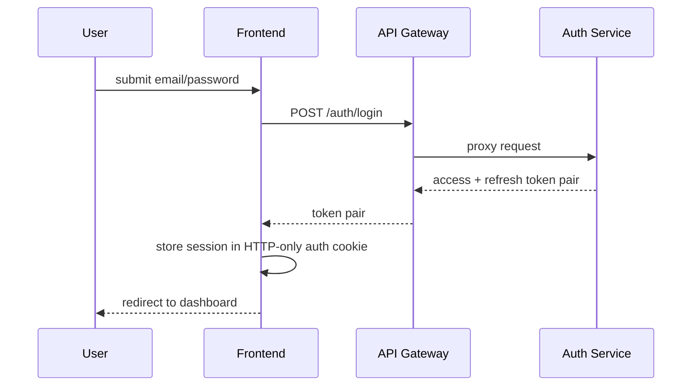
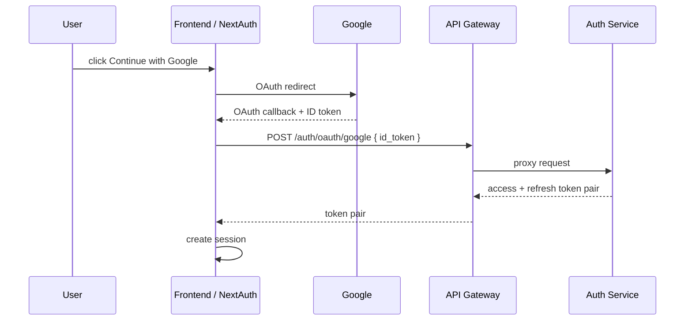
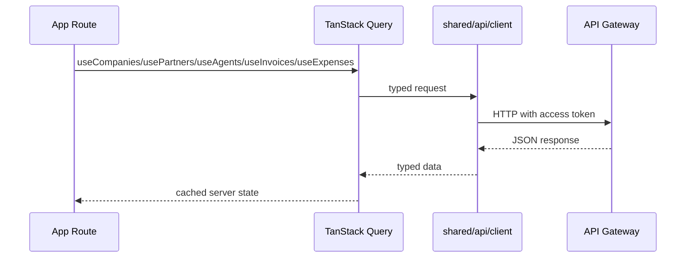
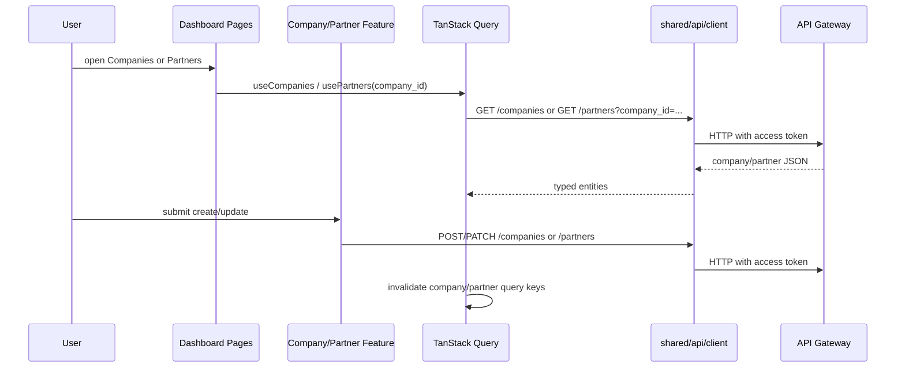
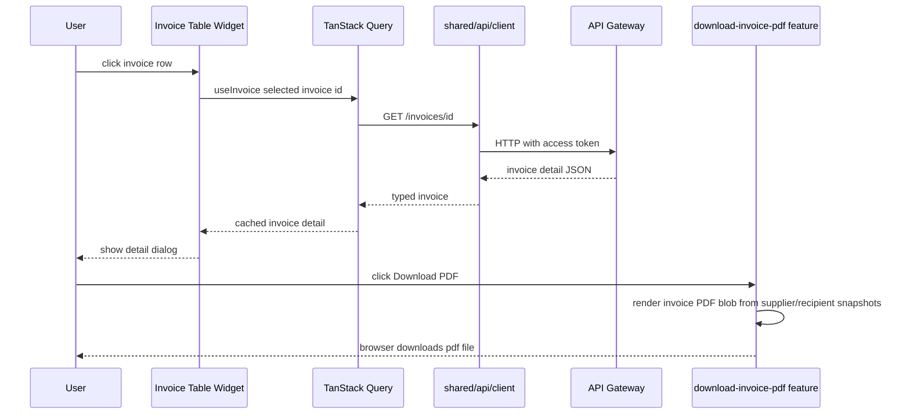
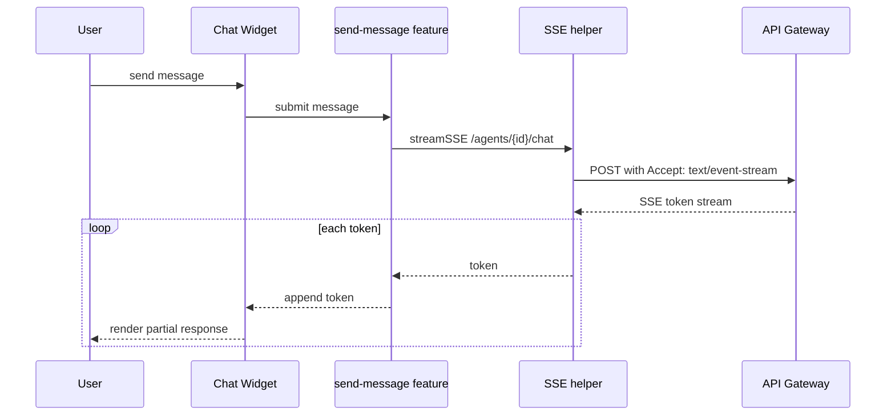
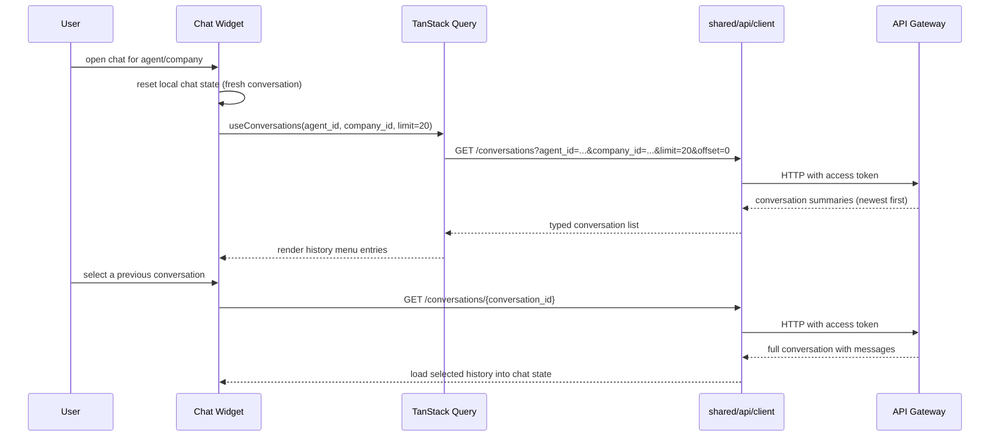
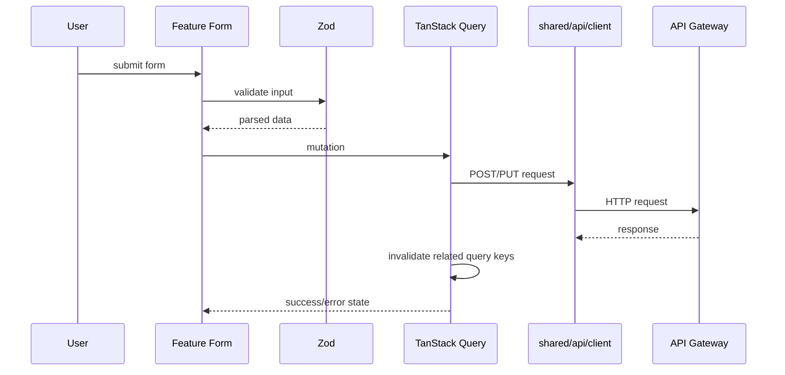
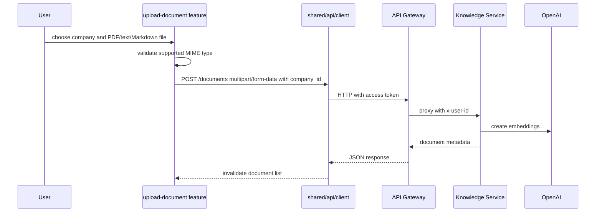

# Frontend Data Flow

## Current State

Docker Compose publishes the frontend on `http://localhost:3010` (container port 3000). `npm run dev` listens on `http://localhost:3000`. Browser requests use `NEXT_PUBLIC_GATEWAY_URL` (`/gateway-api` by default), which Next.js rewrites to `GATEWAY_URL`. From the host, the gateway is `http://localhost:8010` (container port 8000). On the droplet those URLs are `http://159.89.26.67:3010` and `http://159.89.26.67:8010`. The gateway allows the frontend origins in `CORS_ORIGINS` and proxies authenticated requests to internal services.

## Authentication Flow

## Google Sign-In Flow

## Server State Flow

## Company And Partner Flow

Companies are the issuer profiles used by agents, invoices, and document uploads. Partners are selected under a company and reused by the invoice form. Query keys include the selected `company_id` so partner and invoice/document lists do not bleed between companies.

## Invoice Detail And PDF Download Flow

The invoice table owns selected invoice UI state. Full invoice data still comes from `entities/invoice/api/useInvoice`, while the direct PDF download side effect is isolated in `features/download-invoice-pdf/` so entity UI remains reusable and feature side effects stay in the feature layer. PDFs render historical `supplier_snapshot` and `recipient_snapshot` values instead of fetching live company/partner records.

## Chat Streaming Flow

The stream is implemented with `fetch()` rather than `EventSource` because chat uses authenticated `POST /agents/{id}/chat`. The gateway keeps the upstream `httpx` stream open until the downstream browser stream completes.

Opening the chat widget now starts a fresh conversation by default. Previous conversations are listed in a scoped history menu, and persisted messages are loaded only after an explicit user selection.

## Conversation History Reopen Flow

## Form Mutation Flow

## Document Upload Flow

Uploads require a selected company and a valid `OPENAI_API_KEY` because ingestion validates `company_id`, embeds chunks, and stores uploaded chunk metadata before the document reaches `ready` status. Without a key, the upload request reaches the Knowledge Service but fails during embedding.

## State Ownership

| State | Owner |
|-------|-------|
| Backend records | TanStack Query |
| Forms | React Hook Form + Zod |
| Selected company in forms/lists | Component state plus company-scoped query keys |
| Chat streaming buffer | Chat widget reducer |
| Session | NextAuth |
| UI preferences/filter state | Zustand stores |
