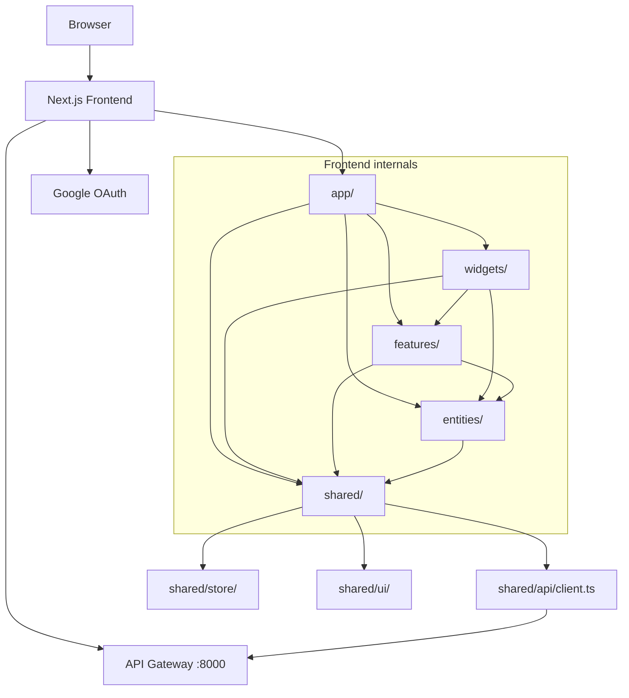

# Frontend Dependency Graph

## Current State

The frontend is implemented in `frontend/`. This graph documents the active dependency direction and external runtime dependencies.

## Target Dependency Graph



## External Dependencies

| Dependency | Status | Purpose |
|------------|--------|---------|
| API Gateway | Implemented | Single backend API entry point |
| Google OAuth | Optional | Google sign-in through NextAuth when OAuth env vars are configured |
| Next.js | Implemented | App framework and standalone Docker runtime |
| NextAuth.js | Implemented | Session and provider integration |
| TanStack Query | Implemented | Server state cache |
| Zustand | Implemented | Client UI and cross-feature state |
| React Hook Form + Zod | Implemented | Forms and validation |
| Tailwind + shadcn/ui primitives | Implemented | Styling and UI components |

## Internal Dependency Rules

```text
app/ -> widgets/ -> features/ -> entities/ -> shared/
```

Rules:

- `features/*` must not import from other `features/*`.
- Backend calls must go through `shared/api/client.ts`.
- Cross-feature coordination must go through `shared/store/`.
- Prefer React Server Components; use `"use client"` only for interactivity.
