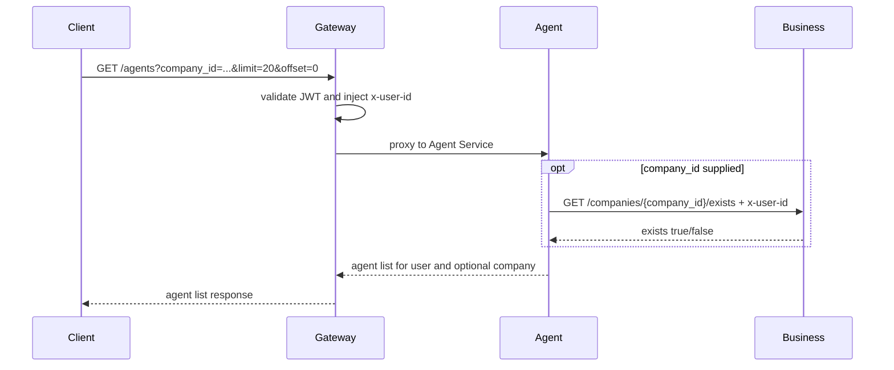
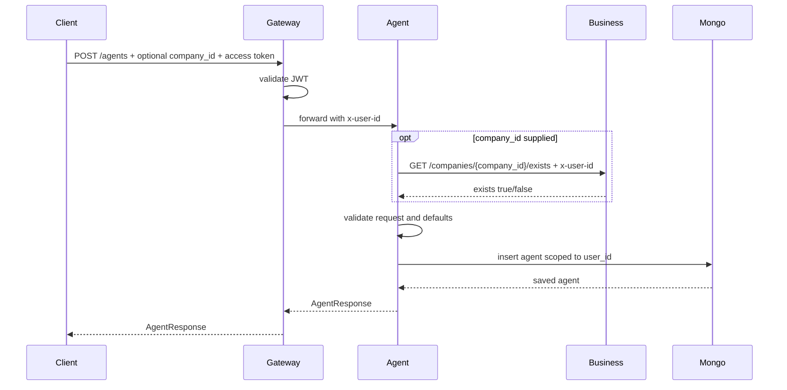
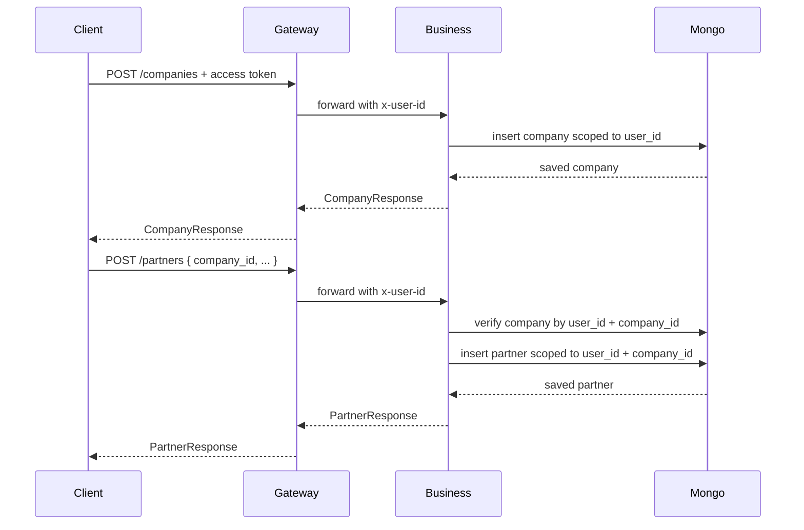
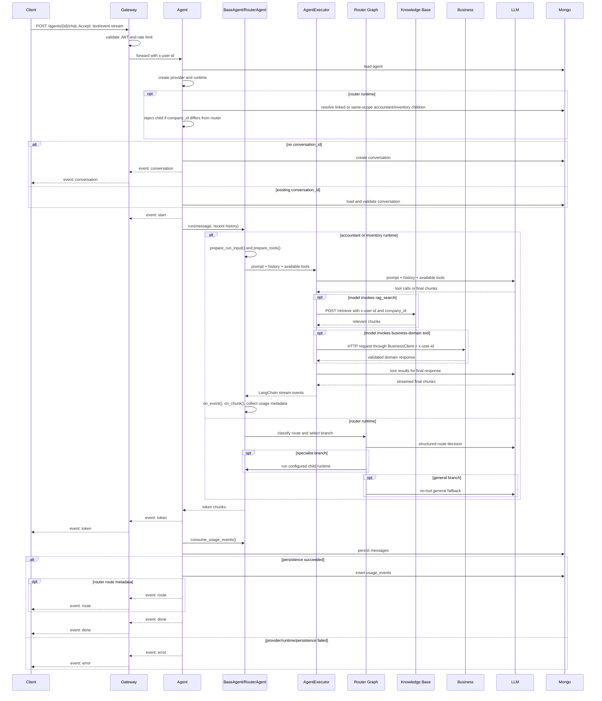
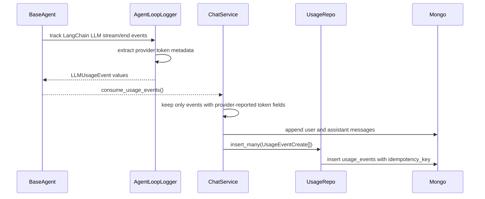
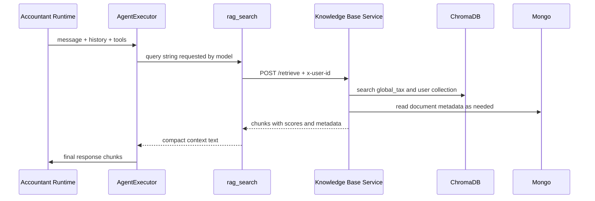
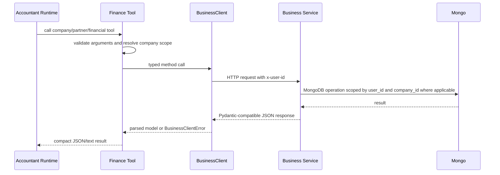

# Agent Service Data Flow

## Gateway List Flow

## Agent CRUD Flow

All CRUD operations are scoped by the gateway-injected `x-user-id`. Agent create/update validates a non-null `company_id` against Business Service, and list can filter by `company_id` after the same ownership check. Invalid IDs and cross-user access return `404`; Business availability failures return `503`.

## Business-Owned Company And Partner Flow

Companies represent invoice issuer profiles. Partners represent reusable clients, suppliers, or both under one company. These routes are no longer mounted by Agent Service. Gateway preserves the public URLs and routes them to Business Service. Agent consumes the same data only through `BusinessClient`.

## Chat Streaming Flow

Provider and runtime setup happens before new conversation creation, so setup errors emit `error` without inserting an empty conversation. Router child runtime resolution also happens before conversation creation. `done` is emitted only after the user and assistant messages are persisted. Raw provider usage events are inserted after message persistence; usage insert failures are logged but do not replace a successful chat with an SSE `error`.

Runtime hooks are internal to `BaseAgent`. They may transform inputs, tools, normalized LangChain events, streamed chunks, final fallback output, and run metadata before the Agent Service emits SSE or writes MongoDB. Hooks must not emit SSE or persist data directly.

## SSE Events

| Event | Data | Notes |
|-------|------|-------|
| `conversation` | `{ "conversation_id": "..." }` | Only emitted for a new conversation. |
| `start` | `{ "conversation_id": "..." }` | Runtime is ready and streaming begins. |
| `token` | `{ "content": "..." }` | One streamed assistant chunk. |
| `route` | `{ "predicted_route": "inventory", "executed_route": "inventory", "reason": "...", "confidence": 0.95, "company_id": "...", "company_scope": "assigned" }` | Optional router metadata emitted after persistence and before `done`. |
| `error` | `{ "message": "..." }` | Terminal error for lookup, provider setup, runtime execution, or message persistence. |
| `done` | `{ "conversation_id": "..." }` | Messages were persisted after successful runtime completion. |

The public SSE event names and payloads do not include usage data. Usage is stored internally in `usage_events` for future billing or analytics. Route metadata is diagnostic and non-persisted; clients should ignore it if they do not display routing information.

## Runtime Usage Flow

The usage ledger records raw provider/model facts only: user, agent, conversation, provider, model, optional run id, LLM call index, input/output/total token counts when reported, stream chunk/character counts, timing, and `source="agent_runtime"`. It does not estimate missing tokens and does not compute billing cost. Router classifier/general calls are attributed to the router agent id; delegated child calls keep the accountant or inventory runtime agent id.

## RAG Tool Flow

The Agent Service never calls ChromaDB directly. RAG retrieval remains owned by the Knowledge Base Service. Assigned agents send their `company_id` so uploaded chunks are filtered by company; unassigned agents set `include_user_documents=false` and use shared `global_tax` only.

## Business-Backed Financial Tool Flow

Financial records are available from Business REST endpoints and Accountant Agent tools. Business Service owns calculations, filters, company ownership, user scoping, persistence, and summary aggregation. Agent owns only tool argument validation, company-scope enforcement for assigned agents, and conversion of Business responses into compact tool output.

Money values are modeled as `Decimal` in shared Pydantic schemas and sent to Business as JSON strings. Business stores them in MongoDB as BSON `Decimal128` and serializes responses as strings.

Invoice creation in Agent tools resolves the company scope and waits for explicit confirmation, then Business validates `company_id`, verifies that `partner_id` belongs to the same company when present, calculates totals, and stores immutable `supplier_snapshot` and `recipient_snapshot` values for historical PDF rendering.

The write tools `create_invoice` and `record_expense` require `confirmed=true`. Without confirmation, they return a confirmation-required message and do not call Business. Partner and invoice tools also require the current agent to be assigned to a company or a resolved `company_id` to be supplied.

## CompanyBook Partner Import Flow

`search_companybook_companies` is read-only and should be used after local partner search, or when the user explicitly asks to search the Bulgarian registry. `import_companybook_partner` is company-scoped: assigned agents use their assigned `company_id`, while unassigned agents must resolve and pass a `company_id` before import.

The import tool reuses existing partners by exact UIC before making a new write. If another request creates the same partner between lookup and insert, Business returns a conflict and the tool resolves the partner by UIC again. If the registry detail is incomplete, no partner is written; the returned `partner_draft` contains all mapped fields and `missing_fields` tells the agent which specific values to request from the user.

## Write Paths

| Data | Write Path |
|------|------------|
| Companies | Gateway -> Business company routes -> Business company service -> Business company repo -> MongoDB |
| Partners | Gateway or Agent partner tools -> Business partner routes/client -> Business partner service -> Business partner repo -> MongoDB |
| Agent config | Gateway -> Agent routes -> Agent service -> Agent repo -> MongoDB |
| Conversation messages | Chat service -> Conversation repo -> MongoDB |
| LLM usage events | Chat service after conversation persistence -> Usage repo -> MongoDB `usage_events` |
| Invoices | Gateway or Agent `create_invoice` tool -> Business invoice route/client -> Business invoice service -> Business invoice repo -> MongoDB |
| Expenses | Gateway or Agent `record_expense` tool -> Business expense route/client -> Business expense service -> Business expense repo -> MongoDB |
| CompanyBook partner import | Accountant tool -> CompanyBook.BG API -> Business partner route/client -> Business partner service -> Business partner repo -> MongoDB |
