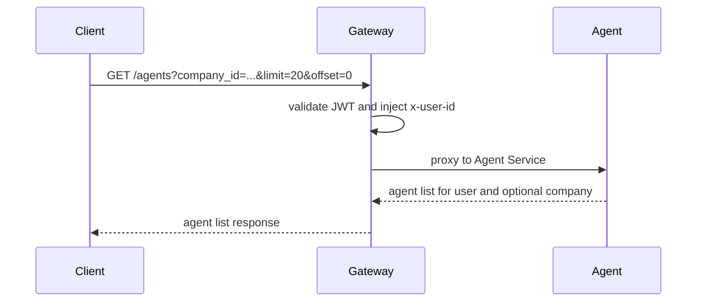
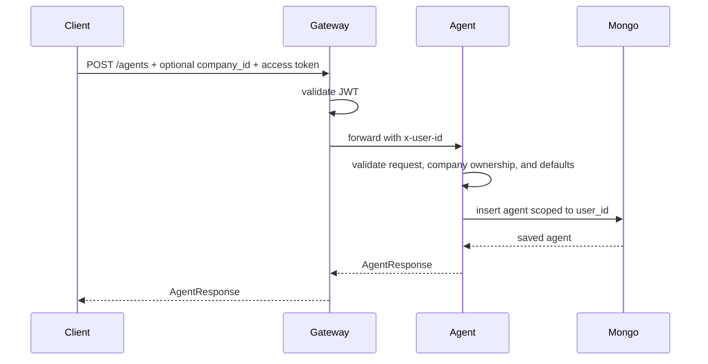
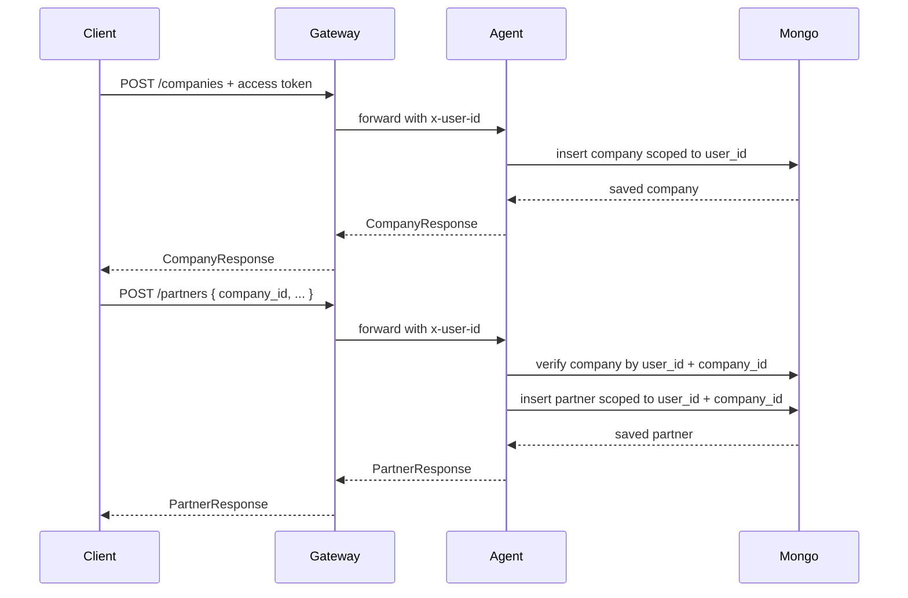
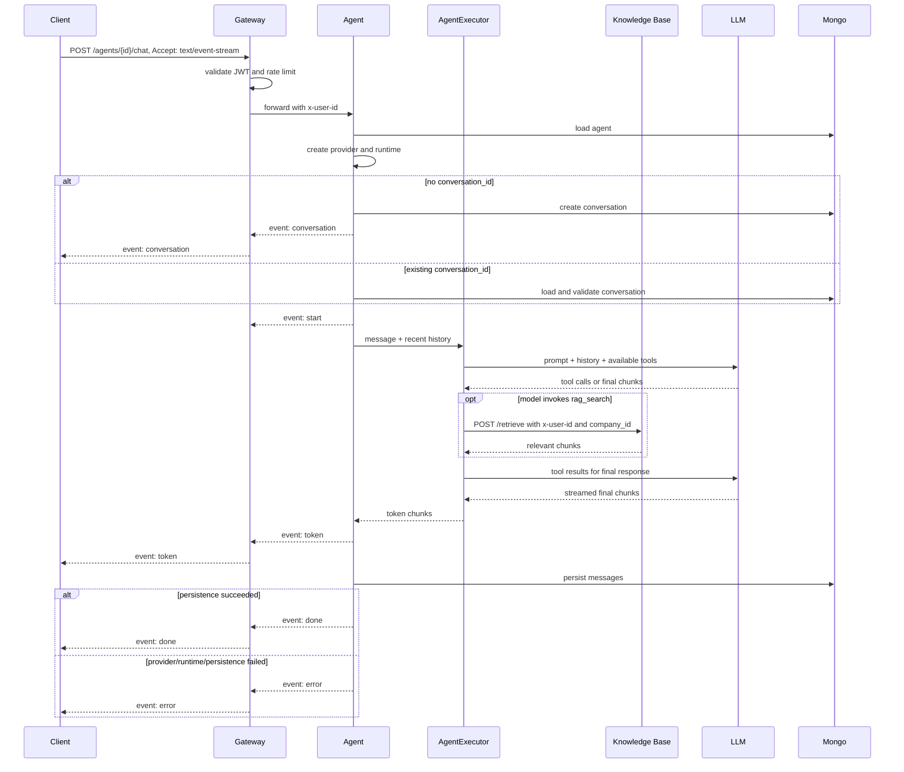
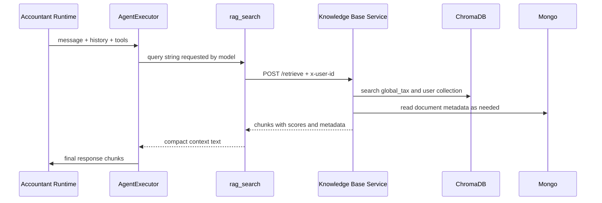
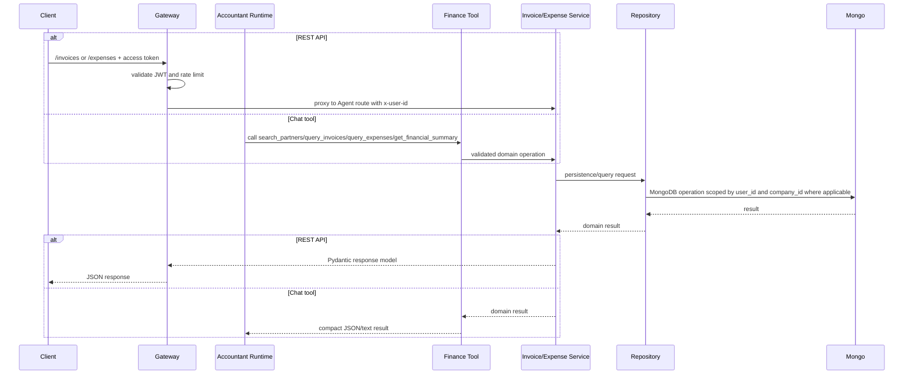
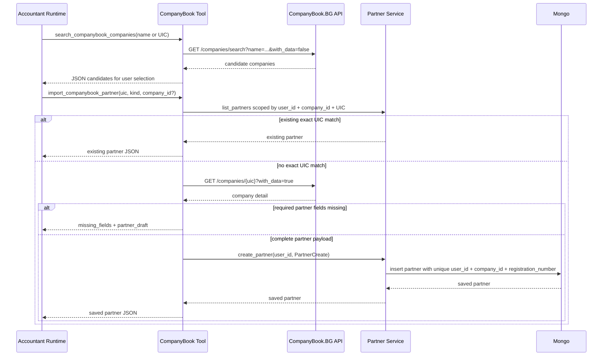

# Agent Service Data Flow

## Gateway List Flow

## Agent CRUD Flow

All CRUD operations are scoped by the gateway-injected `x-user-id`. Agent create/update validates a non-null `company_id` against the current user, and list can filter by `company_id`. Invalid IDs and cross-user access return `404` from service-layer checks.

## Company And Partner Flow

Companies represent invoice issuer profiles. Partners represent reusable clients, suppliers, or both under one company. Cross-user and cross-company IDs return `404`; deletes return `409` while dependent agents, partners, or invoices still reference the record.

## Chat Streaming Flow

Provider and runtime setup happens before new conversation creation, so setup errors emit `error` without inserting an empty conversation. `done` is emitted only after the user and assistant messages are persisted.

## SSE Events

| Event | Data | Notes |
|-------|------|-------|
| `conversation` | `{ "conversation_id": "..." }` | Only emitted for a new conversation. |
| `start` | `{ "conversation_id": "..." }` | Runtime is ready and streaming begins. |
| `token` | `{ "content": "..." }` | One streamed assistant chunk. |
| `error` | `{ "message": "..." }` | Terminal error for lookup, provider setup, runtime execution, or message persistence. |
| `done` | `{ "conversation_id": "..." }` | Messages were persisted after successful runtime completion. |

## RAG Tool Flow

The Agent Service never calls ChromaDB directly. RAG retrieval remains owned by the Knowledge Base Service. Assigned agents send their `company_id` so uploaded chunks are filtered by company; unassigned agents set `include_user_documents=false` and use shared `global_tax` only.

## Financial Records Flow

Financial records are available from both REST endpoints and Accountant Agent tools. The shared service/repository layer keeps calculations, filters, company ownership, and user scoping consistent between the two entry points.

Money values are modeled as `Decimal`, stored in MongoDB as BSON `Decimal128`, and serialized to JSON as strings. Invoice and expense dates are accepted as date-only API values and stored as UTC datetimes for indexed range queries.

Invoice creation validates `company_id`, verifies that `partner_id` belongs to the same company when present, calculates totals, and stores immutable `supplier_snapshot` and `recipient_snapshot` values for historical PDF rendering.

The write tools `create_invoice` and `record_expense` require `confirmed=true`. Without confirmation, they return a confirmation-required message and do not write to MongoDB. Partner and invoice tools also require the current agent to be assigned to a company.

## CompanyBook Partner Import Flow

`search_companybook_companies` is read-only and should be used after local partner search, or when the user explicitly asks to search the Bulgarian registry. `import_companybook_partner` is company-scoped: assigned agents use their assigned `company_id`, while unassigned agents must resolve and pass a `company_id` before import.

The import tool reuses existing partners by exact UIC before making a new write. If another request creates the same partner between lookup and insert, MongoDB's unique index raises a duplicate-key error and the tool resolves the partner by UIC again. If the registry detail is incomplete, no partner is written; the returned `partner_draft` contains all mapped fields and `missing_fields` tells the agent which specific values to request from the user.

## Write Paths

| Data | Write Path |
|------|------------|
| Companies | Gateway -> Company routes -> Company service -> Company repo -> MongoDB |
| Partners | Gateway or partner tools -> Partner service -> Partner repo -> MongoDB |
| Agent config | Gateway -> Agent routes -> Agent service -> Agent repo -> MongoDB |
| Conversation messages | Chat service -> Conversation repo -> MongoDB |
| Invoices | Gateway or `create_invoice` tool -> Invoice service -> Invoice repo -> MongoDB |
| Expenses | Gateway or `record_expense` tool -> Expense service -> Expense repo -> MongoDB |
| CompanyBook partner import | Accountant tool -> CompanyBook.BG API -> Partner service -> Partner repo -> MongoDB |
