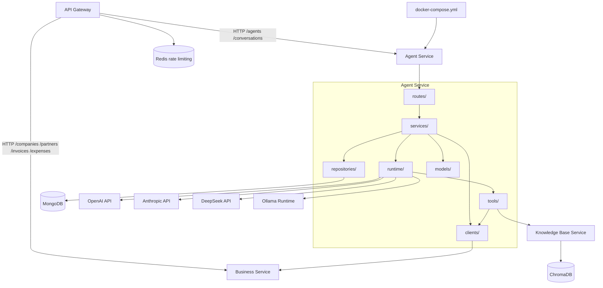

# Agent Service Dependency Graph

## Current Dependencies



## Dependency Matrix

| Dependency | Type | Status | Purpose |
|------------|------|--------|---------|
| API Gateway | inbound HTTP | Implemented | Public access to `/agents` and `/conversations`; SSE pass-through for chat |
| MongoDB | database | Implemented | Agent-owned `agents`, `conversations`, and `usage_events` collections |
| Business Service | internal HTTP | Implemented | Company validation plus Accountant and Inventory tools for companies, partners, invoices, expenses, inventory, and financial summaries |
| Knowledge Base Service | internal HTTP | Implemented | `rag_search` calls `POST /retrieve` with `x-user-id` |
| OpenAI | external HTTPS | Implemented provider | Optional LLM provider when `OPENAI_API_KEY` is set |
| Anthropic | external HTTPS | Implemented provider | Optional LLM provider when `ANTHROPIC_API_KEY` is set |
| DeepSeek | external HTTPS | Implemented provider | Optional LLM provider when `DEEPSEEK_API_KEY` is set |
| Ollama | local HTTP | Implemented provider | Optional local model provider through `OLLAMA_BASE_URL` |
| Redis | gateway dependency | Implemented outside Agent Service | Gateway rate limiting; Agent Service does not use Redis directly |
| ChromaDB | indirect vector store | Indirect only | Accessed by Knowledge Base Service, never directly by Agent Service |

## Owned Data

| Collection | Purpose |
|------------|---------|
| `agents` | Agent configs and ownership |
| `conversations` | Chat history |
| `usage_events` | Immutable raw provider usage facts for completed LLM calls |

Business Service owns `companies`, `partners`, `invoices`, `expenses`, and `counters`. Agent keeps compatible Pydantic schemas for tool arguments and Business response parsing, but it does not own those collections or indexes.

## Internal Dependency Direction

```text
routes -> services -> repositories -> models
                 \-> runtime -> tools -> clients
                 \-> clients
```

Routes do not access MongoDB, providers, or service clients directly. Repositories do not contain business rules. Runtime code does not know about FastAPI request objects or HTTP responses. Business-domain access goes through `BusinessClient`. Router child lookup stays in `ChatService` and `AgentRepository`; `RouterAgent` receives already constructed child runtimes.

## Startup Dependencies

Docker Compose starts infrastructure first. The Agent Service connects to MongoDB during FastAPI lifespan startup and creates indexes for:

- `agents`: `(user_id, created_at desc)`, `(user_id, name)`, `(user_id, agent_type, company_id, created_at desc)`, and `(user_id, company_id, created_at desc)`.
- `conversations`: `(user_id, agent_id, updated_at desc)`, `(user_id, agent_id, company_id, updated_at desc)`, and `(user_id, created_at desc)`.
- `usage_events`: `(user_id, created_at desc)`, `(user_id, provider, model, created_at desc)`, `(conversation_id, created_at)`, `(agent_id, created_at desc)`, and unique `(idempotency_key)`.

It also creates one long-lived `httpx.AsyncClient` for Business Service during lifespan startup and closes it during shutdown. Business Service creates the indexes for companies, partners, invoices, expenses, inventory, and counters.
