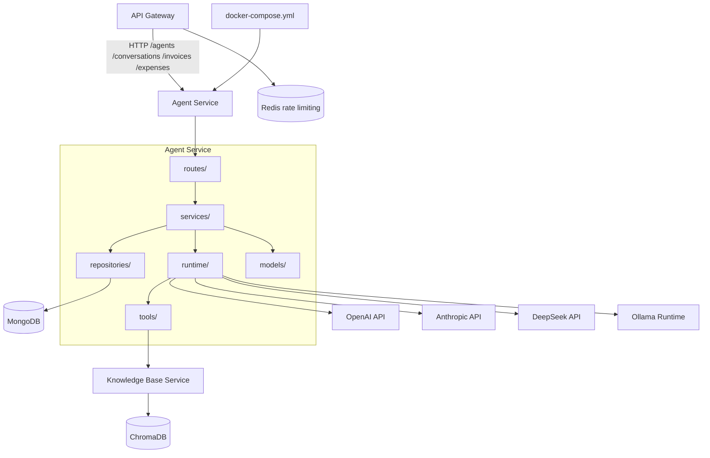

# Agent Service Dependency Graph

## Current Dependencies



## Dependency Matrix

| Dependency | Type | Status | Purpose |
|------------|------|--------|---------|
| API Gateway | inbound HTTP | Implemented | Public access to `/agents`, `/conversations`, `/invoices`, and `/expenses`; SSE pass-through for chat |
| MongoDB | database | Implemented | `agents`, `conversations`, `invoices`, `expenses`, and invoice `counters` collections |
| Knowledge Base Service | internal HTTP | Implemented | `rag_search` calls `POST /retrieve` with `x-user-id` |
| OpenAI | external HTTPS | Implemented provider | Optional LLM provider when `OPENAI_API_KEY` is set |
| Anthropic | external HTTPS | Implemented provider | Optional LLM provider when `ANTHROPIC_API_KEY` is set |
| DeepSeek | external HTTPS | Implemented provider | Optional LLM provider when `DEEPSEEK_API_KEY` is set |
| Ollama | local HTTP | Implemented provider | Optional local model provider through `OLLAMA_BASE_URL` |
| Redis | gateway dependency | Implemented outside Agent Service | Gateway rate limiting; Agent Service does not use Redis directly |
| ChromaDB | indirect vector store | Indirect only | Accessed by Knowledge Base Service, never directly by Agent Service |

## Owned Data

| Collection | Purpose |
|------------|---------|
| `agents` | Agent configs and ownership |
| `conversations` | Chat history |
| `invoices` | User-scoped invoice records with calculated line totals and VAT |
| `expenses` | User-scoped expense records with deductible amounts and optional item lines |
| `counters` | Atomic invoice number sequences per user and year |

## Internal Dependency Direction

```text
routes -> services -> repositories -> models
                 \-> runtime -> tools
```

Routes do not access MongoDB or providers directly. Repositories do not contain business rules. Runtime code does not know about FastAPI request objects or HTTP responses.

## Startup Dependencies

Docker Compose starts infrastructure first. The Agent Service connects to MongoDB during FastAPI lifespan startup and creates indexes for:

- `agents`: `(user_id, created_at desc)` and `(user_id, name)`.
- `conversations`: `(user_id, agent_id, updated_at desc)` and `(user_id, created_at desc)`.
- `invoices`: `(user_id, status, issue_date desc)`, `(user_id, issue_date desc)`, `(user_id, counterparty)`, `(user_id, items.category)`, and unique `(user_id, invoice_number)`.
- `expenses`: `(user_id, category, expense_date desc)`, `(user_id, expense_date desc)`, `(user_id, counterparty)`, and `(user_id, deductible)`.
- `counters`: unique `_id`.
