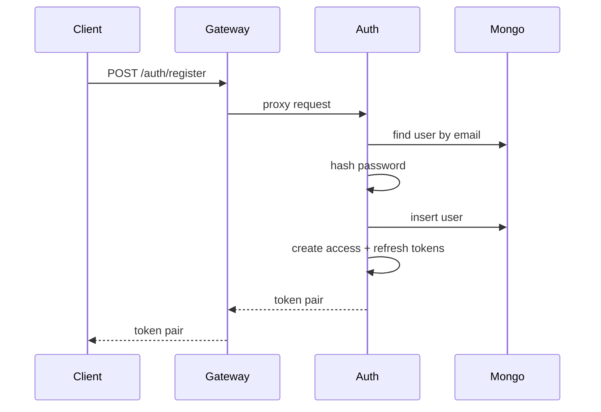
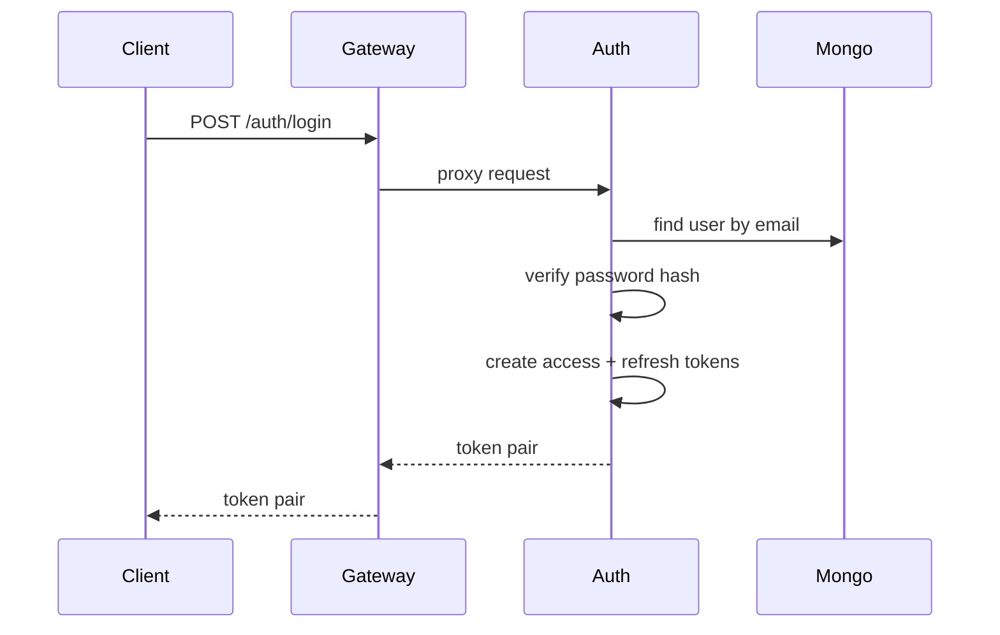
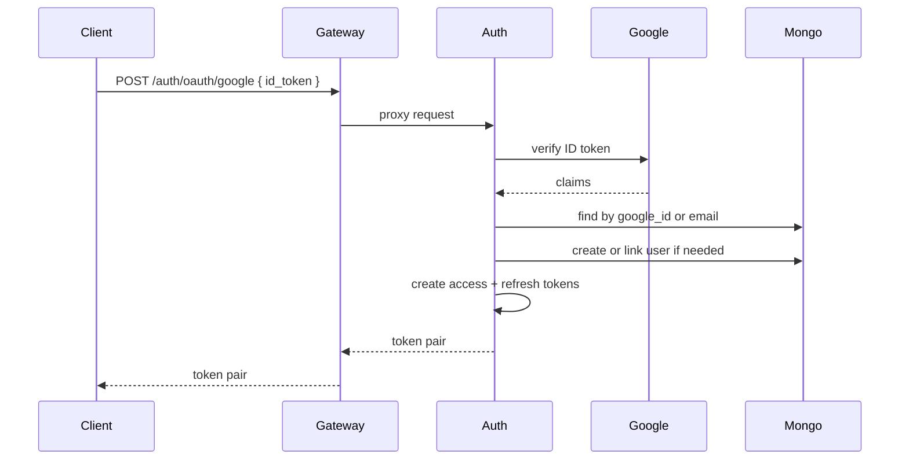
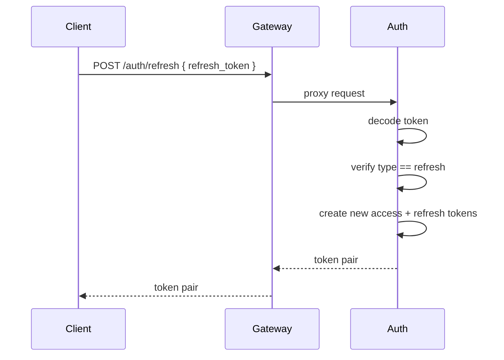
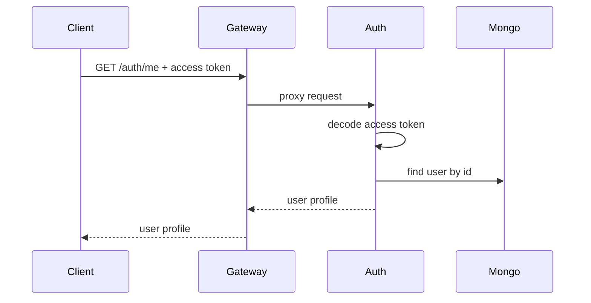

# Auth Service Data Flow

## Registration Flow

## Login Flow

## Google OAuth Flow

## Refresh Flow

## Profile Flow

## Write Paths

| Data | Write Path |
|------|------------|
| New credentials user | Auth service -> User repository -> MongoDB |
| New Google user | Auth service -> Google verification -> User repository -> MongoDB |
| Linked Google account | Auth service -> User repository -> MongoDB |
| Tokens | Generated by Auth service; not persisted |
