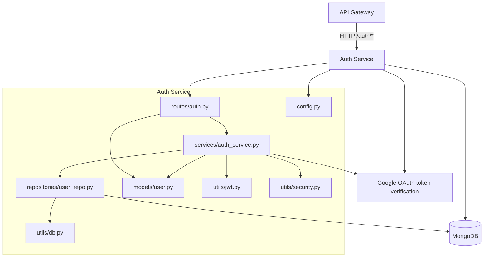

# Auth Service Dependency Graph

## Dependency Graph

## Dependency Matrix

| Dependency | Type | Status | Purpose |
|------------|------|--------|---------|
| API Gateway | inbound HTTP | Implemented | Public access to `/auth/*` |
| MongoDB | database | Implemented | User records |
| Google OAuth | external HTTPS | Implemented | Verify Google ID tokens |
| python-jose | package | Implemented | JWT encode/decode |
| passlib/bcrypt | package | Implemented | Password hashing |

## Owned Data

| Collection | Purpose |
|------------|---------|
| `users` | Account profiles, password hashes, Google links, auth provider |

## Environment Dependencies

| Env Var | Purpose |
|---------|---------|
| `MONGODB_URL` | MongoDB connection string |
| `DB_NAME` | Database name |
| `JWT_SECRET` | JWT signing key |
| `JWT_ACCESS_EXPIRE_MINUTES` | Access token TTL |
| `JWT_REFRESH_EXPIRE_DAYS` | Refresh token TTL |
| `GOOGLE_CLIENT_ID` | Google token audience |
