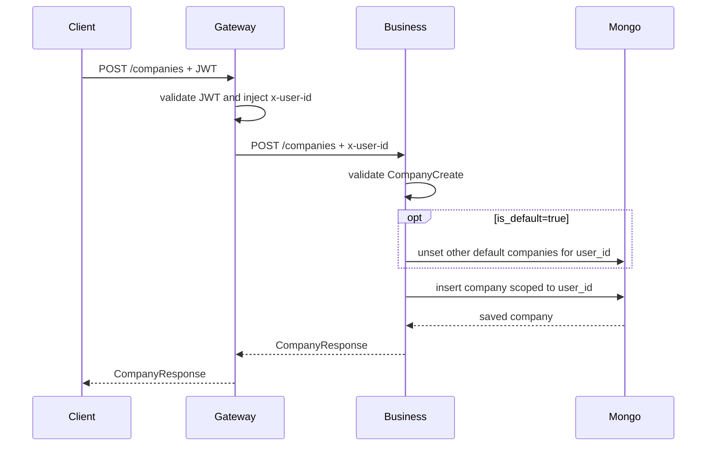
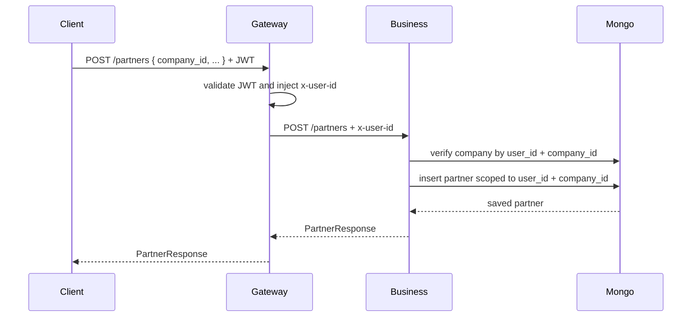
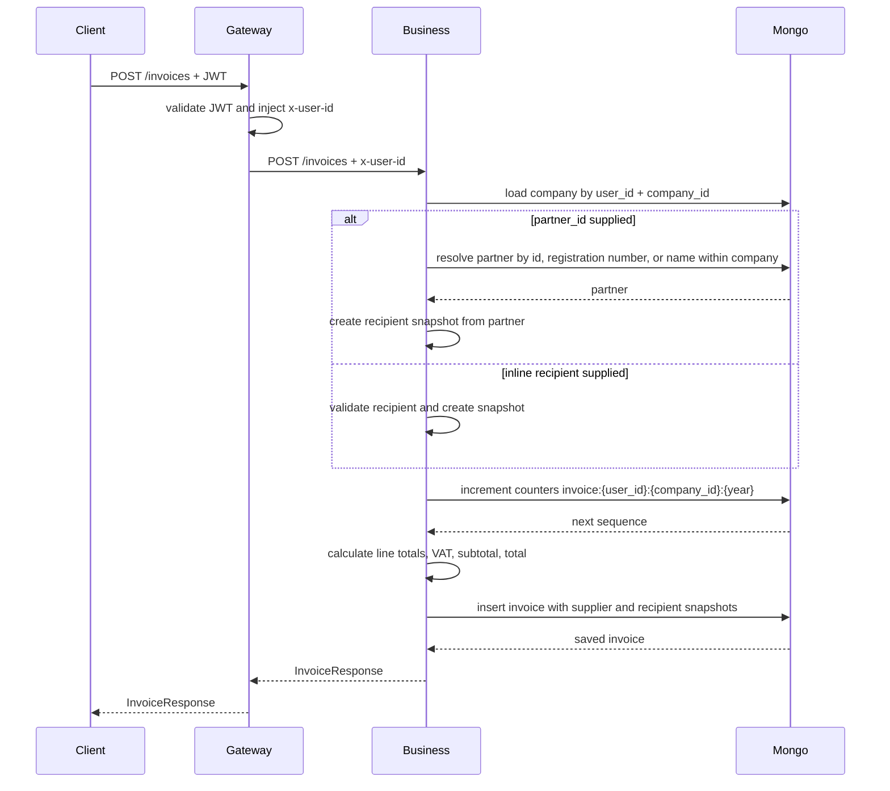
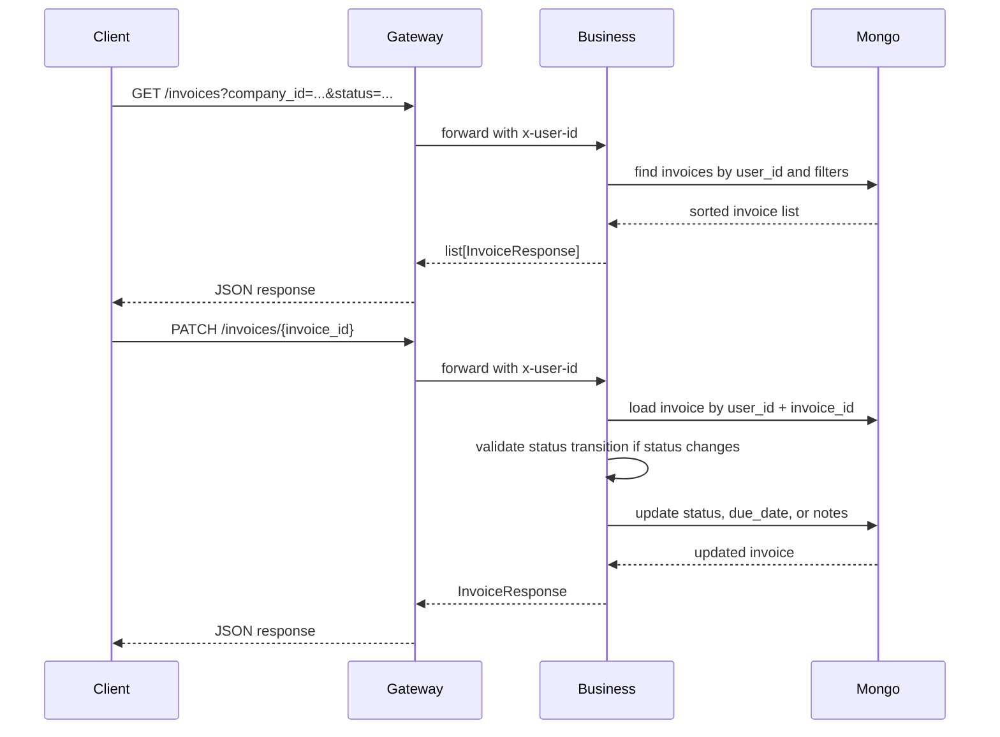
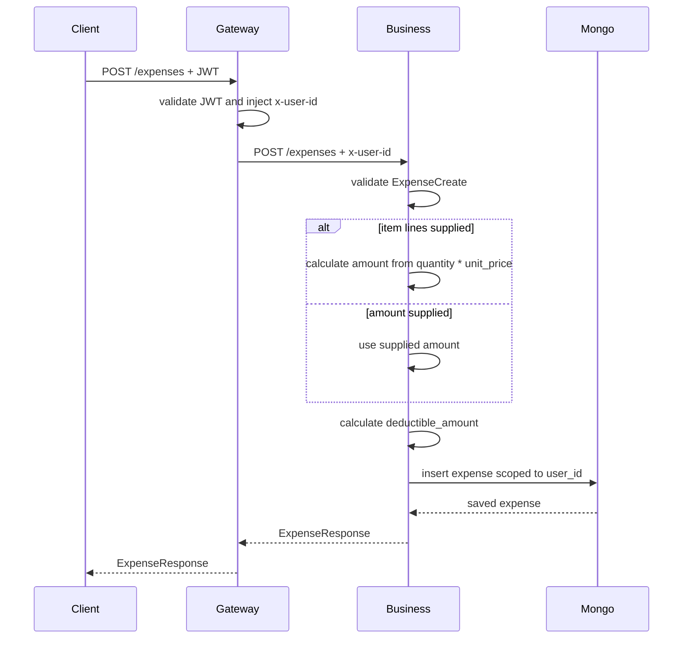
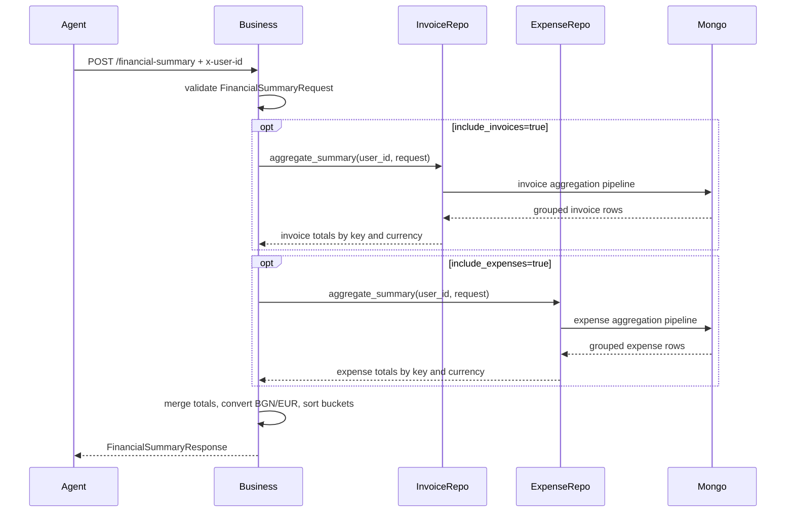
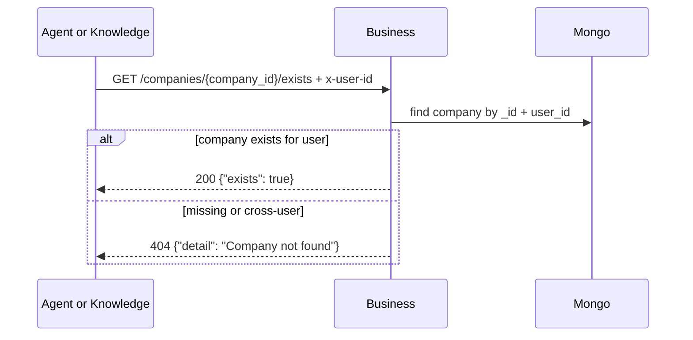
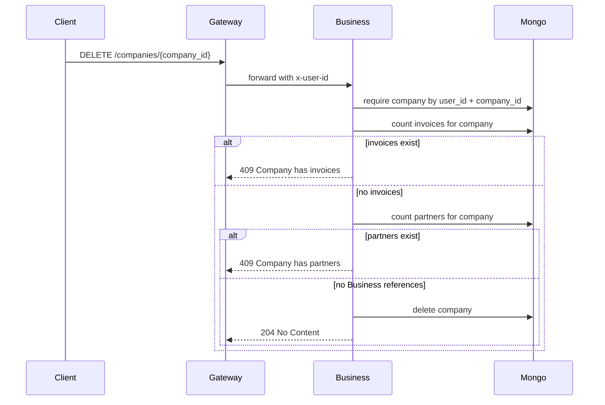

# Business Service Data Flow

## Gateway Company Flow

Company list/get/update/delete follow the same `x-user-id` scoping. Invalid company ids and cross-user access return `404 Company not found`.

## Partner Flow

Partner list/get/update/delete always require `company_id`. This keeps partner ids scoped to the company boundary and prevents loading one company's partner from another company route.

## Invoice Creation Flow

Invoice creation is the only path that creates supplier and recipient snapshots. Later updates can change `status`, `due_date`, or `notes`, but do not recalculate historical party snapshots.

## Invoice Query And Update Flow

Supported invoice filters are `company_id`, `partner_id`, `status`, `date_from`, `date_to`, `counterparty`, `amount_min`, `amount_max`, and `category`. Lists are sorted by newest `issue_date` first.

## Expense Flow

Supported expense filters are `category`, `counterparty`, `date_from`, `date_to`, `deductible`, `amount_min`, and `amount_max`. Lists are sorted by newest `expense_date` first.

## Financial Summary Flow

`/financial-summary` is used by Agent tools over the internal network. It is still a normal FastAPI endpoint with `x-user-id` scoping, so it can be smoke-tested directly from another service container.

## Company Validation Flow

Agent uses this flow when creating/updating agents with a `company_id` or listing agents with a company filter. Knowledge uses it when validating company-scoped document operations.

## Delete Protection Flow

Partner deletion follows the same pattern and returns `409 Partner has invoices` while any invoice references the partner.

## Write Paths

| Data | Write path |
|------|------------|
| Companies | Gateway -> Business company route -> CompanyService -> CompanyRepository -> MongoDB |
| Partners | Gateway or Agent BusinessClient -> Business partner route -> PartnerService -> PartnerRepository -> MongoDB |
| Invoices | Gateway or Agent BusinessClient -> Business invoice route -> InvoiceService -> InvoiceRepository -> MongoDB |
| Expenses | Gateway or Agent BusinessClient -> Business expense route -> ExpenseService -> ExpenseRepository -> MongoDB |
| Counters | InvoiceService -> InvoiceRepository.next_invoice_number -> MongoDB `counters` |
| Financial summaries | Read-only aggregation over `invoices` and `expenses`; no summary document is stored |

## Error And Response Flow

| Condition | Response |
|-----------|----------|
| Missing `x-user-id` | `401 Missing x-user-id header` |
| Invalid or cross-user company id | `404 Company not found` |
| Invalid or cross-company partner id | `404 Partner not found` |
| Invalid invoice or expense id | `404 Invoice not found` / `404 Expense not found` |
| Duplicate unique business key | Mongo duplicate-key error surfaced by FastAPI unless specifically handled by caller |
| Invalid invoice status transition | `400 Invalid invoice status transition` |
| Pydantic validation failure | `422` with validation details |
| Protected company/partner delete | `409` with dependency detail |
