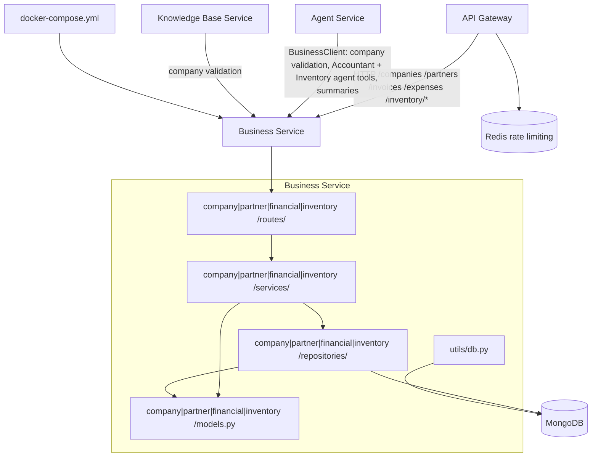
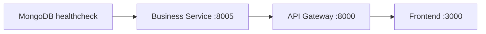

# Business Service Dependency Graph

## Current Dependencies



Business has one runtime infrastructure dependency: MongoDB. It does not connect to Redis, ChromaDB, LLM providers, Auth, or frontend services directly.

## Dependency Matrix

| Dependency | Type | Status | Purpose |
|------------|------|--------|---------|
| API Gateway | inbound HTTP | Implemented | Public access to `/companies`, `/partners`, `/invoices`, `/expenses`, and `/inventory/*` after JWT validation |
| Agent Service | internal HTTP caller | Implemented | Uses Business for company validation, Accountant financial/partner tools, and Inventory Agent item/stock/import tools |
| Knowledge Base Service | internal HTTP caller | Implemented | Uses Business to validate `company_id` ownership for company-scoped documents |
| MongoDB | database | Implemented | Stores `companies`, `partners`, `invoices`, `expenses`, `counters`, `inventory_items`, `inventory_locations`, `stock_movements`, and `inventory_import_previews` |
| Redis | indirect gateway dependency | Implemented outside Business | Gateway rate limiting only; Business does not use Redis directly |
| Auth Service | indirect gateway dependency | Implemented outside Business | Gateway validates JWTs before proxying; Business only receives `x-user-id` |
| ChromaDB | none | Not used | Business never reads or writes vector data |
| LLM providers | none | Not used | Business has no model-provider dependency |

## Owned Data

| Collection | Purpose |
|------------|---------|
| `companies` | User-owned invoice issuer profiles |
| `partners` | Company-scoped clients, suppliers, and imported counterparties |
| `invoices` | Company-scoped invoices with calculated totals and party snapshots |
| `expenses` | User-scoped expenses with deductible calculations |
| `counters` | Atomic invoice number sequences by user, company, and year |
| `inventory_items` | Company-scoped catalog with SKU/barcode/alias search fields |
| `inventory_locations` | Company-scoped stock locations and default-location marker |
| `stock_movements` | Append-only stock movement ledger |
| `inventory_import_previews` | Draft/confirmed/cancelled import review state |

Other service-owned collections:

- Auth owns `users`.
- Agent owns `agents` and `conversations`.
- Knowledge owns `documents` and ChromaDB collections.

Business must not read or write those collections directly.

## Internal Dependency Direction

```text
routes -> <domain>/services -> <domain>/repositories -> <domain>/models.py
                                          \-> financial/repositories/financial_utils.py
                                          \-> utils/db.py
```

Routes depend on services through FastAPI dependencies. Services depend on repositories and Pydantic models. Repositories depend on MongoDB and serialization helpers. Models do not import services or repositories.

Internal cross-domain dependencies are owned by Business:

- `financial/services/invoice_service.py` depends on `company`, `partner`, and `inventory` domains.
- `inventory/services/*` depends on `company/services/company_service.py` for ownership guards.
- Other services must use HTTP contracts and cannot import these internal modules.

## Startup Dependencies

Docker Compose starts MongoDB before Business:



| Service | Depends on | Condition | Reason |
|---------|------------|-----------|--------|
| Business | MongoDB | `service_healthy` | Needs MongoDB for startup ping and index creation |
| Gateway | Business | `service_started` | Gateway has Business as a route target for domain prefixes |
| Agent | MongoDB | `service_healthy` | Agent starts independently but Business must be reachable for company validation and tools at runtime |
| Knowledge | MongoDB, ChromaDB | `service_healthy`, `service_started` | Knowledge starts independently but calls Business for company validation at runtime |

During FastAPI lifespan startup, Business:

1. Creates a Motor client from `MONGODB_URL`.
2. Pings MongoDB.
3. Creates indexes for Business-owned collections.
4. Serves routes.
5. Closes the Motor client during shutdown.

## Indexes

Indexes created by `services/business/app/utils/db.py`:

| Collection | Index | Purpose |
|------------|-------|---------|
| `companies` | `(user_id, created_at desc)` | List a user's companies newest first |
| `companies` | `(user_id, registration_number)` unique | Prevent duplicate company registration numbers per user |
| `companies` | `(user_id, is_default)` | Find and unset default company |
| `partners` | `(user_id, company_id, name)` | Company-scoped lists and name search support |
| `partners` | `(user_id, company_id, kind)` | Filter partners by kind |
| `partners` | `(user_id, company_id, registration_number)` unique | Prevent duplicate partner registration numbers per company |
| `invoices` | `(user_id, status, issue_date desc)` | Status filtering and newest-first lists |
| `invoices` | `(user_id, issue_date desc)` | Date-range invoice lists and summaries |
| `invoices` | `(user_id, counterparty)` | Counterparty filters |
| `invoices` | `(user_id, items.category)` | Category filters and grouped summaries |
| `invoices` | `(user_id, company_id, issue_date desc)` | Company-scoped invoice lists and summaries |
| `invoices` | `(user_id, company_id, status, issue_date desc)` | Company and status filtering |
| `invoices` | `(user_id, company_id, partner_id)` | Partner filtering and delete protection |
| `invoices` | `(user_id, company_id, invoice_number)` unique | Prevent duplicate invoice numbers per company |
| `expenses` | `(user_id, category, expense_date desc)` | Category filtering |
| `expenses` | `(user_id, expense_date desc)` | Date-range expense lists and summaries |
| `expenses` | `(user_id, counterparty)` | Counterparty filters |
| `expenses` | `(user_id, deductible)` | Deductibility filters |
| `inventory_items` | `(user_id, company_id, sku)` unique | Enforce unique SKU per company |
| `inventory_items` | `(user_id, company_id, barcode)` sparse | Fast barcode lookup |
| `inventory_items` | `(user_id, company_id, is_active, name)` | Active-item listing |
| `inventory_items` | `(user_id, company_id, category)` | Category filtering |
| `inventory_items` | `(user_id, company_id, aliases)` | Alias lookup |
| `inventory_items` | text index on `name, description, category, aliases, search_text` | Inventory text search |
| `inventory_locations` | `(user_id, company_id, name)` | Location list order/filtering |
| `inventory_locations` | `(user_id, company_id, is_default)` | Default-location management |
| `stock_movements` | `(user_id, company_id, item_id, occurred_at desc)` | Item movement history |
| `stock_movements` | `(user_id, company_id, location_id)` | Location filtering |
| `stock_movements` | `(user_id, company_id, movement_type)` | Movement-type filtering |
| `stock_movements` | `(user_id, source_type, source_id, source_line_id)` unique sparse | Idempotent source-backed movement writes |
| `inventory_import_previews` | `(user_id, company_id, status, created_at desc)` | Preview status lists |
| `inventory_import_previews` | `(user_id, document_id)` sparse | Document-linked preview lookup |

The `counters` collection uses MongoDB `_id` uniqueness for atomic invoice sequence keys.

## Service-To-Service Contracts

### Gateway -> Business

Gateway maps these prefixes to `BUSINESS_SERVICE_URL`:

```text
/companies
/partners
/invoices
/expenses
/inventory
```

Gateway strips hop-by-hop request headers, injects `x-user-id` after JWT validation, and forwards the request body/query unchanged.

### Agent -> Business

Agent uses a long-lived `httpx.AsyncClient` wrapped by `BusinessClient`. It forwards `x-user-id` and calls:

```text
GET   /companies
GET   /companies/{company_id}/exists
GET   /partners
GET   /partners/{partner_id}
POST  /partners
GET   /invoices
POST  /invoices
GET   /expenses
POST  /expenses
POST  /financial-summary
GET   /inventory/items
GET   /inventory/items/{item_id}
POST  /inventory/items
PATCH /inventory/items/{item_id}
GET   /inventory/locations
POST  /inventory/movements
GET   /inventory/movements
GET   /inventory/levels
POST  /inventory/search
GET   /inventory/import-previews
GET   /inventory/import-previews/{preview_id}
PATCH /inventory/import-previews/{preview_id}
POST  /inventory/import-previews/{preview_id}/confirm
POST  /inventory/import-previews/{preview_id}/cancel
```

Agent treats Business HTTP failures as `BusinessClientError`; chat tools return user-safe error messages instead of exposing transport details.

### Knowledge -> Business

Knowledge validates company-scoped document operations with:

```text
GET /companies/{company_id}/exists
```

The request includes `x-user-id`, so document uploads and retrieval stay scoped to the authenticated user's companies.

## Network Exposure

| Component | Host exposure | Docker network access |
|-----------|---------------|-----------------------|
| Business Service | Not exposed to host | `http://business:8005` |
| API Gateway | `localhost:8000` | `http://gateway:8000` |
| MongoDB | Exposed in dev compose only | `mongodb://mongodb:27017` |

Production-style access should go through Gateway for public routes. Direct Business calls are for internal service-to-service traffic and Docker smoke tests.

## Failure Propagation

| Failing dependency | Business behavior | Caller impact |
|--------------------|-------------------|---------------|
| MongoDB unavailable at startup | FastAPI lifespan startup fails | Business container is unhealthy or exits |
| MongoDB unavailable during request | Motor operation raises | Caller receives server error |
| Missing `x-user-id` | Dependency raises `401` | Gateway callers should not see this unless auth middleware failed or direct calls omitted the header |
| Duplicate unique key | Mongo raises duplicate-key error | Caller should treat as conflict/idempotency issue when applicable |
| Business unavailable to Agent | Agent `BusinessClient` raises transport error | Agent tools report Business unavailable; Agent runtime/SSE remains owned by Agent |
| Business unavailable to Knowledge | Knowledge company validation fails | Company-scoped document operation should fail validation |

## Architectural Rules

- Business depends on MongoDB only for persistence.
- Business must not call Agent repositories or import Agent code.
- Business must not depend on Gateway internals; it only requires `x-user-id`.
- Public domain API compatibility is preserved by Gateway prefix routing.
- Cross-service callers must use HTTP contracts and user-scoped headers, not shared database access.
