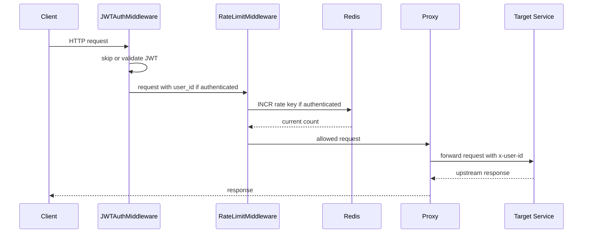
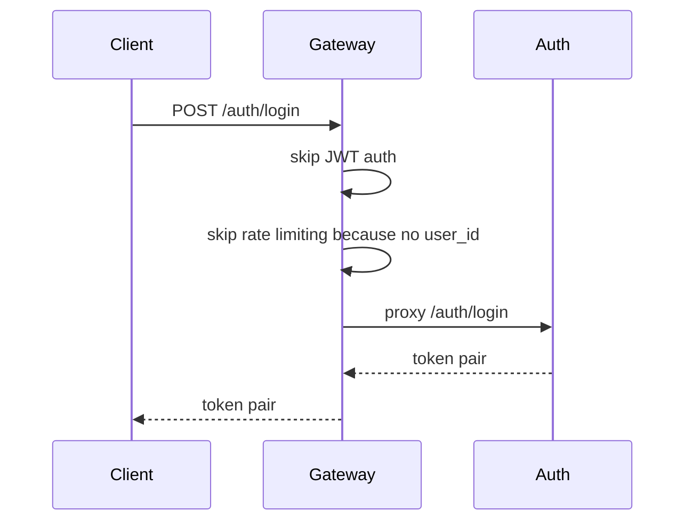
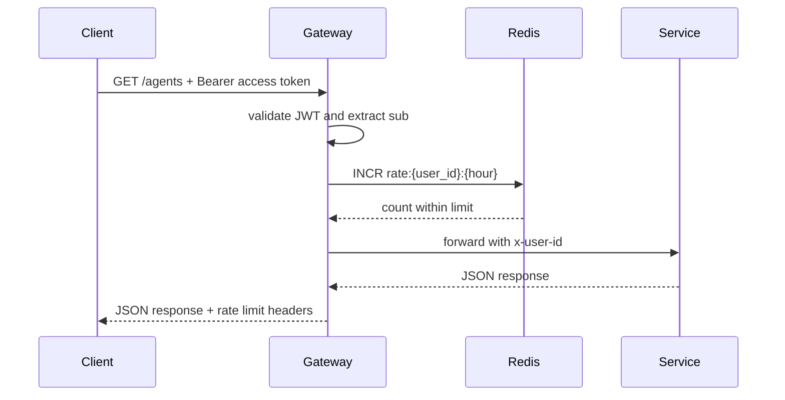
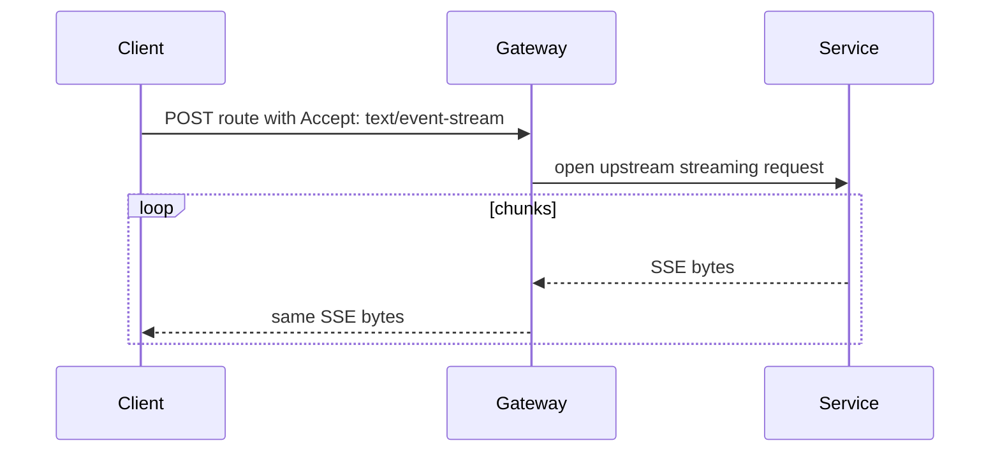

# API Gateway Data Flow

## Request Lifecycle

## Public Auth Flow

## Protected Request Flow

## SSE Proxy Flow

## Data Written By Gateway

| Data | Store | Purpose |
|------|-------|---------|
| `rate:{user_id}:{hour_bucket}` | Redis | Per-user hourly rate counter |

The gateway owns no MongoDB collections and should not persist domain data.
