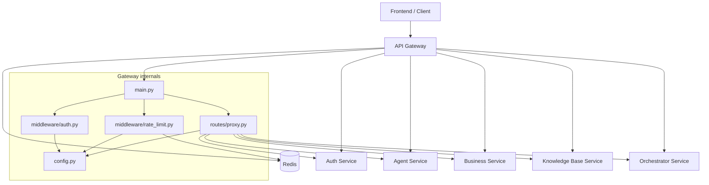

# API Gateway Dependency Graph

## Dependency Graph

## Route Dependencies

| Path Prefix | Target | Status |
|-------------|--------|--------|
| `/auth/*` | Auth Service | Implemented |
| `/agents/*` | Agent Service | Implemented |
| `/conversations/*` | Agent Service | Implemented |
| `/companies/*` | Business Service | Implemented |
| `/partners/*` | Business Service | Implemented |
| `/invoices/*` | Business Service | Implemented |
| `/expenses/*` | Business Service | Implemented |
| `/documents` | Knowledge Base Service | Implemented |
| `/retrieve` | Knowledge Base Service | Implemented |
| `/orchestrator/*` | Orchestrator Service | Stub target |

## Runtime Dependencies

| Dependency | Type | Purpose |
|------------|------|---------|
| Redis | database/cache | Rate limit counters |
| Auth Service | HTTP | Authentication endpoints |
| Agent Service | HTTP/SSE | Agent CRUD, conversations, and chat streaming |
| Business Service | HTTP | Companies, partners, invoices, expenses, and summaries |
| Knowledge Base Service | HTTP | Documents and retrieval |
| Orchestrator Service | HTTP/SSE | Workflow routes |
| python-jose | package | JWT validation |
| httpx | package | Async proxying |
