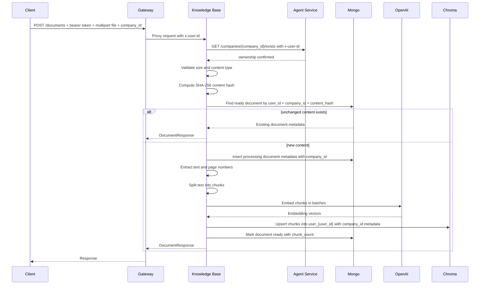
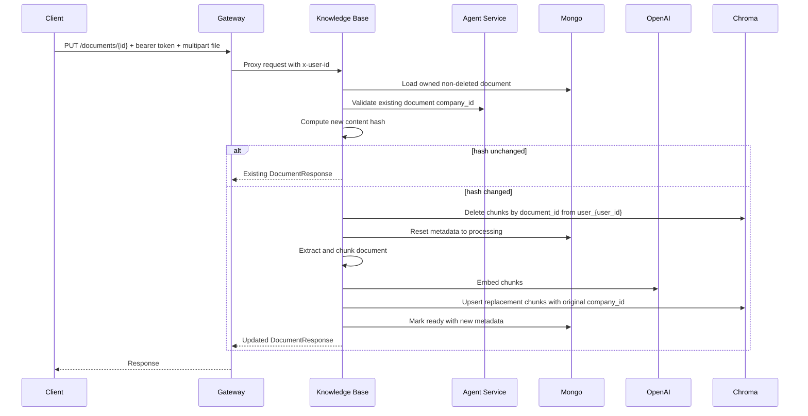
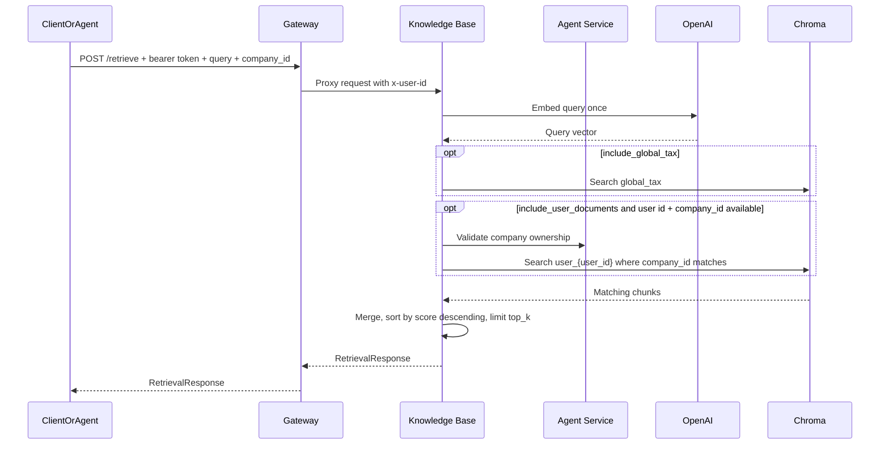
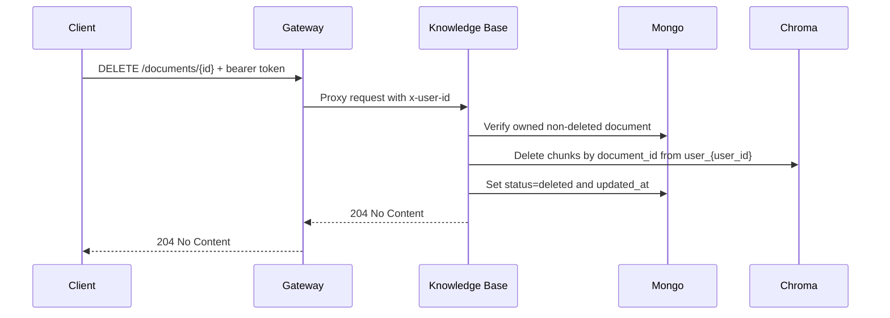
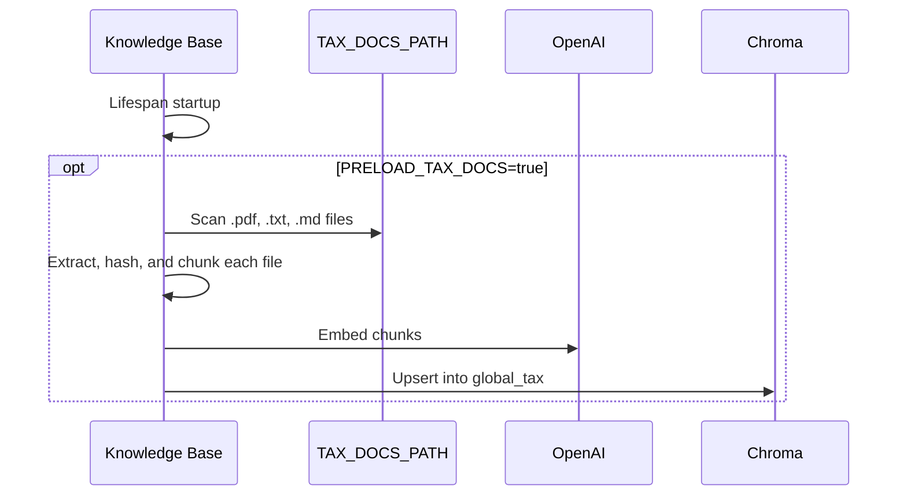

# Knowledge Base Service Data Flow

## Document Upload Flow

`IngestionService.ingest_upload` owns this flow. Company ownership is validated by an internal Agent Service client before metadata or vectors are written. If extraction produces no chunks, metadata is marked `failed` and the request returns `400`.

## Document Update Flow

## Retrieval Flow

`RetrievalRequest.user_id` can override the gateway-injected user id. If neither is present, retrieval still works for `global_tax` when enabled. User-uploaded document retrieval requires `company_id` and filters uploaded-source chunks by that company. Requests that set `include_user_documents=true` without `company_id` return `422` unless the explicit legacy all-company flag is used.

## Delete Flow

Deleted documents are hidden from list/get paths by repository filters.

## Startup Tax Preload Flow

Missing or empty tax document directories do not fail startup.

## Write Paths

| Data | Write Path |
|------|------------|
| Document metadata | Gateway -> `routes/documents.py` -> `DocumentService` -> `IngestionService` or `DocumentRepository` -> MongoDB |
| User vectors | `IngestionService` -> Agent Service company validation -> `EmbeddingProvider` -> `ChromaAdapter` -> ChromaDB `user_{user_id}` with `company_id` metadata |
| Global tax vectors | `TaxPreloadService` -> `EmbeddingProvider` -> `ChromaAdapter` -> ChromaDB `global_tax` |
| Retrieval results | Read-only; no logs are persisted yet |
