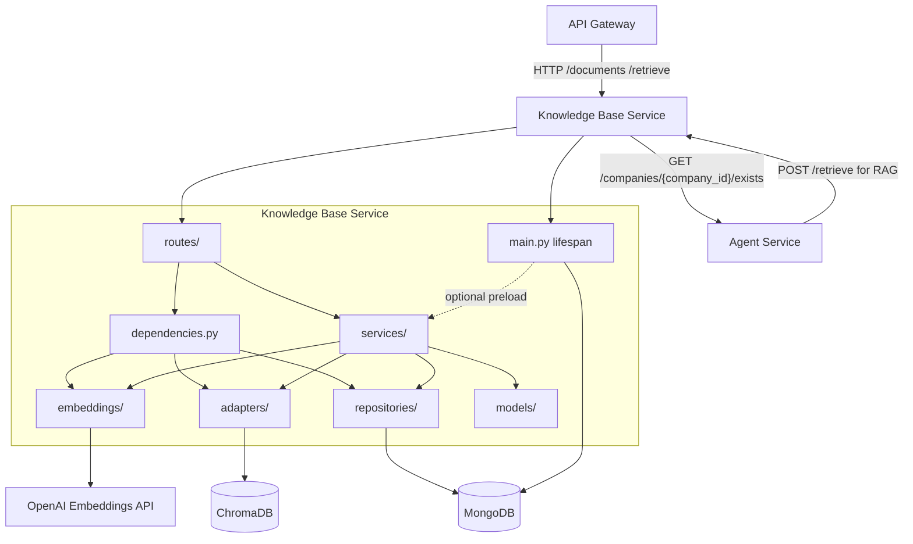

# Knowledge Base Service Dependency Graph

## Runtime Dependencies

## Dependency Matrix

| Dependency | Type | Status | Purpose |
|------------|------|--------|---------|
| API Gateway | inbound HTTP | Implemented | Authenticated document and retrieval routes |
| Agent Service | inbound/outbound HTTP | Implemented | RAG retrieval calls during chat and company ownership validation for document/retrieval operations |
| MongoDB | database | Implemented runtime | Document metadata, ownership, hashes, status |
| ChromaDB | vector store | Implemented runtime | User and global tax chunk vectors |
| OpenAI | external HTTPS | Implemented runtime | Embedding generation for documents and queries |
| `pypdf` | library | Implemented runtime | PDF text extraction |
| `langchain-text-splitters` | library | Implemented runtime | Recursive character chunking |

## Owned Data

| Store | Purpose |
|-------|---------|
| MongoDB `documents` | Metadata, `user_id + company_id` ownership, hashes, ingestion state, timestamps |
| ChromaDB `global_tax` | Shared tax regulation chunks |
| ChromaDB `user_{user_id}` | Per-user uploaded document chunks with `company_id` metadata |

## Startup Dependencies

Docker Compose starts `knowledge` after MongoDB is healthy and ChromaDB is started. During FastAPI lifespan startup, the service pings MongoDB and creates these indexes:

| Index | Purpose |
|-------|---------|
| `user_id + company_id + created_at` | Fast company-scoped document listing |
| `user_id + company_id + content_hash` | Company-scoped content-hash deduplication |
| `user_id + company_id + status` | Filtering active/deleted documents within a company |

When `PRELOAD_TAX_DOCS=true`, startup also needs a valid `OPENAI_API_KEY` and reachable ChromaDB to embed tax files from `TAX_DOCS_PATH`.
