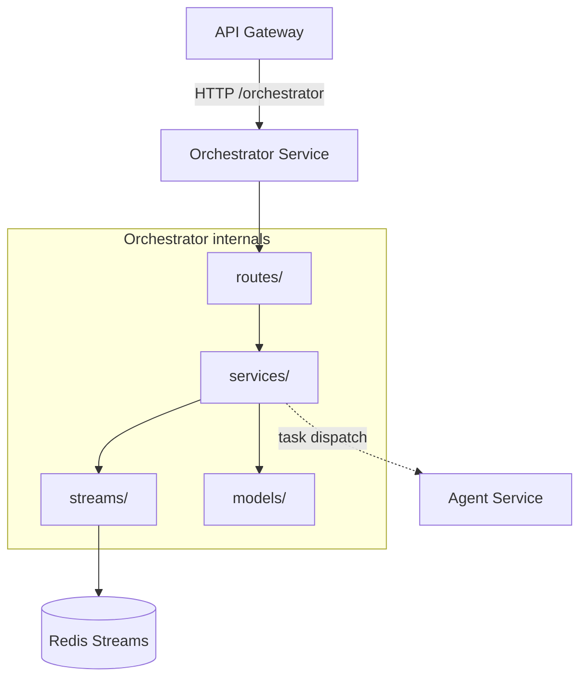

# Orchestrator Service

## Current State

The Orchestrator Service is currently a **stub service** with only:

```http
GET /health -> {"status": "ok", "service": "orchestrator"}
```

The Docker Compose service, Dockerfile, and FastAPI app shell exist. Multi-agent workflows, Redis Streams, task routing, and result aggregation are planned for later phases.

## Responsibility

The Orchestrator coordinates work that requires more than one agent or long-running background execution. In Phase 1 it stays inactive; in later phases it will:

- Accept workflow requests from the API Gateway.
- Create tasks for one or more agent workers.
- Publish tasks to Redis Streams.
- Read agent results from result streams.
- Aggregate partial results into a final user-facing response.
- Stream progress back to the client over SSE.

## Target Internal Architecture

```text
routes/
  workflows.py       # Start/read workflow requests
services/
  orchestration_service.py
  task_router.py
  result_aggregator.py
streams/
  producer.py        # XADD task messages
  consumer.py        # XREADGROUP result messages
models/
  workflow.py
  task.py
  result.py
```

The service should remain coordination-focused. Agent-specific business logic belongs in the Agent Service or agent runtime, not in the Orchestrator.

## Dependency Graph



## Data Ownership

The Orchestrator owns no MongoDB collections in the current target design. Workflow state should start in Redis Streams. If persisted workflow history becomes a product requirement, add explicit storage ownership before writing to MongoDB.

| Store | Owner | Purpose |
|-------|-------|---------|
| Redis Streams `stream:*_tasks` | Orchestrator | Dispatch work to agent workers |
| Redis Streams `stream:results` | Orchestrator | Read task results and aggregate output |

## Target API Surface

| Route | Status | Purpose |
|-------|--------|---------|
| `GET /health` | Implemented | Health check |
| `POST /orchestrator/run` | Planned | Start a multi-agent workflow, optionally streaming progress |
| `GET /orchestrator/workflows/{id}` | Planned | Read workflow status |

## Architectural Rules

- Keep endpoints `async def`.
- Treat Redis Streams as the coordination backbone; do not introduce another queue without an architecture decision.
- Keep workflow messages small and serializable.
- Make task dispatch idempotent where possible.
- Do not store provider API keys or agent prompts in stream messages.
- Do not call MongoDB collections owned by other services directly.
- Preserve SSE pass-through compatibility through the API Gateway.
