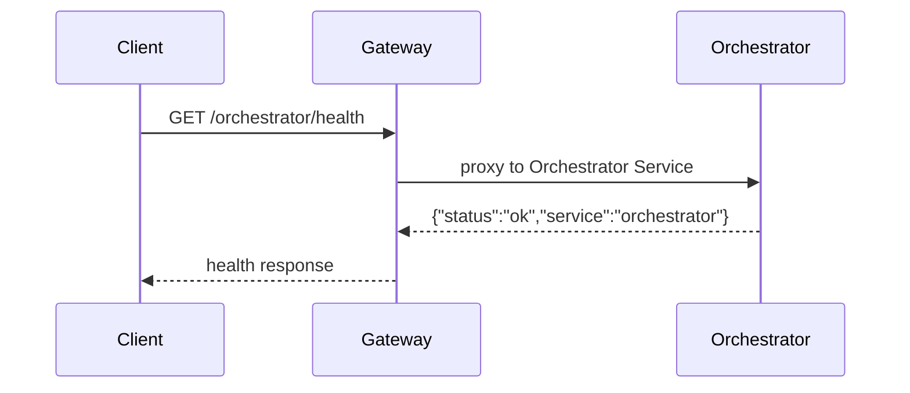
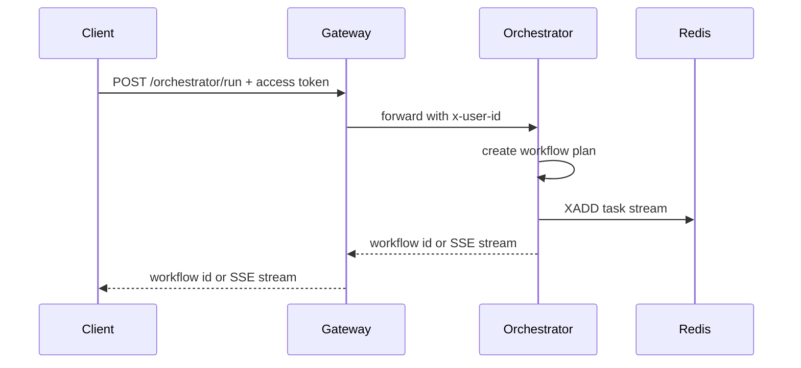
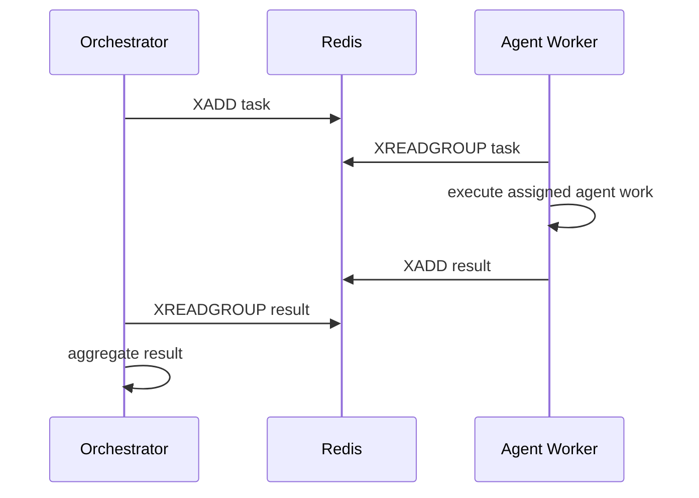
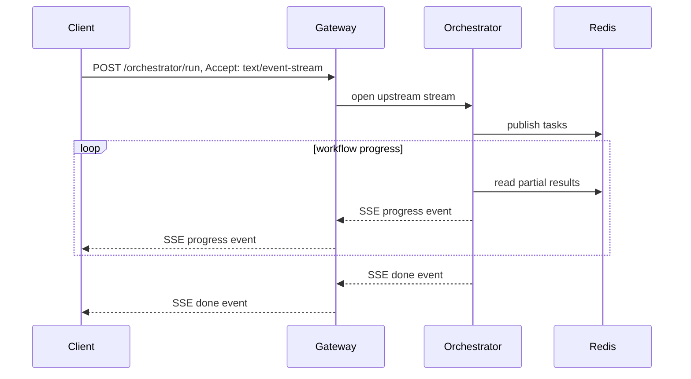

# Orchestrator Service Data Flow

## Current Flow

Only health checks are implemented.

## Planned Workflow Start Flow

## Planned Task Execution Flow

## Planned Progress Streaming Flow

## Write Paths

| Data | Write Path |
|------|------------|
| Task messages | Orchestrator service -> Redis Streams |
| Result messages | Agent workers -> Redis Streams |
| Workflow history | Not owned yet; add a persistence decision before using MongoDB |
