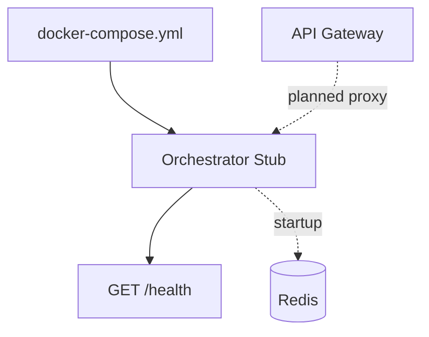
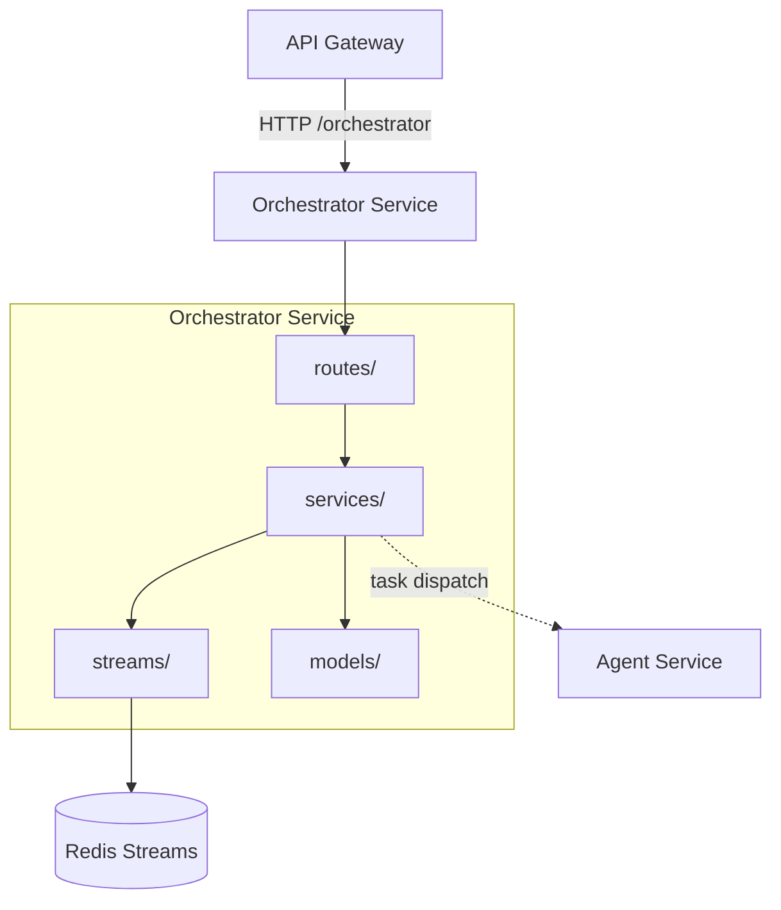

# Orchestrator Service Dependency Graph

## Current Dependencies

Current implementation has no runtime Redis usage yet, but Docker Compose starts the service after Redis is healthy.

## Target Dependency Graph

## Dependency Matrix

| Dependency | Type | Status | Purpose |
|------------|------|--------|---------|
| API Gateway | inbound HTTP/SSE | Planned | Workflow requests |
| Redis | stream store | Planned runtime, configured startup | Task and result streams |
| Agent Service | HTTP / worker integration | Planned | Task execution |

## Owned Data

| Store | Purpose |
|-------|---------|
| Redis `stream:*_tasks` | Task dispatch |
| Redis `stream:results` | Agent result aggregation |

The Orchestrator currently owns no MongoDB collections.
