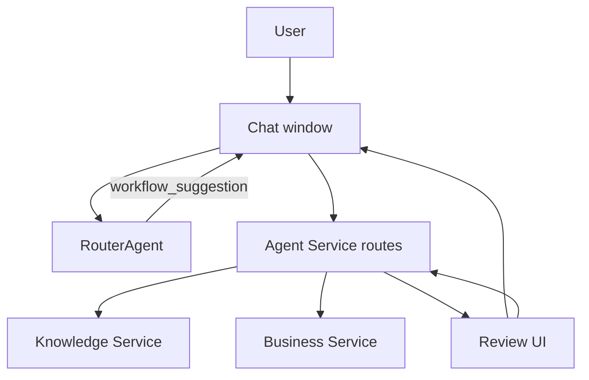
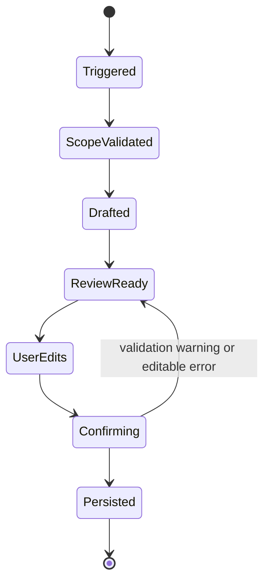

# Workflows

This directory documents user-visible and service-owned workflows that span chat, Agent Service orchestration, Business Service data, Knowledge extraction, and frontend review UI. Each workflow page should explain the trigger, state transitions, API sequence, ownership boundaries, extension points, and verification path.

## Workflow Map

## Implemented Workflows

| Workflow | Status | Primary Trigger | Owner | Documentation |
|---|---|---|---|---|
| Inventory-backed sales invoice | Implemented | Manual kickoff or `workflow_suggestion` from chat | Agent Service + Business Service | [Sales Invoice Inventory](./sales-invoice-inventory.md) |
| Chat workflow suggestions | Implemented for sales invoices | Router chat turn classification | Router runtime + ChatService | [Chat Workflow Suggestions](./chat-workflow-suggestions.md) |
| Document intake | Implemented | File upload in chat | Agent Service + Knowledge Service | [Document Intake](./document-intake.md) |
| Supplier invoice inventory-to-expense | Implemented | Supplier invoice document intake branch | Agent Service + Business Service | [Supplier Invoice Expense](./supplier-invoice-expense.md) |
| Receipt expense confirmation | Implemented | Receipt upload or legacy expense draft endpoint | Agent Service + Business Service | [Supplier Invoice Expense](./supplier-invoice-expense.md#receipt-and-expense-confirmation) |
| Shared workflow primitives | Partially adopted | Backend workflow implementation detail | Agent Service | [Shared Workflow Primitives](./shared-workflow-primitives.md) |

## Shared Workflow Contract

Every review workflow follows the same high-level shape:

The implementation keeps LLM-generated or extracted data out of persistence until the user explicitly confirms the final payload. Business-owned records are written by Business Service APIs; Agent Service only orchestrates review steps and maps downstream errors to stable HTTP responses.

## Extension Checklist

Use this checklist when adding or changing a workflow:

1. Define the user-visible trigger and the exact review points before persistence.
2. Add typed backend request/response models with discriminated `type` fields for review unions.
3. Keep routes thin and put orchestration in services or workflow graph modules.
4. Use `require_company_scoped_agent` for company-bound workflows.
5. Persist domain data through Business Service clients instead of Agent repositories.
6. Mirror backend response contracts with frontend Zod schemas.
7. Add reducer states for loading, review-ready, confirming, confirmed, and error phases.
8. Add Mermaid diagrams and route/state references to this directory.
9. Cover service, route, reducer, and review UI behavior with focused tests.

## Related Documentation

- [Agent Service](../services/agent/README.md)
- [Agent Service Architecture](../services/agent/architecture.md)
- [Router Agent](../agents/router.md)
- [Frontend Architecture](../frontend/architecture.md)
- [API Reference](../api/README.md)
