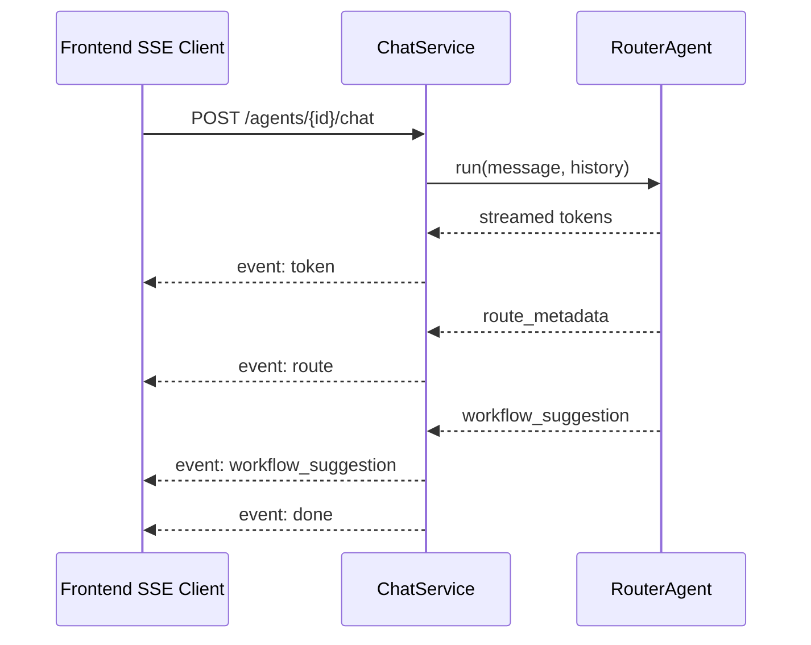
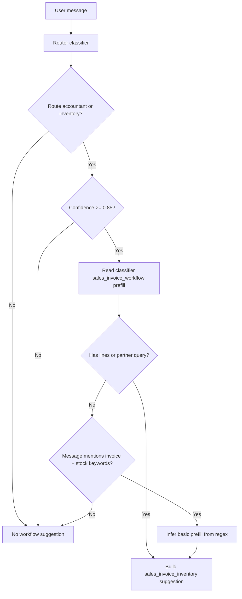
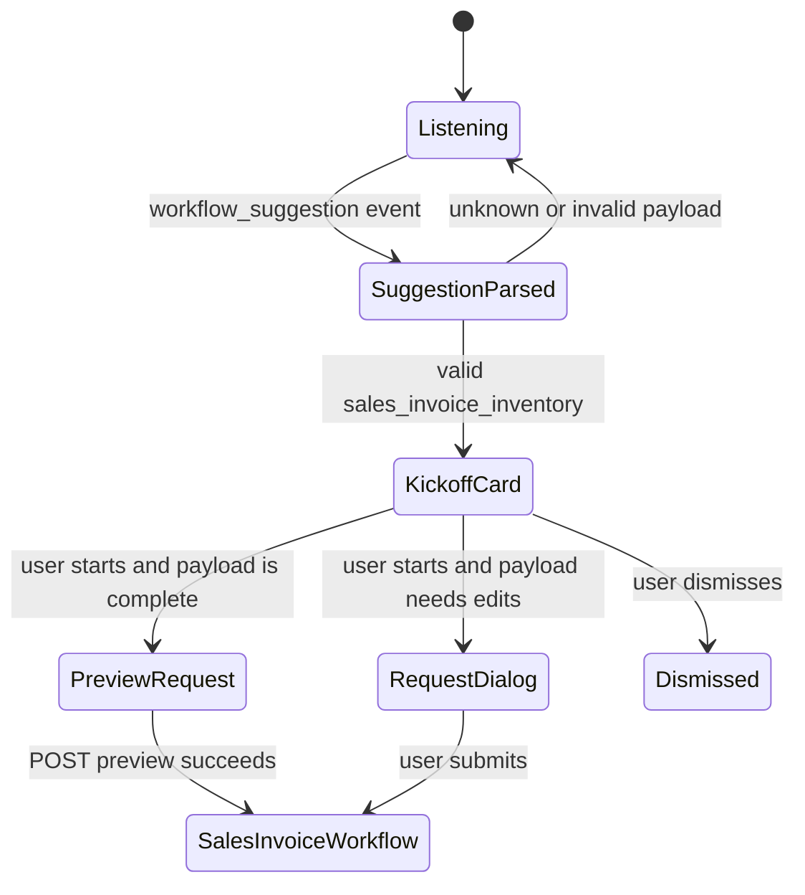

# Chat Workflow Suggestions

## Purpose

Workflow suggestions let chat detect that a user is likely asking for a structured workflow and offer a safe kickoff card instead of letting the LLM directly mutate business data. The current implemented suggestion is `sales_invoice_inventory`.

The suggestion is advisory. The Router does not call workflow endpoints, does not create invoices, and must not imply that a preview has already started.

## Event Contract

`ChatService` emits suggestions as SSE events from `POST /agents/{agent_id}/chat`:

```text
event: workflow_suggestion
data: {"workflow":"sales_invoice_inventory","confidence":0.94,"reason":"...","prefill":{"partner_query":"Acme","lines":[...]}}
```

The event is emitted after normal chat tokens and route metadata, and before `done`.



## Supported Suggestions

| Workflow | Confidence Threshold | Trigger | Frontend Result |
|---|---:|---|---|
| `sales_invoice_inventory` | `0.85` | Inventory-backed sales invoice intent | Shows a kickoff card or opens the sales invoice request dialog with prefilled fields |

## Router Decision Flow



## Prefill Contract

The backend suggestion payload can include:

- `partner_query`
- `recipient`
- `currency`
- `lines`

Each line may include partial sales invoice preview data such as:

- `description`
- `query`
- `quantity`
- `unit_label`
- `unit_price`
- `vat_rate`
- `category`

Frontend parsing is intentionally tolerant at the envelope level and strict at the known workflow level. Unknown workflow names are ignored. Invalid known payloads are ignored rather than crashing the chat stream.

## Frontend Handling



If `toSalesInvoicePreviewPayload()` can build a valid preview payload, the frontend starts the preview directly. If required fields are missing, it opens the request dialog with `toSalesInvoiceRequestInitialValues()` so the user can complete the data.

## Maintainability Rules

- Suggestions should be lightweight and non-persistent.
- Suggestions should never bypass the user review UI.
- Add new workflow suggestions as discriminated `workflow` payloads.
- Keep backend `TypedDict` contracts and frontend Zod schemas in sync.
- Keep thresholds explicit and documented here.
- If multiple suggestions become possible for one turn, define priority rules before emitting more than one event.

## Key Files

Backend:

- `services/agent/app/runtime/workflow_suggestion.py`
- `services/agent/app/runtime/router.py`
- `services/agent/app/services/chat_service.py`
- `services/agent/app/runtime/base_agent.py`
- `services/agent/tests/test_router_agent.py`
- `services/agent/tests/test_router_chat_service.py`

Frontend:

- `frontend/src/shared/api/sse.ts`
- `frontend/src/features/send-message/model/chat-suggestion-schema.ts`
- `frontend/src/features/send-message/ui/sales-invoice-suggested-kickoff-card.tsx`
- `frontend/src/widgets/chat-window/model/chat-reducer.ts`
- `frontend/src/widgets/chat-window/ui/chat-window.tsx`
- `frontend/src/widgets/chat-window/ui/chat-window.test.tsx`
