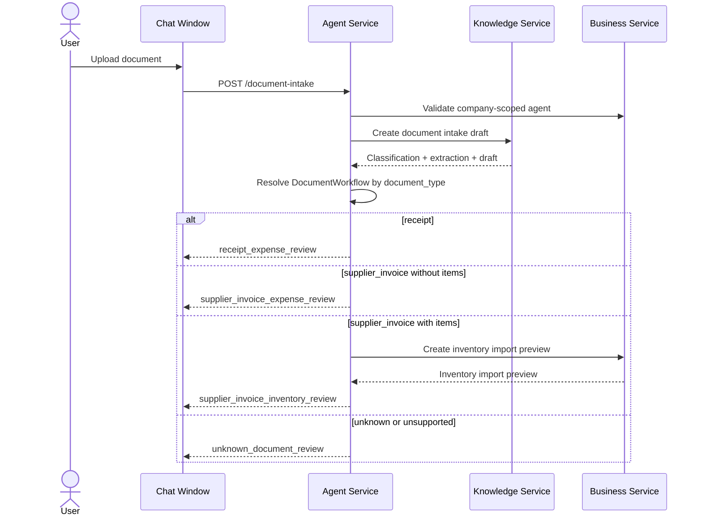
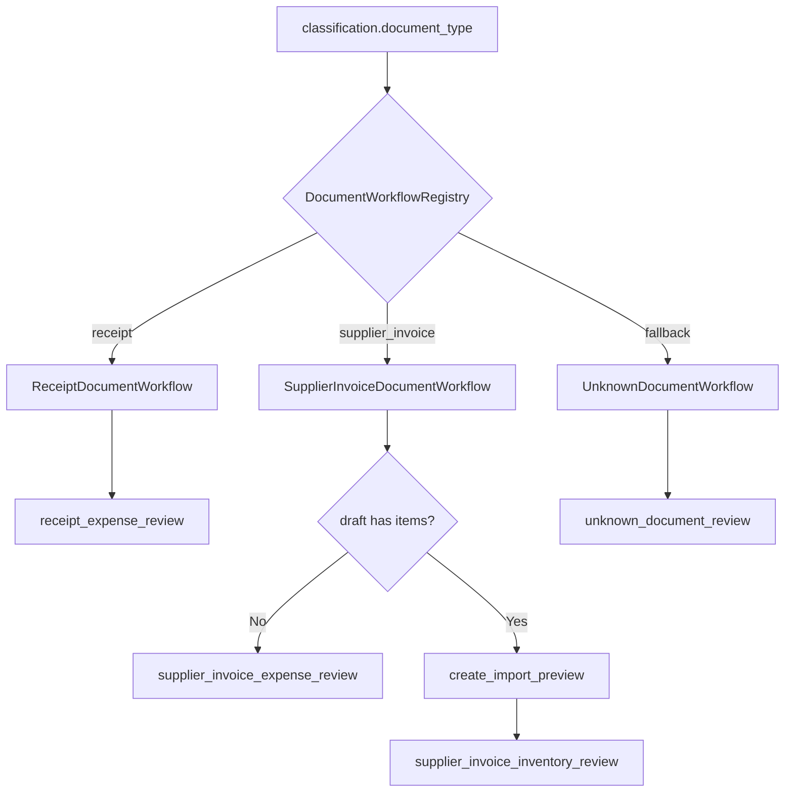
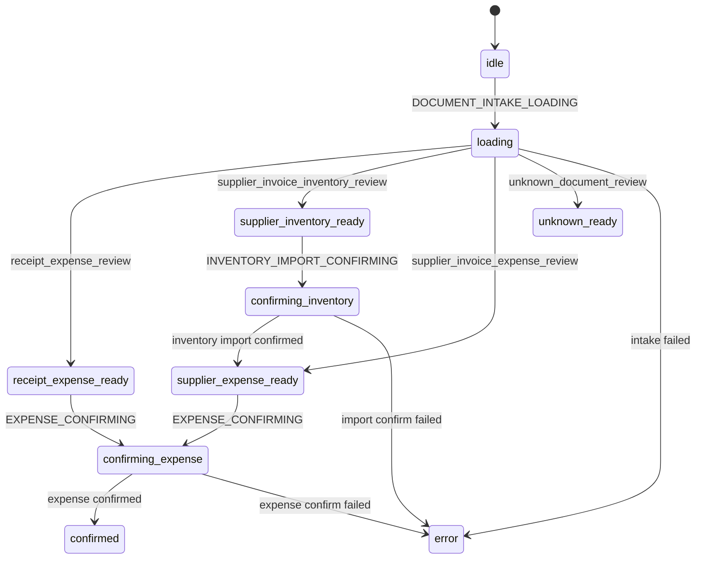

# Document Intake Workflow

## Purpose

Document intake converts an uploaded business document into a typed review payload. It delegates extraction and classification to Knowledge Service, then uses Agent-owned workflow routing to decide which review UI the frontend should show.

The workflow is implemented for receipts, supplier invoices, and unknown documents. Other classified document types currently fall back to the unknown review path until a workflow is registered.

## Ownership

| Area | Owner | Notes |
|---|---|---|
| File upload route and workflow registry | Agent Service | Validates agent/company scope and dispatches by document type. |
| Classification and extraction | Knowledge Service | Returns classification, stored document metadata, extracted text, and draft data. |
| Inventory import preview | Business Service | Created for supplier invoices with line items. |
| Review UI and confirmation state | Frontend chat window | Renders receipt, supplier inventory, supplier expense, or unknown review states. |

## API Entry Point

```text
POST /agents/{agent_id}/document-intake
Content-Type: multipart/form-data
fields:
  file: UploadFile
  requested_type: auto | receipt | supplier_invoice | ...
```

Response model: `DocumentIntakeResponse`, discriminated by `type`.

## Flow



## Registry



The registry is created in `DocumentIntakeService` with a fallback workflow. Adding a new document type should be done by implementing `DocumentWorkflow.create_review()` and registering it in `create_document_workflow_registry()`.

## Response Types

| Type | Meaning | Next User Action |
|---|---|---|
| `receipt_expense_review` | Receipt extraction produced an expense draft | Review and confirm expense |
| `supplier_invoice_expense_review` | Supplier invoice produced an expense draft and no inventory line import is needed | Review and confirm expense |
| `supplier_invoice_inventory_review` | Supplier invoice produced line items that can update inventory | Review inventory import, then continue to expense review |
| `unknown_document_review` | Classification is unsupported or uncertain | Review warnings; no persistence action is offered by this workflow |

## Frontend State Machine



## Validation And Errors

| Scenario | Behavior |
|---|---|
| Agent missing | `404 Agent not found` |
| Agent not assigned to company | `422 Document intake workflow requires a company-scoped agent` |
| Company missing | `404 Company not found` |
| Knowledge client 4xx | Same status with Knowledge message |
| Knowledge unavailable | `503` |
| Registered workflow cannot build a valid review payload | `422` |

## Extension Guide

1. Add or reuse a Knowledge classification `document_type`.
2. Add a `DocumentWorkflow` implementation under `services/agent/app/services/document_workflows/`.
3. Return a discriminated response type from `services/agent/app/models/document_intake.py`.
4. Register the workflow in `create_document_workflow_registry()`.
5. Add frontend Zod parsing and reducer states if the response requires a new UI branch.
6. Add route/service tests for success and validation errors.
7. Add frontend reducer and UI tests for the review branch.

## Key Files

Backend:

- `services/agent/app/services/document_intake_service.py`
- `services/agent/app/services/document_workflows/base.py`
- `services/agent/app/services/document_workflows/receipt.py`
- `services/agent/app/services/document_workflows/supplier_invoice.py`
- `services/agent/app/services/document_workflows/unknown.py`
- `services/agent/app/models/document_intake.py`
- `services/agent/app/routes/agents.py`

Frontend:

- `frontend/src/widgets/chat-window/model/chat-reducer.ts`
- `frontend/src/widgets/chat-window/ui/chat-window.tsx`

Related:

- [Supplier Invoice Expense](./supplier-invoice-expense.md)
- [Shared Workflow Primitives](./shared-workflow-primitives.md)
