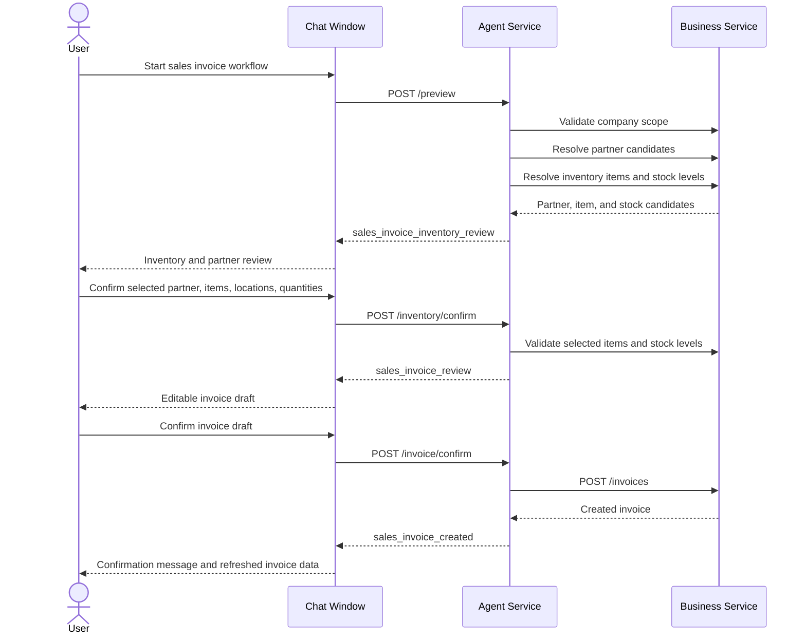
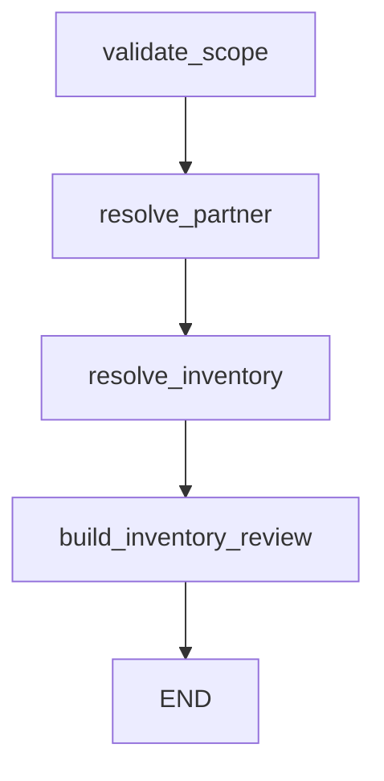
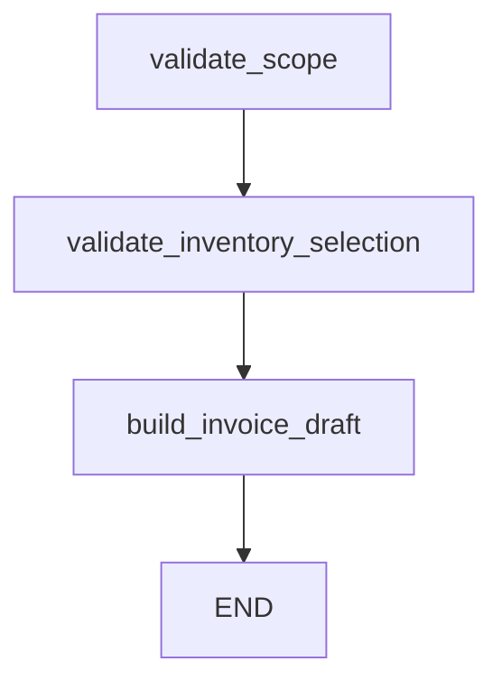
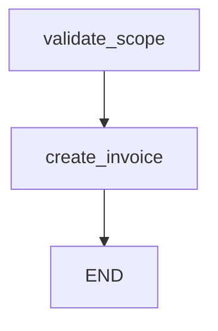
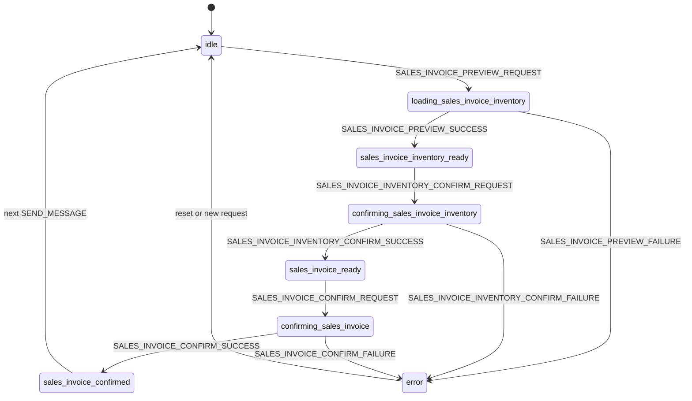

# Sales Invoice Inventory Workflow

## Purpose

The inventory-backed sales invoice workflow turns a structured customer request into a reviewed invoice draft that is linked to inventory items and locations. It is intentionally a multi-step review flow: inventory and partner matches are reviewed first, the invoice draft is reviewed second, and the invoice is persisted only after explicit confirmation.

This workflow is implemented today and can be started either from the manual sales invoice dialog in chat or from a Router-emitted `workflow_suggestion`.

## Ownership

| Area | Owner | Notes |
|---|---|---|
| Workflow orchestration | Agent Service | Routes, service facade, LangGraph nodes, validation, error mapping. |
| Partner, inventory, invoice persistence | Business Service | Agent calls Business through `BusinessClient`; Agent does not write financial records directly. |
| Chat review UI | Frontend | Chat reducer, request dialog, inventory review card, invoice draft confirmation card. |
| Suggestion trigger | Router runtime + ChatService | Suggestions are advisory; the user still starts the workflow explicitly. |

## Preconditions

- The selected agent must exist and belong to the authenticated user.
- The selected agent must have a non-null `company_id`.
- Business Service must confirm that the company exists.
- The request must contain at least one line and either `partner_query` or `recipient`.

## API Sequence

All routes are exposed through the gateway under `/agents/{agent_id}`.

| Step | Route | Request Model | Response Type |
|---|---|---|---|
| Inventory preview | `POST /invoice-workflows/sales-inventory/preview` | `CreateSalesInvoiceInventoryPreviewRequest` | `sales_invoice_inventory_review` |
| Inventory confirmation | `POST /invoice-workflows/sales-inventory/inventory/confirm` | `ConfirmSalesInvoiceInventoryRequest` | `sales_invoice_review` |
| Invoice confirmation | `POST /invoice-workflows/sales-inventory/invoice/confirm` | `ConfirmSalesInvoiceRequest` | `sales_invoice_created` |

All three endpoints require gateway authentication. Direct Agent Service calls must include `x-user-id`; normal clients should call the gateway with `Authorization: Bearer $TOKEN`.

## Endpoint Contracts

### Preview Request

```json
{
  "partner_query": "Acme",
  "recipient": null,
  "issue_date": "2026-05-15",
  "tax_event_date": "2026-05-15",
  "due_date": "2026-06-01",
  "currency": "EUR",
  "notes": "Customer requested expedited delivery",
  "lines": [
    {
      "description": "Widget",
      "query": "SKU-001",
      "quantity": "2",
      "unit_label": "pcs",
      "unit_price": "10.00",
      "vat_rate": "0.20",
      "category": "goods"
    }
  ]
}
```

`partner_query` or `recipient` is required, and `lines` must contain at least one item. Money/quantity values are serialized as strings by the frontend to preserve decimal precision.

### Preview Response

```json
{
  "type": "sales_invoice_inventory_review",
  "company_id": "665f1f77c9e0f7a8093bb701",
  "partner_query": "Acme",
  "recipient": null,
  "partner_candidates": [],
  "lines": [
    {
      "line_index": 0,
      "requested": {
        "description": "Widget",
        "query": "SKU-001",
        "quantity": "2",
        "unit_label": "pcs",
        "unit_price": "10.00",
        "vat_rate": "0.20",
        "category": "goods"
      },
      "selected_item_id": "item_1",
      "selected_location_id": "loc_1",
      "candidates": [],
      "stock_levels": [],
      "available_quantity": "12",
      "warnings": []
    }
  ],
  "warnings": []
}
```

### Inventory Confirmation Request

```json
{
  "source_preview": {
    "partner_query": "Acme",
    "currency": "EUR",
    "lines": [
      {
        "description": "Widget",
        "query": "SKU-001",
        "quantity": "2",
        "unit_price": "10.00",
        "vat_rate": "0.20"
      }
    ]
  },
  "selected_partner_id": "partner_1",
  "recipient": null,
  "lines": [
    {
      "line_index": 0,
      "description": "Widget",
      "quantity": "2",
      "unit_label": "pcs",
      "unit_price": "10.00",
      "vat_rate": "0.20",
      "category": "goods",
      "inventory_item_id": "item_1",
      "inventory_location_id": "loc_1",
      "stock_quantity": "2"
    }
  ]
}
```

The selected partner or inline recipient is required at this stage. Every selected inventory item/location must belong to the scoped company.

### Inventory Confirmation Response

```json
{
  "type": "sales_invoice_review",
  "company_id": "665f1f77c9e0f7a8093bb701",
  "invoice_draft": {
    "company_id": "665f1f77c9e0f7a8093bb701",
    "partner_id": "partner_1",
    "currency": "EUR",
    "status": "draft",
    "items": [
      {
        "description": "Widget",
        "quantity": "2",
        "unit_label": "pcs",
        "unit_price": "10.00",
        "vat_rate": "0.20",
        "category": "goods",
        "inventory_item_id": "item_1",
        "inventory_location_id": "loc_1",
        "stock_quantity": "2"
      }
    ]
  },
  "inventory_warnings": [],
  "partner_warnings": []
}
```

### Invoice Confirmation Request

```json
{
  "invoice_draft": {
    "company_id": "665f1f77c9e0f7a8093bb701",
    "partner_id": "partner_1",
    "currency": "EUR",
    "status": "draft",
    "items": [
      {
        "description": "Widget",
        "quantity": "2",
        "unit_label": "pcs",
        "unit_price": "10.00",
        "vat_rate": "0.20",
        "inventory_item_id": "item_1",
        "inventory_location_id": "loc_1",
        "stock_quantity": "2"
      }
    ]
  },
  "confirmed": true
}
```

`confirmed` must be `true`. The final response is `sales_invoice_created` and wraps the Business `InvoiceResponse`.

## Curl Smoke Test

```bash
curl -X POST "$GATEWAY/agents/$AGENT_ID/invoice-workflows/sales-inventory/preview" \
  -H "Authorization: Bearer $TOKEN" \
  -H "Content-Type: application/json" \
  -d '{
    "partner_query": "Acme",
    "currency": "EUR",
    "lines": [
      {
        "description": "Widget",
        "query": "SKU-001",
        "quantity": "2",
        "unit_price": "10.00",
        "vat_rate": "0.20"
      }
    ]
  }'
```

After preview, submit the reviewed selections to `/inventory/confirm`, then submit the reviewed `invoice_draft` with `confirmed=true` to `/invoice/confirm`.

## End-to-End Flow



## Backend Graphs

The workflow is split into three small LangGraph graphs instead of one long-lived checkpointed graph. Each HTTP step reconstructs state from the request payload and validates current Business data.

### Preview Graph



### Inventory Confirmation Graph



### Invoice Confirmation Graph



## Frontend State Machine

The chat reducer tracks this workflow separately from document intake through `salesInvoiceStatus`.



## Review Payloads

### `sales_invoice_inventory_review`

Contains:

- `company_id`
- original `partner_query` or explicit `recipient`
- partner match candidates
- one resolved line per requested line
- inventory candidates, selected item/location defaults, stock levels, available quantity, and warnings

Selection rules:

- Exact inventory matches are auto-selected only when confidence is at least `0.90`.
- The default location is the location with the highest available quantity.
- Missing matches, missing stock, and insufficient stock are returned as warnings instead of silently blocking the review.

### `sales_invoice_review`

Contains an `InvoiceCreate` draft and warning lists. The draft is built from the confirmed inventory selections, not directly from the original natural language request.

Default behavior:

- `issue_date` defaults to today.
- `tax_event_date` defaults to `issue_date` or today.
- `due_date` defaults to the first day of the next month.
- `status` is `draft`.
- Each item carries `inventory_item_id`, `inventory_location_id`, and `stock_quantity`.

### `sales_invoice_created`

Contains the persisted `InvoiceResponse` returned by Business Service. The Agent Service does not create a local invoice copy.

## Failure Behavior

| Scenario | Response |
|---|---|
| Agent not found | `404 Agent not found` |
| Agent has no `company_id` | `422 Sales invoice inventory workflow requires a company-scoped agent` |
| Company missing | `404 Company not found` |
| Business 4xx | Same status code with Business message |
| Business unavailable or 5xx-like client error | `503` with downstream message |
| Missing partner/recipient during inventory confirm | `422 selected_partner_id or recipient is required` |
| Selected inventory location has no stock level | `422 Selected inventory item has no stock level at the selected location` |
| Final confirmation omitted | `422 Invoice confirmation is required` |
| Draft company does not match agent company | `422 Invoice company scope mismatch` |

## Extension Points

- Add new preview enrichment in `sales_invoice_workflow_graph.py` between `resolve_inventory` and `build_inventory_review`.
- Add new review fields to `sales_invoice_workflow.py`, then mirror them in the frontend Zod schema.
- Add additional frontend review controls in `features/send-message/ui/*` and reducer actions in `widgets/chat-window/model/chat-reducer.ts`.
- Keep persistence in Business Service; if invoice creation requires new side effects, expose them through `BusinessClient`.
- If the workflow becomes resumable across sessions, introduce durable workflow state or LangGraph checkpointing rather than storing partial state only in React.

## Key Files

Backend:

- `services/agent/app/models/sales_invoice_workflow.py`
- `services/agent/app/services/sales_invoice_workflow_graph.py`
- `services/agent/app/services/sales_invoice_workflow_service.py`
- `services/agent/app/routes/agents.py`
- `services/agent/tests/test_sales_invoice_workflow_graph.py`
- `services/agent/tests/test_sales_invoice_workflow_service.py`
- `services/agent/tests/test_sales_invoice_workflow_routes.py`

Frontend:

- `frontend/src/features/send-message/api/sales-invoice-workflow.ts`
- `frontend/src/features/send-message/model/sales-invoice-workflow-schema.ts`
- `frontend/src/features/send-message/ui/sales-invoice-request-dialog.tsx`
- `frontend/src/features/send-message/ui/sales-invoice-inventory-confirmation.tsx`
- `frontend/src/features/send-message/ui/sales-invoice-draft-confirmation.tsx`
- `frontend/src/widgets/chat-window/model/chat-reducer.ts`
- `frontend/src/widgets/chat-window/ui/chat-window.tsx`

Related:

- [Chat Workflow Suggestions](./chat-workflow-suggestions.md)
- [Shared Workflow Primitives](./shared-workflow-primitives.md)
