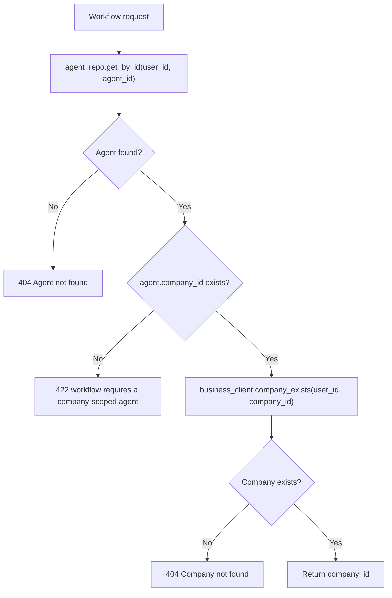
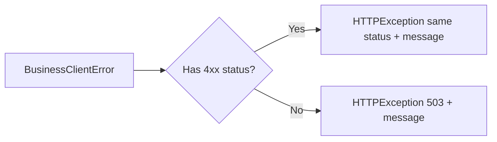
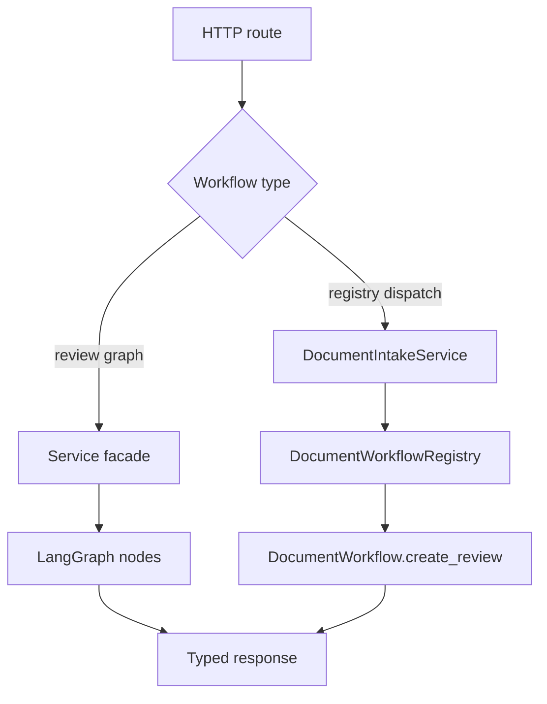

# Shared Workflow Primitives

## Purpose

Agent workflows share a small backend foundation for scope validation, downstream error mapping, and future workflow abstraction. The current primitives are intentionally thin: they keep common safety checks in one place without forcing every workflow into the same runtime shape.

## Current Primitives

| Primitive | File | Status | Used By |
|---|---|---|---|
| `require_company_scoped_agent()` | `services/agent/app/services/workflows/base.py` | Implemented | Sales invoice, document intake, receipt/expense workflows |
| `map_business_client_error()` | `services/agent/app/services/workflows/base.py` | Implemented | Sales invoice and shared workflow callers |
| `WorkflowContext` | `services/agent/app/services/workflows/base.py` | Implemented | Available for future Agent workflows |
| `AgentWorkflow` protocol | `services/agent/app/services/workflows/base.py` | Implemented, lightly used | Available for future Agent workflows |
| `DocumentWorkflow` protocol | `services/agent/app/services/document_workflows/base.py` | Implemented | Document intake workflows |
| `DocumentWorkflowRegistry` | `services/agent/app/services/document_workflows/base.py` | Implemented | Document intake dispatch |

## Scope Validation

Company-bound workflows must call `require_company_scoped_agent()` before touching Business data.

This keeps workflow routes consistent and prevents unassigned agents from creating company-owned invoices, expenses, inventory imports, or partner records.

## Error Mapping

Business Service owns domain persistence and validation. Agent workflows preserve client-actionable Business errors and collapse service availability failures to `503`.

Use this behavior for new Business-backed workflows unless there is a stronger product reason to hide or transform a specific downstream error.

## Workflow Implementation Shapes

The codebase currently uses two workflow shapes:

Use a LangGraph when the workflow has several ordered computation or validation nodes that benefit from named graph steps. Use a registry when the entry point fans out by a discriminator such as `document_type`.

## Adding A New Workflow

1. Decide whether the workflow is graph-shaped, registry-shaped, or a simple service method.
2. Define backend Pydantic models with explicit request and response types.
3. Use discriminated `type` fields for review unions returned to the frontend.
4. Validate company scope before downstream Business calls.
5. Keep routes thin and inject services through `dependencies.py`.
6. Mirror response contracts in frontend Zod schemas before rendering.
7. Model user-review phases in the reducer instead of scattering local component state.
8. Add documentation under `docs/workflows` with sequence and state diagrams.

### Implementation Checklist

Use this lower-level checklist for new Agent-owned workflows:

1. Add backend request/response models under `services/agent/app/models/` and export them from `models/__init__.py` if shared imports need them.
2. Add a service facade and, when useful, graph nodes under `services/agent/app/services/`; reuse `services/workflows/base.py` for company scope validation and Business error mapping.
3. Register dependencies in `services/agent/app/dependencies.py` and expose thin route handlers in `services/agent/app/routes/agents.py` or a dedicated route module.
4. If chat can suggest the workflow, add a `workflow_suggestion` union member in `runtime/workflow_suggestion.py`, teach `RouterAgent` when to emit it, and add ChatService/SSE tests.
5. Add frontend Zod schemas in the owning feature, API helpers for every route, and tolerant SSE parsing for the suggestion envelope.
6. Add or extend `activeWorkflow` reducer state for loading, review, confirming, confirmed, cancellation, and error phases.
7. Build review UI from shared primitives first; introduce workflow-specific cards only for domain-specific form fields.
8. Invalidate affected TanStack Query keys after final confirmation so Business-owned lists stay fresh.
9. Update this directory and the relevant service docs with endpoint examples, ownership boundaries, failure behavior, and verification commands.

## Boundaries

Agent Service may:

- validate agent ownership and company scope
- orchestrate Knowledge and Business calls
- produce review payloads and warnings
- map downstream errors into route responses

Agent Service must not:

- persist Business-owned invoices, expenses, inventory records, partners, or companies directly
- let LLM output bypass explicit user confirmation for writes
- duplicate Business calculations or stock movement rules
- silently continue when company scope is missing

## Key Files

- `services/agent/app/services/workflows/base.py`
- `services/agent/app/services/workflows/__init__.py`
- `services/agent/app/services/document_workflows/base.py`
- `services/agent/tests/test_agent_workflow_utils.py`
