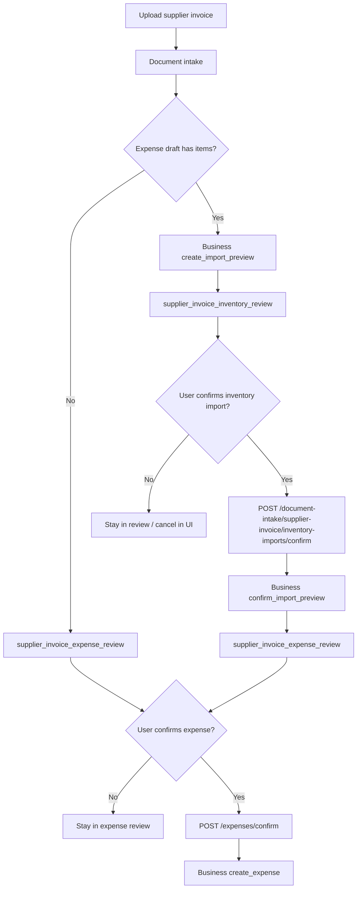
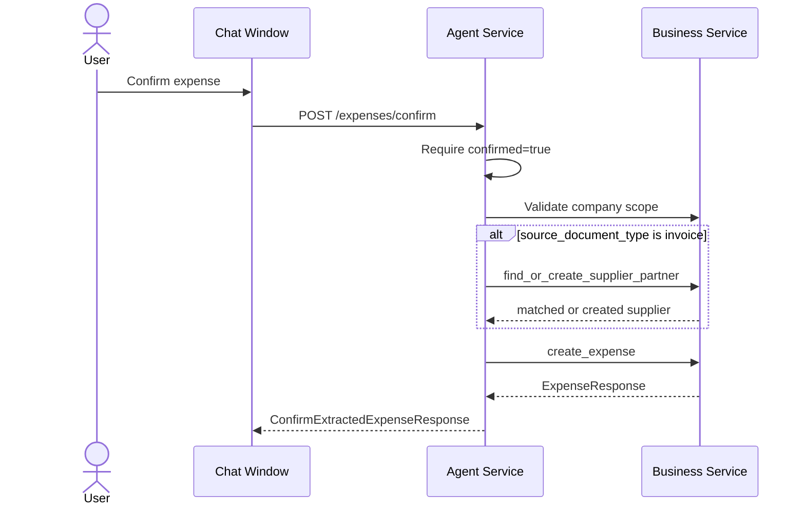
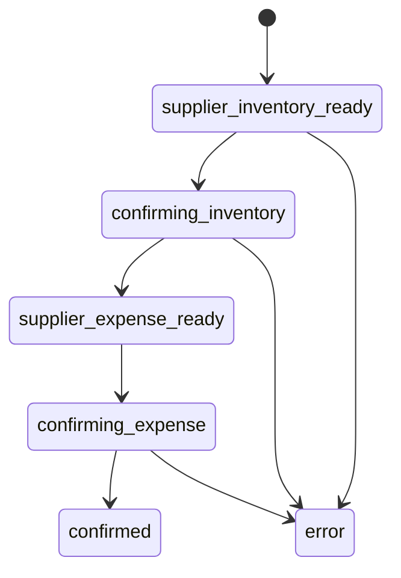

# Supplier Invoice Expense Workflow

## Purpose

The supplier invoice workflow handles uploaded supplier invoices that may affect both inventory and expenses. If the extracted invoice contains line items, the user first reviews an inventory import preview. After inventory is confirmed, the same extracted draft continues into expense confirmation.

This workflow is a branch of [Document Intake](./document-intake.md), but it is documented separately because it crosses two Business domains: inventory and expenses.

## High-Level Flow



## API Sequence

| Step | Route | Purpose | Response |
|---|---|---|---|
| Intake | `POST /agents/{agent_id}/document-intake` | Classify and extract the supplier invoice | `supplier_invoice_inventory_review` or `supplier_invoice_expense_review` |
| Inventory confirmation | `POST /agents/{agent_id}/document-intake/supplier-invoice/inventory-imports/confirm` | Confirm import preview and return the expense draft for the next review | `supplier_invoice_expense_review` |
| Expense confirmation | `POST /agents/{agent_id}/expenses/confirm` | Persist the reviewed expense | `ConfirmExtractedExpenseResponse` |

## Inventory Review Branch

When the extracted draft contains items, `SupplierInvoiceDocumentWorkflow` builds a Business `InventoryImportPreviewCreate` payload:

- `company_id` comes from the company-scoped agent.
- `document_id` comes from the Knowledge-stored document.
- `source_type` is `supplier_invoice_upload`.
- each extracted expense item becomes a `SupplierInvoiceLineCandidate`.

Business Service owns matching, preview status, inventory item creation/update, stock movement behavior, and import confirmation.

## Expense Confirmation Branch

The final expense confirmation is handled by `ReceiptService.confirm_expense()`. It requires `confirmed=true` before persistence.

For supplier invoices, `source_document_type` is `invoice`. If the payload includes invoice source type, reviewed vendor partner details are required and Business Service is asked to find or create the supplier partner before the expense is recorded.



## Receipt And Expense Confirmation

Receipt uploads use the same final expense confirmation endpoint. The difference is that receipt drafts do not require supplier partner upsert.

The legacy endpoint remains available:

```text
POST /agents/{agent_id}/expense-drafts
```

When `ReceiptService` has `DocumentIntakeService` and the source type is `receipt`, it delegates to document intake and converts receipt or supplier expense review payloads back into the legacy `ExpenseDraftResponse`. Otherwise it falls back to Knowledge Service's legacy expense draft endpoint.

## Frontend State Path



## Failure Behavior

| Scenario | Behavior |
|---|---|
| Inventory preview confirm fails with Business 4xx | Same status and message |
| Inventory preview confirm fails because Business is unavailable | `503` |
| Expense confirmation has `confirmed=false` | `400 Confirmation is required before recording expense` |
| Invoice expense confirmation omits vendor partner details | `422 Invoice confirmation requires reviewed vendor partner details` |
| Expense Business write fails with 4xx | Same status and message |
| Expense Business write fails because Business is unavailable | `503` |

## Extension Points

- Add new supplier invoice item mapping fields in `SupplierInvoiceDocumentWorkflow` and Business `InventoryImportPreviewCreate` together.
- Keep inventory import confirmation separate from expense confirmation so users can review stock effects before financial persistence.
- If partial inventory import becomes supported, add explicit statuses to the review payload instead of inferring from preview content.
- Keep receipt compatibility in `ReceiptService` until all clients use document intake directly.

## Key Files

Backend:

- `services/agent/app/services/document_workflows/supplier_invoice.py`
- `services/agent/app/services/document_intake_service.py`
- `services/agent/app/services/receipt_service.py`
- `services/agent/app/models/document_intake.py`
- `services/agent/app/models/financial/receipt.py`
- `services/agent/app/routes/agents.py`

Frontend:

- `frontend/src/widgets/chat-window/model/chat-reducer.ts`
- `frontend/src/widgets/chat-window/ui/chat-window.tsx`

Related:

- [Document Intake](./document-intake.md)
- [Shared Workflow Primitives](./shared-workflow-primitives.md)
